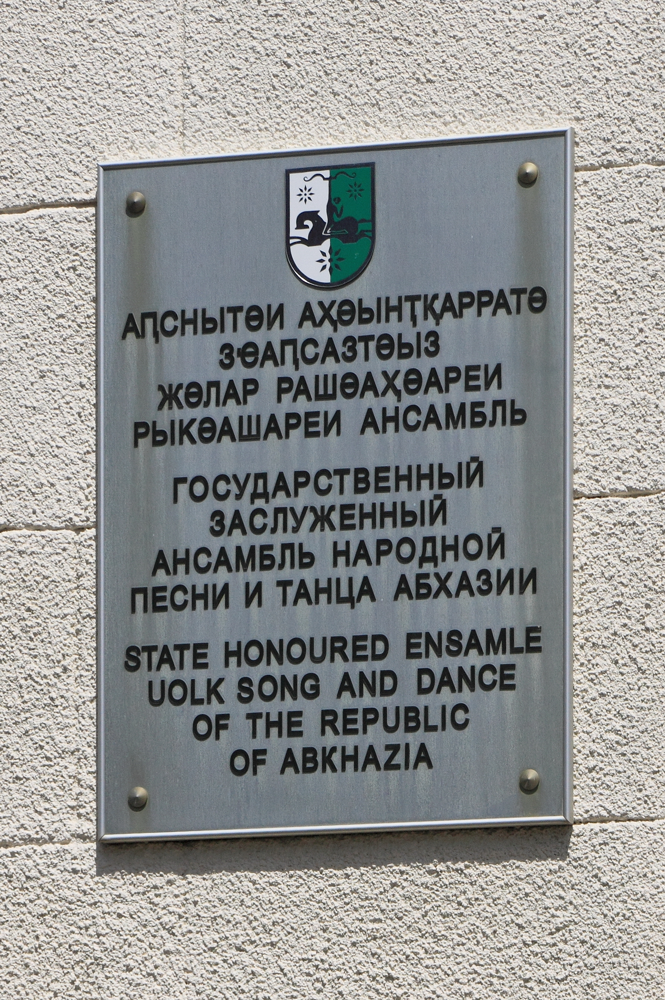

# 阿布哈兹传统宗教与圣所祈福（Abkhaz／Apsua）

<!-- 来源：CC BY-SA 4.0 | https://commons.wikimedia.org/wiki/File:2014_Suchum,_Pa%C5%84stwowy_Zesp%C3%B3%C5%82_Folkowy_Pie%C5%9Bni_i_Ta%C5%84ca_Republiki_Abchazji_(01).jpg -->

## 概述

**阿布哈兹人（Abkhaz；自称 Apsua）** 居住于高加索黑海沿岸的阿布哈兹地区。大英百科指出当代宗教构成以逊尼派伊斯兰与东正教为主，但公开民族志与地方文化叙述同时强调：以 **anykha／nykha（圣所）** 为核心的传统敬礼在战后显著复兴。传统信仰公开概述常环绕至高神与地方神（如雷电相关的 **Afy** 等）、**七大 Anykha（圣所）**——公开名录常突出 **Dydrypsh-nykha（Dydrypsh）** 以及 Lykh-nykha、Ldzaa-nykha 等（具体名录在口述与书写传统中略有出入）——以及氏族／家庭层级的较小圣所；公开伦理亦提及 **Ankhabyu** 等圣所守护／祭司伦理概念。家庭层可见 **Ashtw'ashyra** 等家族祈祷叙事。公共祈祷常与牲祭、共餐、酒与洁净规则相连。本条目为教育概览；**仅观礼／概念层**；**不提供**牲祭操作、誓约 how-to、可复现祷词或任何可滥用的仪轨细节。

## 核心观念（祈福 / 功德 / 祈祷如何被理解）

祈福常被理解为：在圣所与家族长者见证下，以正当献祭与共餐向神／圣所祈求免灾、健康、家族繁衍与地方安宁。公开文化叙述强调灵魂与身体的紧密关系，以及葬于故土等伦理。功德贴近：遵守圣所禁忌日、服从世袭祭司家族规范、在战后语境中以共同祈祷维系社群团结（学术文献亦讨论其政治动员面向）。访客的「福」体现为：**仅观看／理解**阿布哈兹传统宗教为活的高加索圣所文明，而非旅游「异教奇观」或用户主持誓约。

## 典型仪式

### 1. Dydrypsh 与七大 Anykha 命名（公开圣所层）
- **场合**：各 anykha 的年度或轮值公共祈祷；公开名录强调 **Dydrypsh** 等七大圣所命名；战后叙述中有为感恩与护佑而举行的全阿布哈兹性祈祷。
- **主要步骤（概念层）**：由世袭祭司引导，社群聚集于圣所或指定地点，献祭与共餐、祈求平安。**仅概念／观礼层**；不提供宰杀、内脏处理、誓约 how-to 或祷词逐句。
- **物品**：牲祭动物外观、酒、仪式餐食（如 abysta 等）。
- **谁来举行**：圣所祭司家族与地方社群；外人不可主持。

### 2. Ashtw'ashyra 家庭祈祷（家族概念层）
- **场合**：部分家族每隔数年在祖宅花园等圣地举行的 **Ashtw'ashyra**／家庭 Afy 祈祷；公开报道称常择特定忌日／敬畏日。
- **主要步骤（概念层）**：家族长者或受邀德高者主持，向 Afy 祈求家人福祉，随后就地共餐且食物一般不带离。**止于概念**；**禁止**用户仿作家庭誓约。
- **物品**：牲祭相关餐食、酒、盐等外观。
- **谁来举行**：父系家族长者；邻里男性等按地方规范受邀。

### 3. Ankhabyu 圣所伦理与东正教／伊斯兰并存（当代概念层）
- **场合**：教堂／清真寺年历与圣所禁忌日可能交错；公开叙述中的 **Ankhabyu** 伦理（圣所守护／祭司责任概念）与斋期等时段对献祭的限制。
- **主要步骤（概念层）**：理解 **Ankhabyu** 伦理概念与多重宗教身份如何在同一社群中协调。**CONCEPT — viewing only, no vows how-to**。
- **物品**：依各传统（从略）。
- **谁来举行**：相应神职与圣所祭司各司其职。

## 日常与节庆

圣所年历、家族聚会与基督教／伊斯兰节日并存。优先 Britannica 民族概述、学术期刊圣所研究与阿布哈兹文化公开叙述（注意地缘政治语境下的表述差异）。

## 注意与尊重

**勿把牲祭或誓约写成可复制教程。** 勿擅自进入圣所或拍摄祭司仪轨。勿将「抓魂」等丧葬相关概念娱乐化。本条目对限制性细节仅点到概念层；访客止于观看理解。

## 手机互动适合度（Three.js 评估草稿）

- **档位：** B 仅氛围或图文场景
- **敏感度：** 高
- **判断：** **仅氛围／无用户主持。** 高加索圣林／山脚景观与「圣所伦理」说明适合克制的图文场景；真牲祭、共餐祷词、Ankhabyu 誓约与祭司职分绝不可互动化。取 B（偏保守）：可旋转外围场景，不以任何献祭／誓约手势为玩法。
- **若做成互动：** 只做可旋转山脚圣所外围与 Dydrypsh／七大 Anykha 命名说明卡；不提供拖动「献祭」、誓约或角色扮演祭司。
- **红线：** 禁止模拟牲祭、冒充祭司／Ankhabyu、用户主持誓约、以真圣所祈祷作胜负，或游戏化丧葬「抓魂」。
- **评估状态：** 待后期统一评估

## 参考来源

- https://www.britannica.com/topic/Abkhaz
- https://www.discoverabkhazia.org/religion
- https://doi.org/10.31250/2618-8619-2023-1(19)-112-120
- https://abaza.org/en/sanctuaries
