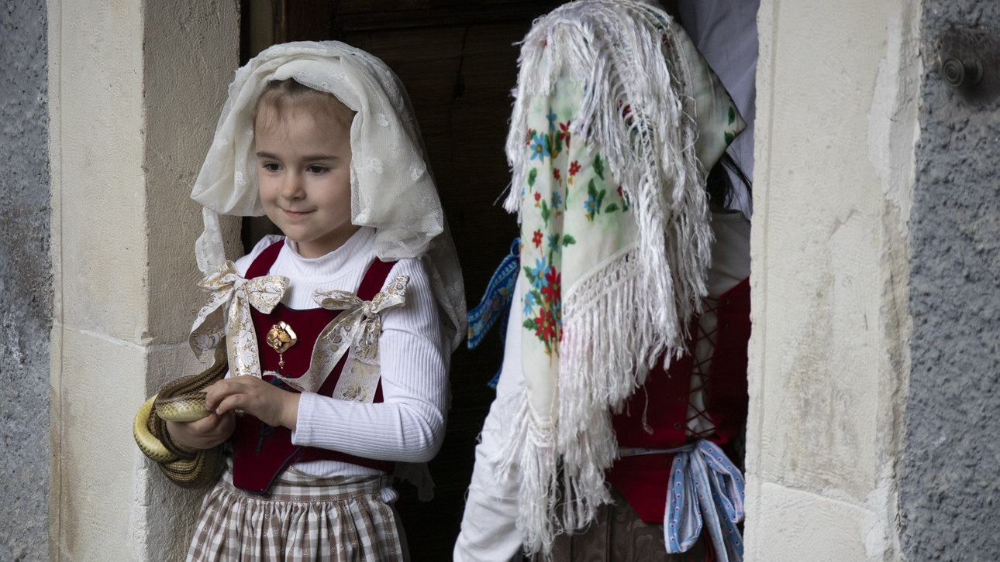

# 阿布鲁佐民间天主教与朝圣祈福（Abruzzese）

<!-- 来源：CC BY-SA 4.0 | https://commons.wikimedia.org/wiki/File:Serpari-Cocullo-2025-Portfolio-1.jpg -->

## 概述

**阿布鲁佐（Abruzzo）** 位于意大利中部亚平宁东侧，以山村圣母朝圣地、牧季祝福与主保节抬像著称。公开天主教民俗记述：还愿、圣周与地震纪念祈祷构成重要公共层；另有广为人知的公共节庆层——**科库洛（Cocullo）「蛇节」／圣道明蛇节（Festa dei Serpari／San Domenico）**（信众以无毒蛇环绕圣像游行，象征护佑与还愿），以及 **苏尔莫纳（Sulmona）复活节「奔跑的圣母」（Madonna che Scappa）**（广场上圣母像奔向复活基督像的戏剧性公共敬礼）。本条目为教育概览；**不提供**可冒充神职的脚本。与翁布里亚、马尔凯、拉齐奥条目可比较但阿布鲁佐山牧认同独立。

## 核心观念（祈福 / 功德 / 祈祷如何被理解）

祈福常被理解为：通过弥撒、朝圣与对圣母／地方圣人的敬礼，求山居安全、家庭保护与灾后重建勇气。功德贴近：支持堂区慈善与抗震互助。访客的「福」体现为：纪念场保持静默，不把震后社区写成废墟观光。

## 典型仪式

### 1. 圣母／山村朝圣（概念层）
- **场合**：瞻礼、个人还愿。
- **主要步骤（概念层）**：理解拜访圣地、祈祷。**止于公开朝圣层**。
- **物品**：从略。
- **谁来举行**：朝圣者；堂区神职。

### 2. 主保节巡游（概念层）
- **场合**：各城村主保日；含 Cocullo 蛇节等地方特色主保敬礼。
- **主要步骤（概念层）**：理解抬像与弥撒；公开记述中蛇节以蛇环圣像的外观象征护佑。**止于观礼礼貌层**；勿骚扰动物或打断游行。
- **物品**：从略。
- **谁来举行**：兄弟会与堂区。

### 2b. 苏尔莫纳「奔跑的圣母」（Madonna che Scappa，公共概念层）
- **场合**：复活节周日苏尔莫纳广场。
- **主要步骤（概念层）**：理解圣母像奔向复活基督像的公共戏剧性敬礼与人群欢呼。**止于观礼礼貌层**。
- **物品**：从略。
- **谁来举行**：堂区、兄弟会与本地社群。

### 3. 灾后纪念与公共祈祷（概念层）
- **场合**：地震纪念日等。
- **主要步骤（概念层）**：理解公共弥撒与默哀。**勿消费创伤**。
- **物品**：从略。
- **谁来举行**：堂区与市政社群。

## 日常与节庆

可与翁布里亚方济各朝圣、马尔凯洛雷托比较「亚平宁朝圣带」。

## 注意与尊重

**勿移除还愿物。** 震区重建社区勿猎奇拍照。弥撒中保持安静。

## 手机互动适合度（Three.js 评估草稿）

- **档位：** C 可做轻度公共朝圣致敬
- **敏感度：** 中
- **判断：** 山村教堂可互动；圣事与创伤不可戏玩。
- **若做成互动：** 朝圣礼仪＋安全提示。
- **红线：** 禁止戏仿圣餐、消费地震创伤。
- **评估状态：** 待后期统一评估

## 参考来源

- https://ich.unesco.org/en/RL/celestinian-forgiveness-celebration-01276
- https://oaj.fupress.net/index.php/ah/article/view/17744
- https://www.abruzzoturismo.it/it/riti-personaggi-e-miti
