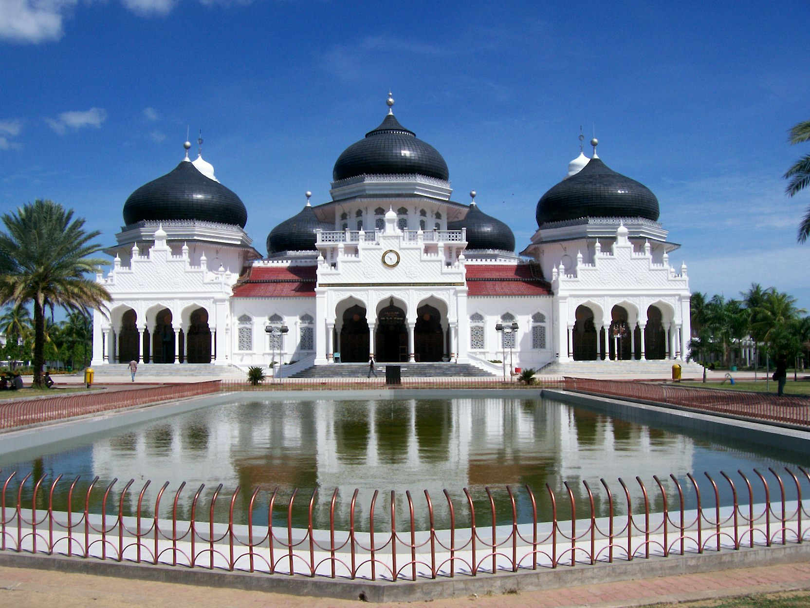

# 亚齐伊斯兰与圣墓—习俗法祈福（Acehnese）

<!-- 来源：CC BY-SA 3.0 | https://commons.wikimedia.org/wiki/File:Meuseujid_Raya_Baiturrahman,_Aceh.jpg -->

## 概述

**亚齐人（Acehnese）** 分布于印度尼西亚苏门答腊北端，历史上有「麦加前廊」之称。公开百科记述：宗教生活以逊尼派伊斯兰为核心，朝觐、天课与莱麦丹斋戒尤其受重视；习惯法（adat）与沙里亚在地方论述中常被说成表里一体；公开民俗亦突出 **Kanduri** 等共餐宴饮、对著名苏菲／学者圣墓（如 **Tengku Syiah Kuala**）的朝谒，以及农业法术记忆与 **Pawang** 相关禁忌余绪。本条目为教育概览；**Pawang 禁忌仅 CONCEPT**；**不提供**法术操作、通灵脚本或任何政治动员话术。

## 核心观念（祈福 / 功德 / 祈祷如何被理解）

祈福常被理解为：通过礼拜、斋戒、施舍与朝觐理想，以及在圣墓求介祷、在 **Kanduri** 共餐中巩固社群纽带，祈求平安与家族顺利。功德贴近：支持经堂教育与社区救济，尊重亚齐人对伊斯兰认同的自我表述。访客的「福」体现为：遵守着装与性别分区，勿把地方法规争议猎奇化，勿扮演 Pawang。

## 典型仪式

### 1. Kanduri 共餐宴饮（公开社群层）
- **场合**：节庆、还愿、纪念学者／家人等公开记述中的 **Kanduri** 社区共餐。
- **主要步骤（概念层）**：理解诵经、分享食物、巩固邻里互助的公开民俗。**止于共餐文化层**；不写成可冒充宗教职司的通关。
- **物品**：共餐桌、斋饭外观。
- **谁来举行**：家庭与社区；游客可礼貌观礼公开宴饮场合。

### 2. Tengku Syiah Kuala 等圣墓朝谒（概念层）
- **场合**：许愿还愿、纪念著名宗教学者；公开叙述常提 **Tengku Syiah Kuala** 等陵园。
- **主要步骤（概念层）**：理解诵经、施舍、拜访陵园的公开叙述。**禁止**编造介祷配方。
- **物品**：陵园外观。
- **谁来举行**：个人／家庭；地方宗教权威引导。

### 3. Pawang 禁忌余绪（高度敏感，CONCEPT ONLY）
- **场合**：农事、天候、疾病等历史与民俗记述中的 **Pawang** 角色与禁忌。
- **主要步骤（概念层）**：知晓存在超自然实践与禁忌余绪。**CONCEPT ONLY**；**禁止**复现法术／通灵／禁忌操作清单。
- **物品**：从略。
- **谁来举行**：历史上地方专家；外人不可扮演。

## 日常与节庆

优先 encyclopedia／everyculture；注意亚齐与爪哇克贾文、米南加保习俗法条目的差异。莱麦丹、开斋与 Kanduri 构成可见公共节奏。

## 注意与尊重

**勿在冲突记忆议题上站队煽动。** 勿拍摄未同意的妇女与宗教课堂。禁止法术旅游与 Pawang 体验营销。

## 手机互动适合度（Three.js 评估草稿）

- **档位：** B 仅氛围或图文场景
- **敏感度：** 中高
- **判断：** **仅氛围／无用户主持。** 清真寺外观与「麦加前廊」史可说明；Kanduri 可作远观共餐场景；Pawang／完整礼拜不可操作化。
- **若做成互动：** 只做建筑＋史说明卡与 Kanduri 外观图文；不提供礼拜通关或禁忌操作。
- **红线：** 禁止模拟礼拜通关、通灵、扮演 Pawang、政治动员。
- **评估状态：** 待后期统一评估

## 参考来源

- https://www.encyclopedia.com/humanities/encyclopedias-almanacs-transcripts-and-maps/acehnese-0
- https://www.encyclopedia.com/environment/encyclopedias-almanacs-transcripts-and-maps/acehnese-religion
- https://www.everyculture.com/East-Southeast-Asia/Acehnese.html
