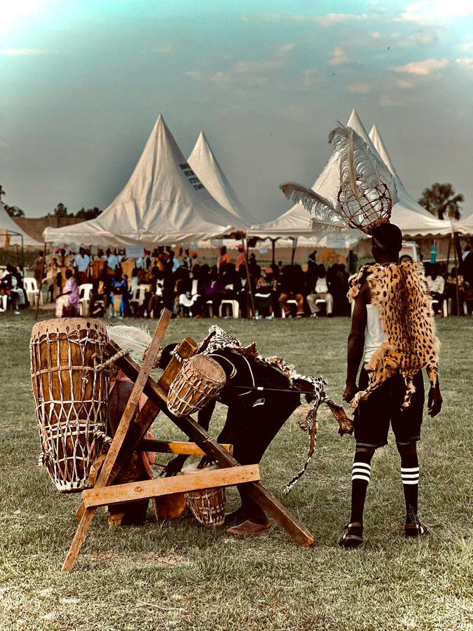

# 阿乔利传统宗教与祖灵祈福（Acholi）

<!-- 来源：CC BY 4.0 | https://commons.wikimedia.org/wiki/File:Traditional_Attires,_Acholi_Culture_(Bwola_Dance).jpg -->

## 概述

**阿乔利人（Acholi）** 分布于乌干达北部与南苏丹毗邻地带，属尼罗语族公开分类。公开概述记述：传统宗教强调祖灵、地方灵（公开叙述中的 **Jok** 等）与和解仪式在战后社会修复中的作用——其中 **Mato Oput** 和解叙事尤为知名；地方亦有 **Keno** 等圣所／圣地概念记述；今日广泛并存基督教（圣公会、天主教、五旬节等）与传统治疗—净化叙事。本条目为教育概览；**Mato Oput／Jok／Keno 均为 CONCEPT — non-operational**；**特别克制**涉及冲突创伤；**不提供**驱邪脚本、献牲操作或可冒充仪式专家的步骤。

## 核心观念（祈福 / 功德 / 祈祷如何被理解）

祈福常被理解为：通过对祖先的正确关系、地方 Jok 秩序与教堂祈祷，求平安、丰收与冤屈得申。功德贴近：支持北部重建、语言与社区和解机制。访客的「福」体现为：**不把战争创伤写成旅游卖点**，不把 Mato Oput 做成用户可「主持」的和解关卡。

## 典型仪式

### 1. Mato Oput 和解叙事（CONCEPT — non-operational）
- **场合**：公开文化与战后修复叙述中的 **Mato Oput** 和解礼仪叙事；家族争端与回归语境。
- **主要步骤（概念层）**：理解和解礼仪的社会功能与叙事象征。**仅 CONCEPT／非操作性**；**禁止**复现净化／饮用／驱邪操作。
- **物品**：从略（公开象征外观）。
- **谁来举行**：长老与被承认的仪式权威；外人不可主持。

### 2. Jok／Keno 圣所概念（CONCEPT — non-operational）
- **场合**：公开民族志中的 **Jok** 地方灵与 **Keno** 等圣所／圣地敬礼叙事。
- **主要步骤（概念层）**：理解地方灵—圣所秩序。**CONCEPT ONLY／非操作性**；不提供献牲或通灵步骤。
- **物品**：从略。
- **谁来举行**：社群承认者。

### 3. 教堂崇拜（概念层）
- **场合**：主日、奋兴、生命礼仪。
- **主要步骤（概念层）**：理解基督教公开崇拜层。**止于公开教会层**。
- **物品**：从略。
- **谁来举行**：教牧与会众。

## 日常与节庆

优先乌干达北部研究公开层；并与兰戈、卢奥、努尔条目区分。教会年历与和解叙事并存于当代公共生活。

## 注意与尊重

**冲突与性暴力创伤场合禁止猎奇提问／拍摄。** 禁止驱邪表演请求；禁止把 Mato Oput 写成可复制操作手册。

## 手机互动适合度（Three.js 评估草稿）

- **档位：** B 仅氛围或图文场景
- **敏感度：** 极高（含战后）
- **判断：** **仅氛围／无用户主持。** 文化地理可说明；Mato Oput、Jok／Keno 与战争创伤不可游戏化或用户主持。
- **若做成互动：** 只做语言文化说明卡；避免军事地图游戏与和解仪轨通关。
- **红线：** 禁止驱邪通关、献牲、用户主持 Mato Oput、消费战争创伤。
- **评估状态：** 待后期统一评估

## 参考来源

- https://www.britannica.com/topic/Acholi
- https://www.britannica.com/place/Uganda
- https://www.britannica.com/place/Northern-Uganda
