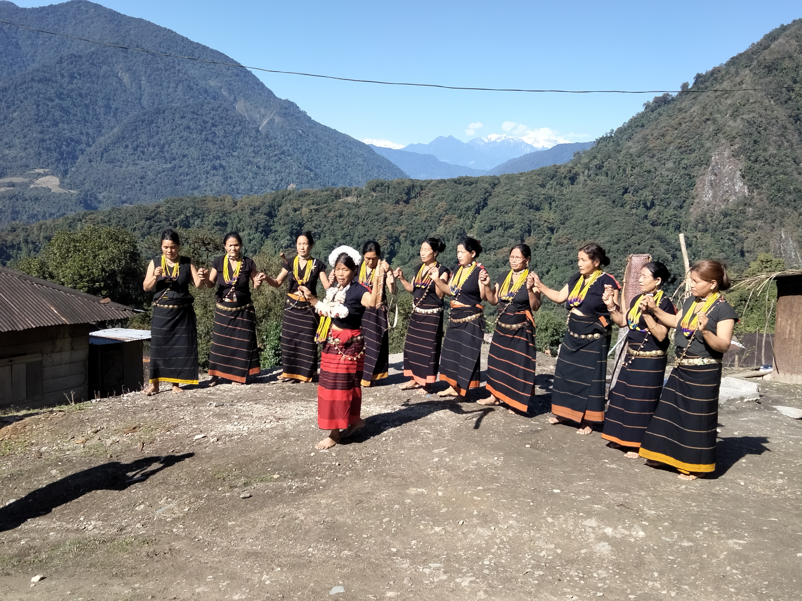

# 阿迪传统信仰与东尼—波罗祈福（Adi）

<!-- 来源：CC BY-SA 4.0 | https://commons.wikimedia.org/wiki/File:Ponung_dance_performance_of_Adi_women_minyong_at_high_altitude,_Gete_village,_Upper_Siang_district.jpg -->

## 概述

**阿迪人（Adi）** 分布于阿鲁纳恰尔邦西亚昂等河谷，含多个支系（公开叙述中常提及 Gallong／Galo 等）。多数遵循 **Donyi-Polo** 本土信仰：日—月象征未见之至高力，另有作物神、家屋守护等；礼仪处理善恶精灵。公开节庆与场所命名包括丰收节 **Solung**、公共祈祷场所 **Gangging**，以及 **Aran**、**Mirü** 等农事／社群礼仪叙事；血祭／血奉献在部分记述中出现，**仅 CONCEPT ONLY**。基督教在部分社区显著。本条目为教育概览；**不提供**献牲操作或可冒充祭司的步骤。

## 核心观念（祈福 / 功德 / 祈祷如何被理解）

祈福常被理解为：通过对 Donyi-Polo 与地方神灵的敬意，祈求丰收、家屋平安与社群秩序。功德贴近：支持阿迪语与湿地／山地农耕知识。访客的「福」体现为：先弄清支系自称，勿一锅炖；勿把 Solung 做成用户主持的献祭关卡。

## 典型仪式

### 1. Solung 丰收节（公开节庆层）
- **场合**：阿迪公开记述中的 **Solung** 等丰收／农事节庆。
- **主要步骤（概念层）**：理解集体庆祝、分享与农事感恩。**止于公开节庆层**；血奉献细节 **CONCEPT ONLY**。
- **物品**：节庆服饰、共餐外观。
- **谁来举行**：社群与家庭；游客可礼貌观礼公共庆祝。

### 2. Gangging 公共祈祷场所；Aran／Mirü（概念层）
- **场合**：复兴运动后的 **Gangging** 定期祈祷；公开神名／礼仪叙事中的 **Aran**、**Mirü** 等。
- **主要步骤（概念层）**：理解集体祈祷作为认同与信仰实践；知晓农事／家屋敬礼类型名称。**止于公开层**。
- **物品**：从略。
- **谁来举行**：引导者与信众；祭司职分属社群。

### 3. 血奉献与基督教并行（CONCEPT ONLY／概念层）
- **场合**：部分传统记述中的血祭／血奉献；部分支系堂会。
- **主要步骤（概念层）**：血奉献 **CONCEPT ONLY**——仅作文化史理解，**禁止**复现；基督教并行处理解并存与杂交实践，**勿审判**。
- **物品**：从略。
- **谁来举行**：祭司／教牧各司其职；外人不可扮演。

## 日常与节庆

优先 Wikipedia／民族志公开层；并与尼西、阿帕塔尼、珞巴语境区分。Solung 等节庆与 Gangging 集会构成可见公共节奏。

## 注意与尊重

**禁止献牲／血奉献演示。** 勿强入 Gangging 摄影。尊重支系差异。

## 手机互动适合度（Three.js 评估草稿）

- **档位：** B 仅氛围或图文场景
- **敏感度：** 高
- **判断：** **仅氛围／无用户主持。** 河谷景观与 Solung／Gangging 命名可说明；祭仪与血奉献不可操作化。
- **若做成互动：** 只做 Donyi-Polo／Solung 概念卡与河谷氛围；不提供献牲手势。
- **红线：** 禁止献牲、血奉献通关、冒充祭司。
- **评估状态：** 待后期统一评估

## 参考来源

- https://en.wikipedia.org/wiki/Adi_people
- https://en.wikipedia.org/wiki/Donyi-Polo
- https://joshuaproject.net/people_groups/16165/IN
