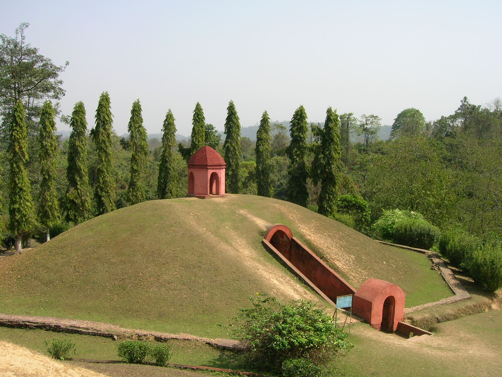

# 阿豪姆／普拉隆传统与祭祖节（Tai-Ahom Phuralung／Me-Dam-Me-Phi）

<!-- 来源：CC BY-SA 4.0 | https://commons.wikimedia.org/wiki/File:Charaideo_Maidam_of_Ahom_Kings_at_Charaideo_in_Sivasagar,_Assam_4.jpg -->

## 概述

**阿豪姆人（Ahom／Tai-Ahom）** 于十三世纪自今缅甸－云南一带进入布拉马普特拉河谷，建立阿豪姆王国，对今日印度阿萨姆历史影响深远。大英百科学生版等指出：阿豪姆原有自身神祇与礼仪，後来多采纳印度教与阿萨姆语，同时保留部分祖先崇拜与泰族民间宗教要素；近现代出现语言与文化复兴运动。传统信仰常称 **Phuralung（普拉隆）**：强调祖先（Dam）、天界／自然力量与祭司职分——公开记述中的 **Deodhai** 等祭司概念；公开节庆中最广为人知的是每年 **Me-Dam-Me-Phi**（向祖先与神灵奉献）。**2024 年**联合国教科文组织将查莱多（Charaideo）**Moidams** 坟丘葬制列入世界遗产，并提及相关祭祖礼仪在遗址仍有延续。本条目为教育性概览；**Deodhai 仅 CONCEPT**；**不提供** Ban-Phi 牲礼操作、祭司秘本或可复现祭祖祷词教程。

## 核心观念（祈福 / 功德 / 祈祷如何被理解）

祈福常被理解为：透过向祖先与神灵（Phi）奉献，求家族兴旺、社群平安，并维持与天界（Mong Phi 等公开表述）的连系。Me-Dam-Me-Phi 字面公开释义常拆解为奉献（Me）、祖先／亡者（Dam）与神灵（Phi）。功德贴近：参与家族／公共祭祖、尊重 **Deodhai** 祭司氏族职分、区分禁止牲礼的 Phuralung 类型礼仪与涉及 Ban-Phi 的限制性仪轨。访客的「福」体现为：在公开节日中遵守现场规则，不擅自进入王族坟丘核心或模仿牲礼。

## 典型仪式

### 1. Me-Dam-Me-Phi 祭祖节（概念层）
- **场合**：阿萨姆公开记述多定于每年 1 月 31 日；希瓦萨加尔、迪布鲁格尔等地有显著公共庆祝，部分地区为公共假期语境。
- **主要步骤（概念层）**：家庭与社群设祭、奉献食物与祝祷、纪念祖先。**仅概念介绍**；不提供祭品清单操作或祷词逐句教程。
- **物品**：祭台、传统服饰与公共集会外观。
- **谁来举行**：阿豪姆家庭、社群组织与有职分者。

### 2. Phuralung 与 Deodhai 祭司概念（限制性公共知识层）
- **场合**：家庭或社群层级的传统奉献；公开综述中的 **Deodhai** 祭司概念与 Phuralung／Ban-Phi 礼仪类型。
- **主要步骤（概念层）**：理解祭司职分与礼仪类型区分。**Deodhai 为 CONCEPT**；本档案**不提供**牲礼步骤或祭司秘本。
- **物品**：奉献用具外观（概念）。
- **谁来举行**：传统祭司氏族／家族长辈。

### 3. 2024 UNESCO Moidams 坟丘与王权记忆（概念层）
- **场合**：查莱多等地阿豪姆王族坟丘景观；**2024 UNESCO** 世界遗产语境下的纪念与祭祀延续。
- **主要步骤（概念层）**：参观与纪念以遗产保护规则为准；礼仪细节从略。
- **物品**：坟丘（moidam）外观。
- **谁来举行**：社群与遗产管理机构协作；游客仅观览。

## 日常与节庆

当代多数阿豪姆人同时生活在印度教、世俗与复兴传统的多重认同中。Me-Dam-Me-Phi 成为可见的族群文化标志；语言（Tai-Ahom）复兴与祭司文献整理仍在进行。尊重阿萨姆地方与社群对节庆、坟丘的管理。

## 注意与尊重

**勿把 Me-Dam-Me-Phi 简化为「吃喝节」。** 勿在 moidam 遗址擅动土石或摆拍「献牲」。涉及 Ban-Phi 与祭司文本时，仅作概念层理解。优先阿豪姆社群与阿萨姆官方／遗产口径。

## 手机互动适合度（Three.js 评估草稿）

- **档位：** B 仅氛围或图文场景
- **敏感度：** 中
- **判断：** **仅氛围／无用户主持。** 公开祭祖节与 2024 UNESCO moidam 遗产景观适合做成可走近的纪念场景与说明卡；牲礼与 Deodhai 祭司秘仪不可互动化。
- **若做成互动：** 只做可旋转的祭祖节外观、Charaideo／UNESCO 说明卡与「禁止模拟牲礼」提示；不提供点燃／奉献手势作为胜负条件。
- **红线：** 禁止模拟 Ban-Phi 牲礼、擅入坟丘核心、冒充 Deodhai，或以 Me-Dam-Me-Phi 真仪名称作胜负。
- **评估状态：** 待后期统一评估

## 参考来源

- https://kids.britannica.com/students/article/Ahom/623552
- https://www.britannica.com/topic/moidams-of-the-Ahom-dynasty
- https://whc.unesco.org/en/list/1711/
- https://assam.gov.in/about-us/399
