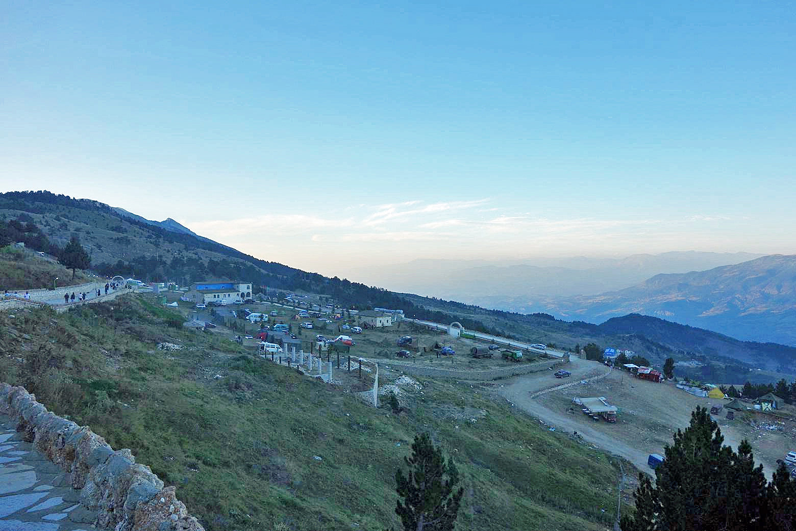

# 阿尔巴尼亚民间信仰与托莫尔山朝圣祈福（Albanian folk／Bektashi Tomorr）

<!-- 来源：CC BY-SA 4.0 | https://commons.wikimedia.org/wiki/File:Tekke_of_Abaz_Aliu,_Mount_Tomorr_-_Mapillary_(gKi6cc24uVhfp-Hq9ulIcw).jpg -->

## 概述

**阿尔巴尼亚民间信仰** 层累于天主教、东正教、逊尼伊斯兰与**贝克塔什（Bektashi）** 苏菲传统之上，并保留前基督教的山、日、祖先与民间疗愈叙事。公开文化与朝圣报道中，最广为人知的年度焦点之一是**托莫尔山（Mount Tomorr／Tomor）** 朝圣——多在**八月**高峰：贝克塔什信众纪念 **Abaz Ali** 等圣者叙事，登山祈祷、燃烛、献礼与共同体宴饮；公开记述中的 **qurbani（献牲／还愿屠牲）** 仅作概念层认知，**不提供操作**。亦吸引其他背景的寻求疗愈与好运者。城乡家户层则常见恶眼防护——包括 **Dordolec** 等稻草／布偶式驱邪「恶眼玩偶」的公共民俗外观——以及圣人／圣徒瞻礼、家庭守护实践与口头祝福。本条目为教育概览；**不提供**献牲操作、苏菲密契脚本、咒语配方或任何可冒充教团权威的程序。

## 核心观念（祈福 / 功德 / 祈祷如何被理解）

祈福常被理解为：在宗教多元并存的民族伦理（常概括为宽容共处）中，通过朝圣、圣人敬礼与家庭祝福，寻求健康、丰饶与保护。功德贴近：完成托莫尔等圣地的艰苦步行、施舍、尊重不同教派邻里、维护家户圣角。访客的「福」体现为：拒绝把阿尔巴尼亚简化为「欧洲唯一穆斯林国家」标签，承认基督教与贝克塔什的深厚根基。

## 典型仪式

### 1. 托莫尔山贝克塔什朝圣（公共层；八月高峰）
- **场合**：夏季／八月年度朝圣高峰。
- **主要步骤（概念层）**：公开报道——登山、祈祷、烛火与供奉外观、共同体聚会；**八月 qurbani 仅作概念命名，不提供操作**。
- **物品**：山径与圣所外观（概念）。
- **谁来举行**：贝克塔什教团与朝圣者。

### 2. 教堂／清真寺瞻礼与家庭祝福（公共层）
- **场合**：主保圣人日、开斋／宰牲节、复活节等。
- **主要步骤（概念层）**：礼拜、家宴与邻里拜访。**止于概念**。
- **物品**：宗教建筑外观（概念）。
- **谁来举行**：教牧／伊玛目与家庭。

### 3. 民间护佑与口头祝福余绪（Dordolec 等，概念层）
- **场合**：日常生活中的恶眼防护与疗愈叙事。
- **主要步骤（概念层）**：理解其作为焦虑管理与邻里伦理的文化功能；公开民俗中的 Dordolec 玩偶属象征性外观。**禁止**咒语配方或制作教程。
- **物品**：Dordolec 等外观（概念）。
- **谁来举行**：家庭长辈。

## 日常与节庆

阿尔巴尼亚社会主义时期的官方无神论曾压抑公共宗教，1990 年后朝圣与教团生活显著复兴。写作应与本档案「阿列维」条目区分：托莫尔朝圣是巴尔干贝克塔什语境，不宜直接等同安纳托利亚阿列维。

## 注意与尊重

**勿在朝圣拥挤山径作出危险「网红」行为。** 勿嘲笑贝克塔什礼仪。非信徒勿擅自进入限制区域或领受限定性圣物。勿煽动教派对立。献牲仅作概念认知。

## 手机互动适合度（Three.js 评估草稿）

- **档位：** C 可做致敬小品（非真仪）
- **敏感度：** 低–中
- **判断：** 登山朝圣风光与烛火意向适合轻量致敬；密契与献牲不可操作化。取 C：原创手势练习，明确非真仪。
- **若做成互动：** 手势练习示例——(1) 陀螺仪眺望托莫尔山说明卡；(2) 拖动将「和平意向」放入意向簿示意；(3) 写下为旅人／病者的一句祝福；(4) 点亮烛火象征希望。禁止献牲闯关。
- **红线：** 禁止模拟献牲、密契入会或以真朝圣仪轨名称作胜负。
- **评估状态：** 待后期统一评估

## 参考来源

- https://balkaninsight.com/2016/05/18/quarries-make-hellish-mess-of-albania-s-holy-mountain-05-16-2016/
- https://doi.org/10.3390/rel16020163
- https://albaniandailynews.com/news/holy-pilgrimage-thousands-of-bektashi-believers-climb-mount-tomorri-
- https://albaniaheritage.com/en/mali-i-tomorrit-dhe-baba-tomorri/
- https://doi.org/10.3390/histories4010009
