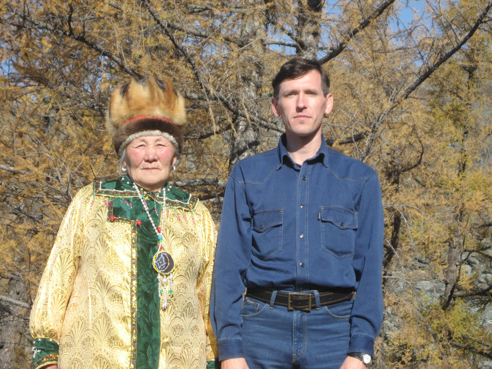

# 阿尔泰／白教布尔汗信仰（Ak Jang／Burkhanism）

<!-- 来源：CC BY 4.0 | https://commons.wikimedia.org/wiki/File:Burkhanist_workers_at_Tereng.jpg -->

## 概述

**阿尔泰人（Altaians／Altai-kizhi 等）** 居住于俄罗斯阿尔泰共和国一带的突厥语族群。百科全书与学术综述指出：传统宗教长期以萨满（***kam***）、天／火与家宅灵观念为核心；1904 年前後兴起民族宗教运动 **Ak Jang（白教／白信仰）**，俄语文献常称 **Burkhanism（布尔汗教）**，融合阿尔泰民间信仰、腾格里宇宙观、藏传佛教要素与部分东正教接触经验，曾反对「黑信仰」式血腥献牲，强调乳品、香火等「白」奉献。公开文化符号包括系挂 **Jalama** 白丝带、**Sang** 杜松／乳品烟熏奉献概念，以及 **Kai／Kaichi** 喉音史诗演唱；***kam*** 鼓为限制性公共知识。苏联时期遭压制，後苏联以来有复兴与再诠释。本条目为教育性概览；**Kam 鼓 CONCEPT ONLY／restricted**；**不提供**萨满出神程序、献牲替代操作或祭司职分教程。

## 核心观念（祈福 / 功德 / 祈祷如何被理解）

祈福常理解为在上／中／下三界秩序中求得人畜平安、旅途与牧业顺遂，并以「白」奉献表达对至上者／保护神与祖先叙事的敬意。功德贴近：维护火塘与家宅洁净、尊重史诗演唱者（***kaichi***）与社群年节、在复兴语境中区分公开文化展演与需资格的礼仪。访客的「福」体现为观礼、不擅自敲鼓「扮演萨满」、不把乳酒／乳品奉献写成可通关小游戏。

## 典型仪式

### 1. Jalama 白丝带与 Sang 杜松／乳品奉献（概念层）
- **场合**：日常护宅、节庆、行前祈请；公开可见的 **Jalama** 白丝带系挂与 **Sang** 杜松／乳品烟熏奉献叙事。
- **主要步骤（概念层）**：公开记述概括为对火与家宅灵致敬、以乳制品／香等非血腥「白」奉献表达取向。**Sang 为 CONCEPT**；不提供奉献配方或可复现步骤。
- **物品**：白丝带外观、火塘、乳品容器外观。
- **谁来举行**：家庭与受承认的礼仪承担者。

### 2. Kai／Kaichi 喉音史诗（公共文化层）
- **场合**：婚礼、节庆、文化复兴集会；***kaichi*** 以 **Kai** 喉音传统咏唱英雄史诗。
- **主要步骤（概念层）**：以 *topshur* 等乐器伴奏咏唱，承载伦理与宇宙叙事。可作文化教育场景，不把它写成「召唤神灵关卡」。
- **物品**：弦乐器外观。
- **谁来举行**：史诗传承人。

### 3. Kam 鼓（限制性公共知识层，CONCEPT ONLY）
- **场合**：问病、寻因、与灵界交涉（传统表述）中的 ***kam*** 与鼓。
- **主要步骤（概念层）**：民族志框架提及鼓、出神与灵伴。**CONCEPT ONLY／restricted**；**不提供**诱导、鼓点或可复现出神脚本。
- **物品**：萨满鼓外观（博物馆常见）。
- **谁来举行**：社群承认的 *kam*；非游客角色扮演。

## 日常与节庆

当代阿尔泰信仰生活常并置萨满传统、白教复兴、佛教兴趣与东正教背景；知识分子与草根对「何为真正阿尔泰信仰」常有不同强调。观光活动中的服装与音乐会不等于完整宗教资格。

## 注意与尊重

**勿擅自使用萨满鼓或模仿出神。** 勿将布尔汗／白教简化为可下载的「反萨满通关包」。涉及献牲史与替代奉献时，仅作概念层理解。优先阿尔泰社群与同行评审研究口径。

## 手机互动适合度（Three.js 评估草稿）

- **档位：** B 仅氛围或图文场景
- **敏感度：** 中
- **判断：** **仅氛围／无用户主持。** 阿尔泰山地、Jalama 白丝带远观与 Kai 史诗乐器适合做成可旋转氛围场景与说明卡；Kam 出神与任何献牲／Sang 操作不可互动化。
- **若做成互动：** 只做可旋转的阿尔泰风景／毡房外观、史诗乐器图文卡与「勿扮演萨满」警示；不提供击鼓出神或奉献操作。
- **红线：** 禁止模拟出神附体、献牲、伪造祭司职分，或以 Ak Jang／Burkhan 真仪名称作胜负。
- **评估状态：** 待后期统一评估

## 参考来源

- https://www.encyclopedia.com/humanities/encyclopedias-almanacs-transcripts-and-maps/altaians
- https://doi.org/10.1080/1361736042000245295
- https://studybuddhism.com/en/advanced-studies/history-culture/buddhism-in-russia/the-pre-soviet-history-of-buddhism-in-the-russian-empire/the-pre-soviet-history-of-buddhism-in-altai
- https://www.britannica.com/topic/shamanism
