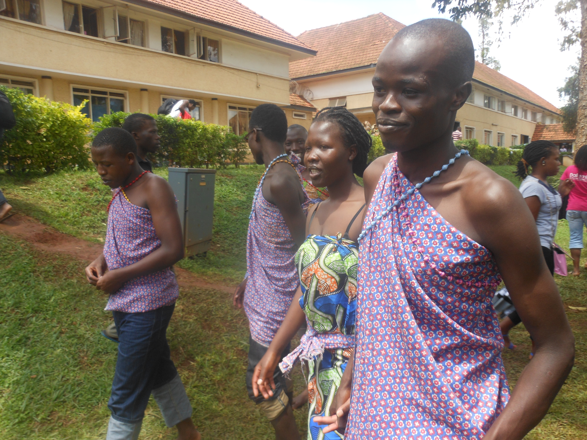

# 阿卢尔传统信仰与艾伯特湖祈福（Alur）

<!-- 来源：CC BY-SA 4.0 | https://commons.wikimedia.org/wiki/File:Alur_fashion.JPG -->

## 概述

**阿卢尔人（Alur）** 分布于乌干达—刚果民主共和国艾伯特湖／西尼罗一带，属尼罗特语群社群。公开叙述涉及酋长（**Rwoth**）求雨／权威叙事、祖灵与 **Jok** 圣所概念，以及湖泊生计祝福叙事——与基督教接触并存——**中高敏感**。教育概览；**Rwoth／Jok／湖泊祝福均为 CONCEPT — non-operational**；不提供祭祀操作。与阿乔利、兰吉、卢奥等条目区分。

## 核心观念（祈福 / 功德 / 祈祷如何被理解）

祈福常被理解为：通过对祖灵、土地、Rwoth 权威叙事与社区道德秩序的正确关系，求丰收、健康与家庭平安。功德贴近：支持跨界和平与母语教育。访客的「福」体现为：尊重**公开**教会与文化日；不把求雨叙事做成用户可主持的仪轨。

## 典型仪式

### 1. Rwoth 求雨／酋长叙事（CONCEPT — non-operational）
- **场合**：公开文化叙述中的 **Rwoth** 酋长权威与求雨／护佑叙事。
- **主要步骤（概念层）**：理解酋长—社群伦理与雨泽象征关联。**CONCEPT／非操作性**；**禁止**求雨咒语或祭祀操作指南。
- **物品**：从略。
- **谁来举行**：传统承认的权威；外人不可扮演。

### 2. Jok 圣所概念（CONCEPT — non-operational）
- **场合**：公开记述中的 **Jok** 地方灵／圣所敬礼叙事。
- **主要步骤（概念层）**：理解祖灵与 Jok 秩序。**CONCEPT ONLY／非操作性**。
- **物品**：从略。
- **谁来举行**：家庭与长者（内部）。

### 3. 湖泊生计祝福叙事与基督教公开礼拜（概念层）
- **场合**：艾伯特湖渔猎／农作公开生计祝福叙事；教堂与社区聚会。
- **主要步骤（概念层）**：理解分享、生态尊重与公开礼拜。**湖泊祝福为叙事／概念层**；**勿写成求雨咒语教程**；礼拜止于公开层。
- **物品**：从略。
- **谁来举行**：家庭与教会会众。

## 日常与节庆

优先公开文化与教会活动；关注边境旅行安全。

## 注意与尊重

勿将西尼罗民族工具化为冲突符号。禁止用户主持 Rwoth／Jok 仪轨。

## 手机互动适合度（Three.js 评估草稿）

- **档位：** B 仅氛围或图文场景
- **敏感度：** 中高
- **判断：** **仅氛围／无用户主持。** 可做湖岸—村落氛围与生计说明；不可做 Rwoth 求雨或 Jok 祭祀核心。
- **若做成互动：** 静态艾伯特湖图文与尊重说明；不提供求雨／献牲手势。
- **红线：** 禁止祭祀通关、冒充长老／Rwoth、冲突关卡化。
- **评估状态：** 待后期统一评估

## 参考来源

- https://www.britannica.com/topic/Alur
- https://www.britannica.com/place/Lake-Albert-lake-Africa
- https://www.britannica.com/place/Uganda
