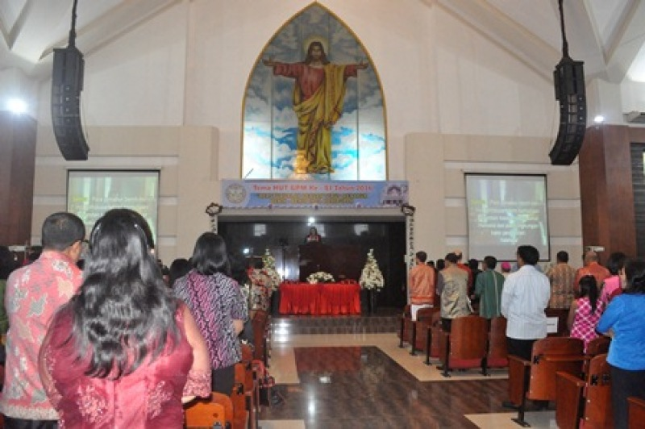

# 安汶基督教／伊斯兰与马鲁古习惯法祈福（Ambonese）

<!-- 来源：Public domain (PD Indonesian Government) | https://commons.wikimedia.org/wiki/File:GPM_Maranatha_Ambon.jpg -->

## 概述

**安汶人（Ambonese）** 为印度尼西亚马鲁古群岛安汶及周边的跨宗教社群，历史上以基督教（尤新教）与伊斯兰并置、以及香料贸易闻名。公开概述记述：教堂／清真寺礼仪构成公共祈福主轴；**adat（习惯法）** 与祖先敬意在和解、土地与生命礼仪中仍重要；跨村跨教的 **Pela Gandong**（pela／血缘结盟式互惠）被视为马鲁古和平与互保的重要公开记忆；部分地方叙述亦提及 **Raja（传统首领）** 祝福概念。教派冲突记忆使当代和平建设格外关键。本条目为教育概览；**仅概念／观礼层**；**不提供**政治动员、Raja 祝福 how-to 或可冒充神职的脚本。

## 核心观念（祈福 / 功德 / 祈祷如何被理解）

祈福常被理解为：在各自宗教框架内求护佑，并通过 **Pela Gandong** 与 adat 等地方机制维护跨村、跨教和平。功德贴近：支持马鲁古和平教育与香料文化遗产。访客的「福」体现为：不挑起教派话题猎奇，理解结盟伦理为地方社群自治遗产。

## 典型仪式

### 1. Pela Gandong 跨教结盟与和平纪念（公开／概念层）
- **场合**：跨村 pela 纪念、和平教育活动、共同节庆公开层。
- **主要步骤（概念层）**：理解 **Pela Gandong** 作为跨基督教／伊斯兰村社互惠与互保的公开叙述；纪念冲突后的共在努力。**勿消费冲突创伤**；止于教育概念。
- **物品**：从略（纪念物外观因活动而异）。
- **谁来举行**：社群长老、公民组织与村社代表；外人不可主持结盟仪式。

### 2. Adat 习惯法与 Raja 祝福 CONCEPT（概念层）
- **场合**：婚约、土地、冲突调解；公开记述中的传统首领（**Raja**）祝福概念。
- **主要步骤（概念层）**：理解 adat 与祖先伦理的公共作用，以及 **Raja blessing CONCEPT**（仅命名／概念）。**禁止**复现内部秘仪或用户仿作首领祝福。
- **物品**：从略。
- **谁来举行**：长老、家庭与被承认的地方权威。

### 3. 清真寺／教堂公共崇拜（公开层）
- **场合**：主日／主麻、大节。
- **主要步骤（概念层）**：理解基督教或伊斯兰公开崇拜层。**止于公开堂寺层**。
- **物品**：从略。
- **谁来举行**：牧师／伊玛目与信众。

## 日常与节庆

优先 Britannica 马鲁古／安汶公开层；并与米纳哈萨、东帝汶、托拉查条目区分。

## 注意与尊重

**勿在教派议题上煽动。** 弥撒／礼拜中保持恭敬。禁止把冲突史写成旅游卖点。勿冒充 Raja 或 adat 仲裁者。

## 手机互动适合度（Three.js 评估草稿）

- **档位：** B 仅氛围或图文场景
- **敏感度：** 中高
- **判断：** **仅氛围／无用户主持。** 港口与教堂／清真寺外观、Pela Gandong 命名说明可做图文场景；圣事、Raja 祝福与冲突叙事不可操作化／游戏化。
- **若做成互动：** 只做香料史＋和平共在／Pela 命名说明卡；不提供主持礼拜或结盟手势。
- **红线：** 禁止戏仿圣事、礼拜通关、消费教派冲突、冒充 Raja／adat 仲裁。
- **评估状态：** 待后期统一评估

## 参考来源

- https://www.britannica.com/place/Ambon
- https://www.britannica.com/place/Moluccas
- https://www.britannica.com/topic/Protestantism
