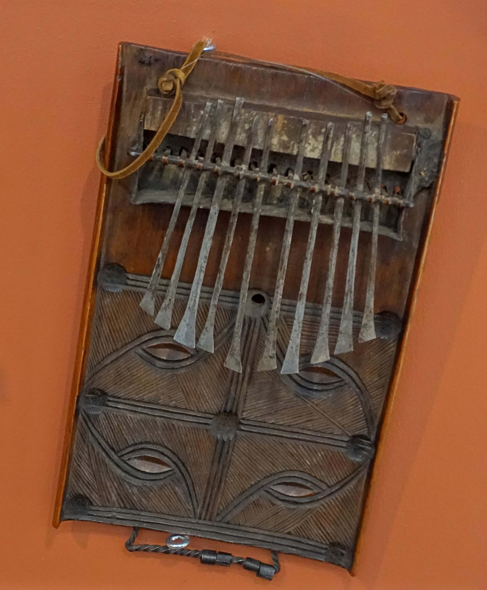

# 安本杜传统信仰与北部安哥拉祈福（Ambundu / Kimbundu）

<!-- 来源：CC0 1.0 | https://commons.wikimedia.org/wiki/File:Mbira_thumb_piano,_Angola_(Mbundu),_wood,_leather,_metal_-_Redpath_Museum_-_McGill_University_-_Montreal,_Canada_-_DSC08249.jpg -->

## 概述

**安本杜人（Ambundu，语言为 Kimbundu）** 分布于安哥拉北部（含罗安达腹地历史区域）。公开叙述涉及祖灵（常以 **Mukishi／Hamba** 等概念称述）、至高神 **Nzambi** 命名、社区伦理与基督教接触——**中高敏感**。公开文化层亦可见 **Dikanza**、**Semba** 等音乐／节奏传统。教育概览；**仅概念层**；不提供祭祀操作。与奥文本杜（Ovimbundu）、巴刚果等安哥拉条目区分——安本杜为独立民族史，不另开空洞 mbundu 混名卡。

## 核心观念（祈福 / 功德 / 祈祷如何被理解）

祈福常被理解为：通过对祖灵（**Mukishi／Hamba CONCEPT**）、**Nzambi** 命名与社区道德秩序的正确关系，求健康、司法公正与家庭平安。功德贴近：支持战后和解叙事与语言教育。访客的「福」体现为：尊重**公开**教堂与文化日，理解祖灵伦理止于概念。

## 典型仪式

### 1. Mukishi／Hamba 祖灵伦理与 Nzambi 命名（敏感，仅 CONCEPT）
- **场合**：公开历史与人类学概述。
- **主要步骤（概念层）**：理解 **Mukishi／Hamba** 祖灵伦理与 **Nzambi** 命名。**CONCEPT ONLY**；**禁止**祭祀操作指南、招魂或冒充仪者。
- **物品**：从略。
- **谁来举行**：家庭与仪式专家（内部）。

### 2. 基督教公开礼拜（公开层）
- **场合**：教堂与节庆。
- **主要步骤（概念层）**：从众参加公开礼拜。**止于公开层**。
- **物品**：从略。
- **谁来举行**：教会与会众。

### 3. Dikanza／Semba 公共音乐与国家文化日（公开层）
- **场合**：合法文化活动、公开音乐展演。
- **主要步骤（概念层）**：欣赏 **Dikanza**、**Semba** 等公开音乐／舞蹈层。**勿盗用礼仪性曲目当游戏BGM。**
- **物品**：从略。
- **谁来举行**：文化团体与音乐家。

## 日常与节庆

优先罗安达等公开文化与教会活动。

## 注意与尊重

勿将内战创伤娱乐化。区分 Ambundu 与 Ovimbundu。祖灵与 Nzambi 仅概念命名，禁止操作化。

## 手机互动适合度（Three.js 评估草稿）

- **档位：** B 仅氛围或图文场景
- **敏感度：** 中高
- **判断：** **仅氛围／无用户主持。** 可做城市—教堂氛围与 Dikanza／Semba 命名说明；不可做祖灵祭祀操作。
- **若做成互动：** 静态安哥拉文化图文与尊重说明；不提供祭祀手势。
- **红线：** 禁止祭祀通关、冒充仪者、战争关卡化、招魂。
- **评估状态：** 待后期统一评估

## 参考来源

- https://www.britannica.com/topic/Mbundu
- https://www.britannica.com/place/Angola
- https://www.britannica.com/place/Luanda
