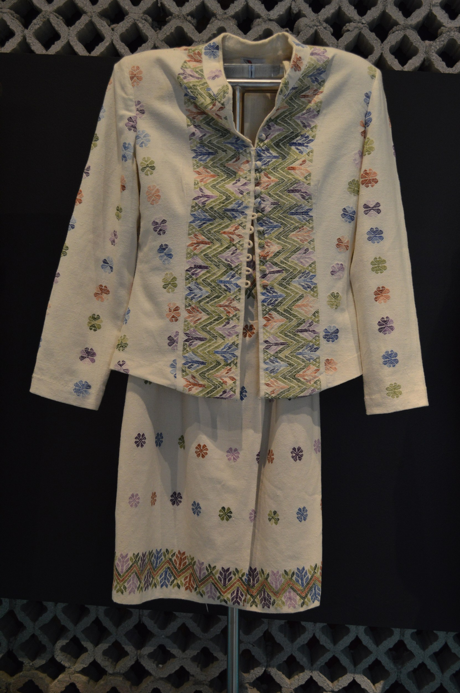

# 阿穆斯戈民间天主教与纺织—雨神祈福（Amuzgo）

<!-- 来源：CC BY-SA 4.0 | https://commons.wikimedia.org/wiki/File:OchoRegiones012.JPG -->

## 概述

**阿穆斯戈人（Amuzgo）** 分布于墨西哥格雷罗与瓦哈卡交界。公开概述记述：天主教圣徒与雨神—玉米伦理交织；以 **huipil** 等纺织闻名；**San Pedro** 等主保节与 **mayordomía（堂区／节庆执事）** 构成公共祈福层。本条目为教育概览；雨／玉米神祇 **CONCEPT ONLY**；**不提供**献牲、疗愈脚本或可冒充仪者的步骤。与米斯特克、纳瓦、特里基等邻族区分，填补梅索美洲少数族群缺口。

## 核心观念（祈福 / 功德 / 祈祷如何被理解）

祈福常被理解为：通过对主保圣人、**mayordomía** 公共责任与雨神／玉米伦理（**CONCEPT ONLY**）的敬意，求雨水、健康与织作顺利。功德贴近：支持阿穆斯戈语与公平纺织贸易。访客的「福」体现为：节庆中礼让本地礼仪，购买 **huipil** 等织物走公平渠道。

## 典型仪式

### 1. Huipil 纺织与女性礼仪空间（公共文化／概念层）
- **场合**：织作、家庭祝福与公开展示。
- **主要步骤（概念层）**：理解 **huipil** 纺织作为文化与生计核心。**止于概念；勿强行进入私密空间。**
- **物品**：huipil 与织机外观（概念）。
- **谁来举行**：织者与家庭。

### 2. San Pedro 主保节与 mayordomía（公开层）
- **场合**：瞻礼、主日、**San Pedro** 等主保节；**mayordomía** 公开执事责任。
- **主要步骤（概念层）**：理解弥撒、游行与 mayordomía 的公共组织角色。**止于公开观礼层**；禁止用户扮演执事主持。
- **物品**：从略。
- **谁来举行**：神职、mayordomos 与社群。

### 3. 雨神—玉米祈请（CONCEPT ONLY）
- **场合**：播种、求雨公开记述。
- **主要步骤（概念层）**：理解雨水—丰收伦理命名。**CONCEPT ONLY**；**禁止**复现祭仪、献牲或用户祈雨操作。
- **物品**：从略。
- **谁来举行**：家庭与地方权威（内部）。

## 日常与节庆

优先格雷罗／瓦哈卡交界公开文化层。

## 注意与尊重

**勿强求萨满清洗。** 摄影须许可。禁止把纺织仪式奇观化。雨／玉米神祇仅概念。

## 手机互动适合度（Three.js 评估草稿）

- **档位：** B 仅氛围或图文场景
- **敏感度：** 高
- **判断：** **仅氛围／无用户主持。** 纺织与 San Pedro／mayordomía 公开层可说明；雨神祭仪不可操作化。
- **若做成互动：** 只做纺织伦理＋圣人／mayordomía 概念卡；不提供祈雨或献牲手势。
- **红线：** 禁止献牲、疗愈脚本、冒充仪者／执事、用户主持求雨。
- **评估状态：** 待后期统一评估

## 参考来源

- https://www.britannica.com/topic/Amuzgo
- https://www.britannica.com/place/Guerrero
- https://www.britannica.com/place/Oaxaca-state-Mexico
