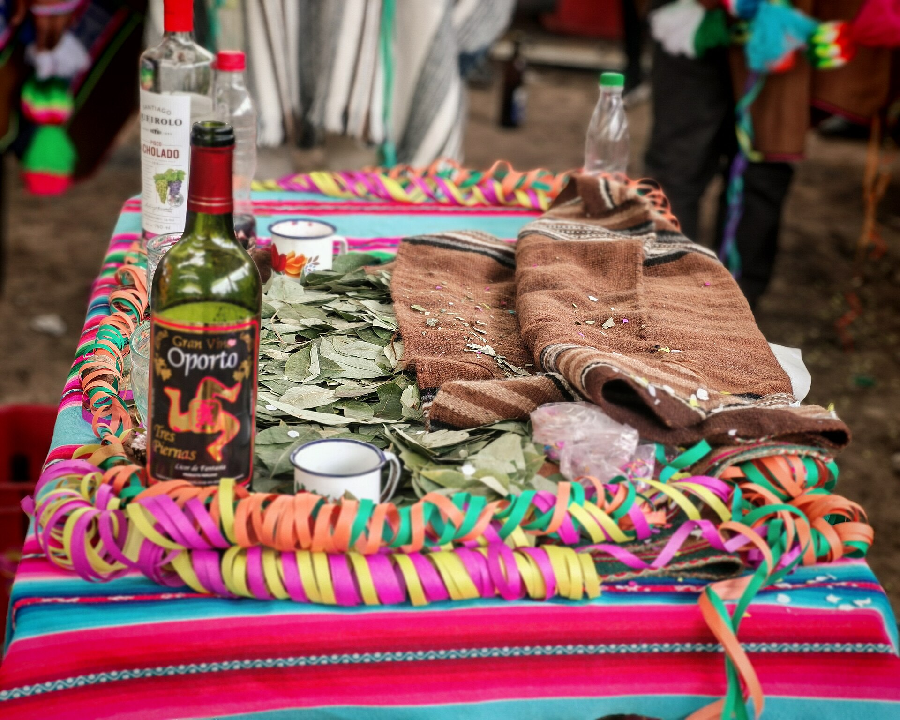

# 安第斯／印加余绪（despacho、pago a la tierra）

<!-- 来源：CC BY-SA 4.0 | https://commons.wikimedia.org/wiki/File:Mesa_de_ofrenda_a_la_Pachamama.jpg -->

## 概述

安第斯山脉社群（含克丘亚、艾马拉等）的宇宙观强调人类与大地母亲 **Pachamama**、山灵 **Apus** 之间的互惠（*ayni*）。祈福与感恩常透过献给大地的礼包仪式来表达，西班牙语地区广泛称为 **despacho** 或 **pago a la tierra**（付地／大地酬付）；公开叙述中由 **Paqo**（地方仪式专家）主持，**用户仅观礼**。公开概念亦包括 **Kintu**（古柯叶三叶组等供奉概念）、洒酒 **ch’alla**，以及 **Qoyllurit'i** 等高原朝圣命名。印加国家礼仪已成历史，但地方农牧周期中的供奉在殖民与天主教影响下继续以融合形式存在。联合国教科文组织登录的卡亚瓦亚安第斯宇宙观，展示了仪式、医药与神话的整体性。本条目为教育概览；**不提供** despacho 配置 how-to、迷幻植物线或用户主持操作。

## 核心观念（祈福 / 功德 / 祈祷如何被理解）

大地提供收成与生命，人类必须以尊重、供物与节庆回报，否则可能遭遇失衡。*Despacho* 是一份精心排列的象征礼包；**Paqo performs Despacho — users view only**。**Kintu** 古柯叶供奉为 CONCEPT。功德近于维持互惠与社区劳动互助。天主教圣徒节常与地方山灵崇拜叠合。治疗师／祭司权威来自学徒制与社区认可；访客不得主持。

## 典型仪式

### 1. Paqo 主持 Despacho／pago a la tierra（观礼层）
- **场合**：播种与收获、建房、家庭感恩、八月致敬帕查玛玛等。
- **主要步骤（概念层）**：由 **Paqo** 在洁净布上排列供物成礼包；祈祷呼请大地与山灵；焚烧或埋入大地（方式因地而异）。**用户仅观看／理解**；不提供物项清单教程或用户仿作。
- **物品**：布、谷物、糖、花、酒、古柯叶等外观（概念；地方清单不同）。
- **谁来举行**： **Paqo** 或有经验的长者；家庭延请。外人不可主持。

### 2. Kintu 古柯叶与 ch’alla 洒酒（CONCEPT）
- **场合**：供奉、新物启用、车辆、店铺、节日。
- **主要步骤（概念层）**：理解 **Kintu**（古柯叶 CONCEPT）与 **ch’alla** 洒向大地／物件角落的公开叙述。**CONCEPT ONLY**；禁止用户操作教程。
- **物品**：古柯叶、酒类饮料外观（概念）。
- **谁来举行**：主人、受邀长者或 Paqo。

### 3. Qoyllurit'i 朝圣命名与社区节庆（公开命名层）
- **场合**：天主教圣徒节与地方年历重叠；高原朝圣（公开命名如 **Qoyllurit'i**）。
- **主要步骤（概念层）**：弥撒与土著供奉并行；舞蹈、音乐、分享食物；向山灵致意。**止于朝圣命名与观礼规范**。
- **物品**：圣像、旗帜、供品、乐器。
- **谁来举行**：村社、兄弟会与仪式专家共同组织。

## 日常与节庆

八月常被视为特别尊崇帕查玛玛的时段。农事节点决定小型酬付频率。城市移民把 *despacho* 带进公寓与文化中心，出现旅游化版本；社区内部仪式仍强调关系与责任。

游客市场出售的“安第斯礼包体验”品质参差。尊重的做法是：若受邀观礼则听从指引，不把古柯叶与供物当新奇消费品，不擅自在考古遗址“自创祭献”。

## 注意与尊重

完整 *despacho* 的物项配置与祷词属地方知识，勿从网络抄流程在圣地操作。考古遗址与国家公园常禁止焚烧埋物。涉及迷幻植物的治疗线属高度敏感与法律风险领域，本档案不讨论。摄影与商业展演需社区同意。

## 手机互动适合度（Three.js 评估草稿）

- **档位：** B 仅氛围或图文场景
- **敏感度：** 中
- **判断：** **仅氛围／无用户主持。** 完整 despacho 由 Paqo 主持；用户仅观礼。Kintu／ch’alla 为 CONCEPT；Qoyllurit'i 可作朝圣命名说明。做成可完成献地礼仍有僭越风险。
- **若做成互动：** 只做可旋转／可走近的高原场景与说明卡（含 Qoyllurit'i 命名）；不作主持或献祭。
- **红线：** 不提供 despacho 配置流程、圣地焚埋操作、迷幻植物线，或用户扮演 Paqo。
- **评估状态：** 待后期统一评估

## 参考来源

- https://ich.unesco.org/en/RL/andean-cosmovision-of-the-kallawaya-00048
