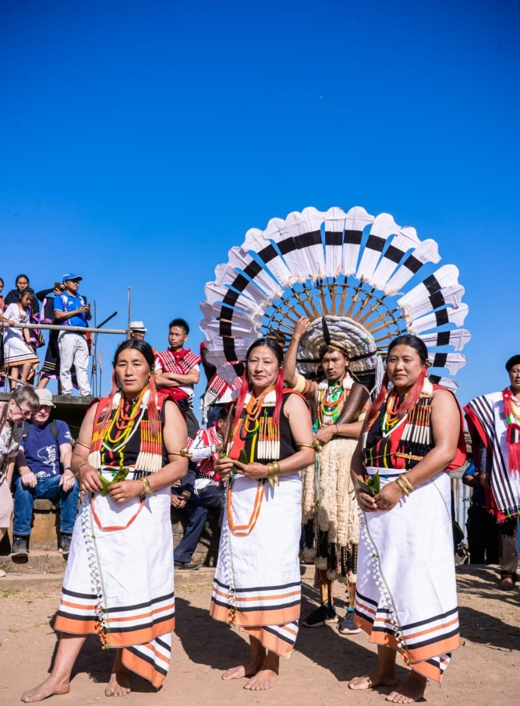

# 安加米那加基督教与普夫察纳祈福余绪（Angami）

<!-- 来源：CC BY-SA 4.0 | https://commons.wikimedia.org/wiki/File:Angami_Tribe_NAGALAND_INDIA_20.jpg -->

## 概述

**安加米那加人（Angami Naga）** 主要分布于印度那加兰科希马等地。公开记述：今日绝大多数为基督徒（浸信会等影响深远）；传统宗教称 **Pfütsana／Krüna**，仅极少数村落实践，1987 年起有护持组织；公开文化年历突出 **Sekrenyi** 节庆与邦级 **Hornbill Festival** 等认同展演。历史上有精灵、禁忌周期（genna）、**Feast of Merit（功勋宴）** 等历史概念，以及祭司传统。本条目为教育概览；**Pfütsana CONCEPT ONLY**；**不提供**猎首历史操作化、献牲或可冒充祭司的步骤。与那加总览、米佐、钦—佐米条目可比较。

## 核心观念（祈福 / 功德 / 祈祷如何被理解）

祈福常被理解为：在多数社区通过基督崇拜求护佑；在 Pfütsana 少数实践者中通过对至高神与地方灵的敬意维系社群秩序（**CONCEPT ONLY**）。功德贴近：支持 Tenyidie 语言与诚实讲述改宗史。访客的「福」体现为：不把少数传统信仰者写成「未开化标本」；区分舞台文化节与封闭仪轨。

## 典型仪式

### 1. Sekrenyi 与 Hornbill Festival（公开文化层）
- **场合**：**Sekrenyi** 等安加米岁时／洁净—认同节庆公开层；邦级 **Hornbill Festival** 等文化展演。
- **主要步骤（概念层）**：理解节庆作为认同与部分宗教记忆载体。**区分舞台与封闭仪轨**；止于观礼／命名。
- **物品**：从略（服饰与舞台外观）。
- **谁来举行**：文化组织与村社；外人不可主持真祭。

### 2. Feast of Merit 历史 CONCEPT（概念层）
- **场合**：公开民族志中的历史功勋宴叙述。
- **主要步骤（概念层）**：理解 **Feast of Merit** 作为历史社会地位与互惠宴饮概念。**historical CONCEPT**；禁止复现献牲或地位竞赛操作。
- **物品**：从略。
- **谁来举行**：历史记述中的社群主办者（当代不可用户仿作）。

### 3. Pfütsana 护持与基督教并存（高度敏感，CONCEPT ONLY）
- **场合**：南部少数村落公开记述；多数社区的浸信会／基督教崇拜。
- **主要步骤（概念层）**：理解本土宗教护持组织的存在与公开教会层。**Pfütsana CONCEPT ONLY**；**禁止**复现 genna／献牲细节。
- **物品**：从略。
- **谁来举行**：被承认的实践者与社群；牧师与会众（教会层）。

## 日常与节庆

优先 Wikipedia／民族志公开层；注意那加兰政治敏感，外人勿煽动。

## 注意与尊重

**严禁猎首题材操作化。** 勿强求传统宗教表演。禁止献牲旅游。Feast of Merit／Pfütsana 仅概念。

## 手机互动适合度（Three.js 评估草稿）

- **档位：** B 仅氛围或图文场景
- **敏感度：** 高
- **判断：** **仅氛围／无用户主持。** 山地教堂外观、Sekrenyi／Hornbill 命名可说明；猎首史、Feast of Merit 献牲与 Pfütsana 不可操作化。
- **若做成互动：** 只做信仰变迁与节庆命名说明卡；不提供主持或献牲手势。
- **红线：** 禁止猎首、献牲、冒充祭司、戏仿圣事、用户主持 Pfütsana。
- **评估状态：** 待后期统一评估

## 参考来源

- https://en.wikipedia.org/wiki/Angami_Naga
- https://en.wikipedia.org/wiki/Pf%C3%BCtsana
- https://joshuaproject.net/people_groups/16219/IN
