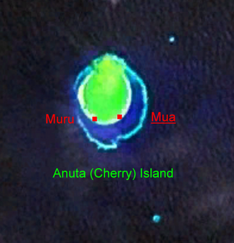

# 阿努塔传统信仰与基督教—酋长祈福（Anuta）

<!-- 来源：Public domain（NASA World Wind） | https://commons.wikimedia.org/wiki/File:Anuta_169.85030E_11.61124S.png -->

## 概述

**阿努塔（Anuta）** 为所罗门群岛东南极小的波利尼西亚外岛，与提科皮亚文化相关但社群自有边界。公开民族志记述：基督教占主导，同时酋长权威、祖先记忆与严格资源伦理维系小岛生存；人口少、生态脆弱，外来访问须极度克制。本条目为教育概览；**不提供**历史献牲或可冒充酋长／祭司的步骤。

## 核心观念（祈福 / 功德 / 祈祷如何被理解）

祈福常被理解为：在教堂礼仪中求护佑，并通过遵守首领与互惠规范维持岛屿繁荣。功德贴近：支持小岛气候适应与研究伦理（知情同意、最小干扰）。访客的「福」体现为：**默认不去**，除非明确受邀并遵守一切规范。

## 典型仪式

### 1. 基督教堂区礼仪（概念层）
- **场合**：主日、生命礼仪。
- **主要步骤（概念层）**：理解当代主要公共崇拜。**止于公开教会层**。
- **物品**：从略。
- **谁来举行**：教牧与信众。

### 2. 酋长与资源伦理（敏感，仅概念）
- **场合**：分配、和解、正式集会公开记述。
- **主要步骤（概念层）**：理解首领权威与分享规范。**勿擅自要求演示**。
- **物品**：从略。
- **谁来举行**：酋长与长者。

### 3. 祖先记忆（高度敏感，仅概念）
- **场合**：口述与历史叙述。
- **主要步骤（概念层）**：理解祖先在认同中的位置。**禁止**复现献祭。
- **物品**：从略。
- **谁来举行**：社群内部。

## 日常与节庆

优先与提科皮亚条目对照；强调更小规模与更严格的访问伦理。

## 注意与尊重

**默认不鼓励旅游。** 禁止把人写成标本。勿复现历史献祭。

## 手机互动适合度（Three.js 评估草稿）

- **档位：** A 不建议做成操作型互动
- **敏感度：** 极高（极小岛屿）
- **判断：** 访客压力即可伤害社群，不宜游戏化「到达」。
- **若做成互动：** 不建议；最多静态生态伦理说明。
- **红线：** 禁止献牲、冒充酋长、虚拟登陆闯关。
- **评估状态：** 待后期统一评估

## 参考来源

- https://www.britannica.com/place/Anuta
- https://www.britannica.com/place/Solomon-Islands
- https://www.britannica.com/place/Polynesia
