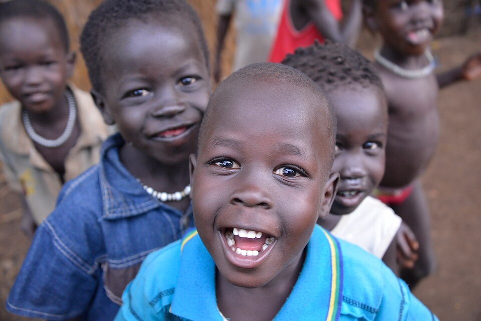

# 阿努瓦克传统信仰与河岸—祖灵祈福（Anyuak／Anuak）

<!-- 来源：CC BY-SA 2.0 | https://commons.wikimedia.org/wiki/File:Anuak_Kids,_Dimma_(14330516340).jpg -->

## 概述

**阿努瓦克人（Anyuak／Anuak）** 分布于南苏丹—埃塞俄比亚交界的索巴特／加姆贝拉河岸地带。公开概述记述：传统宇宙强调祖先、河岸农耕与神圣王权伦理余绪；今日并存基督教与流离、冲突语境——**须极度克制**。本条目为教育概览；**不提供**献牲、王权密仪或可冒充仪者的步骤。与努尔、丁卡、希卢克条目相关尼罗语境但认同独立。

## 核心观念（祈福 / 功德 / 祈祷如何被理解）

祈福常被理解为：通过对祖先与河岸土地的敬意，并／或通过教堂祈祷，求雨水、丰收与和解。功德贴近：支持难民教育与和平。访客的「福」体现为：**勿以采风名义进入冲突／流离现场**。

## 典型仪式

### 1. 祖先与河岸农耕伦理（概念层）
- **场合**：农事、家庭危机公开记述。
- **主要步骤（概念层）**：理解祖先—土地联结。**禁止**复现祭仪。
- **物品**：从略。
- **谁来举行**：家庭与长者。

### 2. 神圣王权记忆（敏感，仅概念）
- **场合**：公开政治人类学叙述。
- **主要步骤（概念层）**：知晓存在神圣王权相关传统。**禁止**密仪操作化。
- **物品**：从略。
- **谁来举行**：历史上社群内部。

### 3. 教堂崇拜（概念层）
- **场合**：主日、生命礼仪。
- **主要步骤（概念层）**：理解基督教公开层。**止于公开教会层**。
- **物品**：从略。
- **谁来举行**：教牧与会众。

## 日常与节庆

优先加姆贝拉／上尼罗公开文化层；安全优先。

## 注意与尊重

**冲突与流离勿猎奇。** 禁止献牲操作化。摄影须许可。

## 手机互动适合度（Three.js 评估草稿）

- **档位：** A 不建议做成操作型互动
- **敏感度：** 极高
- **判断：** 冲突与王权密仪不宜游戏化。
- **若做成互动：** 不建议；最多静态河岸农耕说明。
- **红线：** 禁止献牲、冒充王权仪者、消费创伤。
- **评估状态：** 待后期统一评估

## 参考来源

- https://www.britannica.com/topic/Anyuak
- https://www.britannica.com/place/Gambela
- https://www.britannica.com/place/South-Sudan
