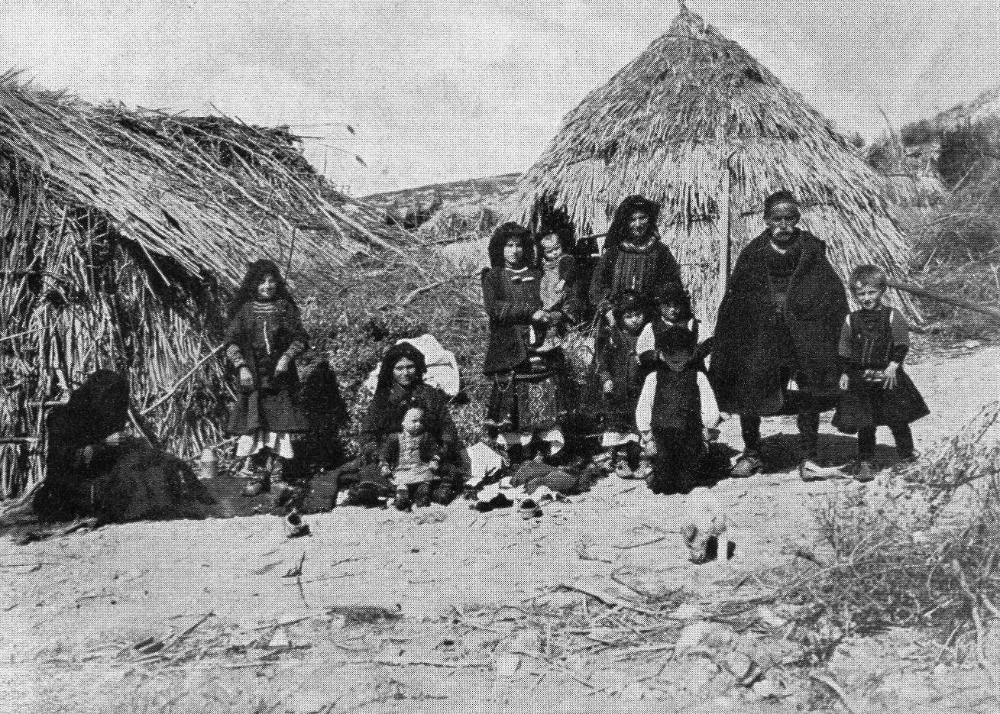

# 阿罗马尼亚／巴尔干瓦拉几东正教祈福传统（Aromanian／Vlach）

<!-- 来源：Public Domain | https://commons.wikimedia.org/wiki/File:Vlasi_vo_Egejska_Makedonija.jpg -->

## 概述

**阿罗马尼亚人（Aromanians；亦称巴尔干瓦拉几／Vlach 之一支）** 为散居于希腊、阿尔巴尼亚、北马其顿、罗马尼亚、保加利亚等地的东罗曼语民族，历史上以山地牧养与商路著称。公开综述强调其绝大多数为**东正教徒**，遵循东正教礼仪年；奥斯曼时代属「罗马」（Rum）米勒，君士坦丁堡牧首体系下常以希腊语为教会与城市精英共通语，导致部分城市阿罗马尼亚人深度希腊化。今日认同政治复杂：语言濒危、各国少数权利政策不一。本条目为教育概览；**不提供**可冒充圣事的操作。与「罗马尼亚卡鲁什」「加告兹」等条目为**平行巴尔干传统**。

## 核心观念（祈福 / 功德 / 祈祷如何被理解）

祈福常被理解为：通过圣礼、圣人瞻礼、守斋与家庭圣像角，寻求健康、旅途平安与族群存续；牧养季节常以 **圣乔治（St George）** 与 **圣德米特里（St Demetrius）** 等瞻礼标志转场节点，迁徙记忆亦赋予对山路与牲畜的祝福话语。祖先纪念（**Moșii** 等巴尔干东正教民俗层）与 **圣母安眠节（Dormition）** 等大节亦常见。功德贴近：供养堂区、教授阿罗马尼亚语、纪念商路圣人与殉道者。访客的「福」体现为：承认其非「希腊人的方言分支」或「罗马尼亚海外侨民」单一标签，尊重自我认同。

## 典型仪式

### 1. 东正教圣礼与礼仪年（公共层）
- **场合**：主日圣礼、圣诞、复活、斋期。
- **主要步骤（概念层）**：圣礼、游行、家宴。**非信徒勿领圣餐**。
- **物品**：教堂与圣像外观（概念）。
- **谁来举行**：神父与会众。

### 2. 主保圣人与村镇瞻礼（圣乔治／圣德米特里／Dormition 等，公共层）
- **场合**：各侨居地的主保节日；牧养历上的圣乔治、圣德米特里节点；圣母安眠节（Dormition）等。
- **主要步骤（概念层）**：弥撒、游行、音乐与宴饮。**止于概念**。
- **物品**：从略。
- **谁来举行**：堂区与同乡会。

### 3. 牧养—商路记忆与祖先纪念（Moșii 等，公共文化层）
- **场合**：季节迁徙叙事、婚礼与命名；祖先纪念（Moșii）民俗节点。
- **主要步骤（概念层）**：家户祝福、口述与公开纪念外观。**止于概念**；非圣事操作。
- **物品**：从略。
- **谁来举行**：长辈与家庭。

## 日常与节庆

梅措沃等地是著名阿罗马尼亚文化城镇。优先 Britannica「Vlach」与人权／少数语言报告中的审慎表述。

## 注意与尊重

**勿强迫其在「希腊／罗马尼亚」认同中站队。** 勿在礼拜违规摄影。尊重语言濒危现实，勿嘲笑口音。

## 手机互动适合度（Three.js 评估草稿）

- **档位：** C 可做致敬小品（非真仪）
- **敏感度：** 低
- **判断：** 巴尔干山地教堂与礼仪年适合轻量致敬；圣事不可模拟通关。取 C：原创手势练习，明确非真仪。
- **若做成互动：** 手势练习示例——(1) 陀螺仪眺望皮恩多斯山地说明卡；(2) 拖动将「和平意向」放入烛台示意；(3) 写下对母语／家园的一句祝福；(4) 点亮复活灯火象征希望。禁止模拟圣餐。
- **红线：** 禁止模拟圣事或以真弥撒名称作胜负。
- **评估状态：** 待后期统一评估

## 参考来源

- https://ich.unesco.org/en/RL/august-15th-dekapentavgoustos-festivities-in-two-highland-communities-of-northern-greece-tranos-choros-grand-dance-in-vlasti-and-syrrako-festival-01726
- https://doi.org/10.59277/ICSUGH.SINCAI.28.15
- https://doi.org/10.1080/01472520802402739
- https://doi.org/10.1080/01426397.2016.1229461
- https://ayla.culture.gr/en/
