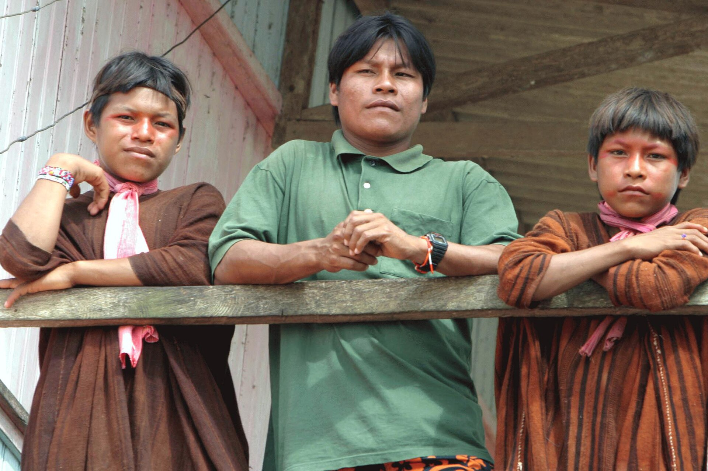

# 阿沙宁卡传统信仰与亚马孙祈福（Asháninka）

<!-- 来源：CC BY 3.0 BR（Agência Brasil） | https://commons.wikimedia.org/wiki/File:Ash%C3%A1ninka.jpg -->

## 概述

**阿沙宁卡人（Asháninka；亦作 Asháninca）** 为秘鲁中部与巴西相邻地带的阿拉瓦克语系原住民族，是秘鲁亚马孙人口较多的群体之一。公开文化介绍记述宇宙观富于神话：文化英雄 **Avireri** 将人转化为动物、植物、山与河；可见世界之外尚有众不可见存在——善意者如太阳 **Pavá**、月亮 **Kashirí**，以及邪恶力量 **kamári**。萨满 **sheripiári** 作为人与超自然存在的中介（**CONCEPT**）。公开文化亦提及 **masato**（发酵木薯饮）等共享宴饮层；烟草／植物灵药叙述 **NO ops**——本条目绝不提供用法。末世／更新叙事强调此世充满恶意力量，终将迎来无病无死的新世界。当代天主教与福音派影响显著。本条目为教育概览；**不提供**萨满植物用法、附体脚本、诅咒操作或任何可冒充 sheripiári 的程序。

## 核心观念（祈福 / 功德 / 祈祷如何被理解）

祈福常被理解为：在园地、河流与亲属网络中，通过对太阳—月亮叙事与善灵的亲近，抵御 kamári，维护健康与土地存续。功德贴近：守护领土、履行亲属互助、拒绝剥削性资源合同、在教会与传统伦理中扶助弱者。访客的「福」体现为：支持阿沙宁卡人的土地与自决权利，而非消费「末日丛林」奇观或「植物药旅」。

## 典型仪式

### 1. 月亮节／Kashirí 与 Masato 共享叙述（公共文化层）
- **场合**：与月亮神及木薯来源神话相关的节庆叙述；**masato** 等宴饮共享公开层。
- **主要步骤（概念层）**：公开神话解释木薯与月相；理解 masato 为文化饮宴命名。**止于概念**；勿把观光活动当成完整圣仪或酿造教程。
- **物品**：园地与宴饮外观（概念）。
- **谁来举行**：家庭与社群。

### 2. Sheripiari CONCEPT（高度敏感，仅概念）
- **场合**：疾病、社会冲突与灵性失衡。
- **主要步骤（概念层）**：理解 **sheripiári** 的中介角色命名。**CONCEPT ONLY**；**禁止**任何致幻／烟草／植物灵药配方或疗法复现（**tobacco/plant spirit medicine NO ops**）。
- **物品**：从略。
- **谁来举行**：社群承认的萨满。

### 3. 丧葬迁居伦理与教会生活（部分敏感）
- **场合**：传统上死亡后可能弃村以防恶鬼骚扰的公开叙述；当代教堂礼仪。
- **主要步骤（概念层）**：理解恐惧与更新并存的来世观。**禁止**招魂游戏。
- **物品**：从略。
- **谁来举行**：家族与教牧。

## 日常与节庆

阿沙宁卡人长期面对橡胶业、恐怖主义时期暴力与油气／伐木压力。写作应优先 everyculture、人权与阿沙宁卡组织自身叙述。

## 注意与尊重

**禁止「丛林萨满旅」推销。** 勿购买来源不明的羽毛或仪式器物。勿擅自进入村庄拍摄儿童。勿将阿沙宁卡与希皮博、舒阿尔条目混同。烟草／植物灵药 **NO ops**。

## 手机互动适合度（Three.js 评估草稿）

- **档位：** B 仅氛围或图文场景
- **敏感度：** 高
- **判断：** **仅氛围／无用户主持。** 河流—园地风光与 masato／Kashirí 命名可做说明；sheripiári 疗法与恶灵叙事不可操作化。
- **若做成互动：** 只做场景＋土地权利说明卡；不提供植物或萨满手势。
- **红线：** 禁止植物配方、招魂、末世惊吓闯关、冒充 sheripiári。
- **评估状态：** 待后期统一评估

## 参考来源

- https://www.everyculture.com/wc/Norway-to-Russia/Ash-ninka.html
- https://www.britannica.com/place/Amazon-Rainforest
- https://www.culturalsurvival.org/
