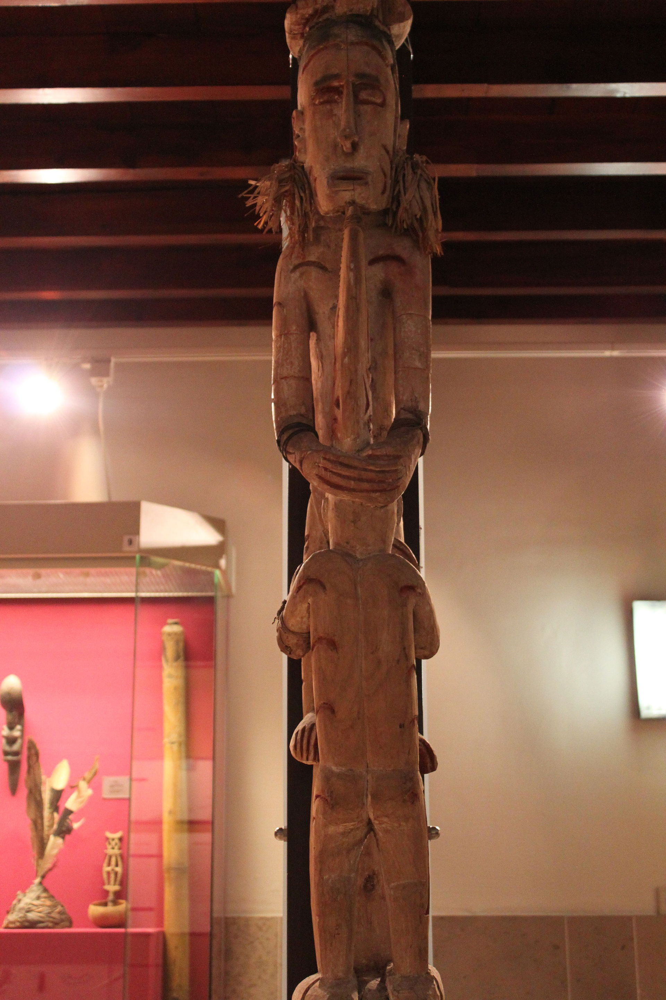

# 阿斯马特传统信仰与祖先—木雕祈福概观（Asmat）

<!-- 来源：CC BY-SA 4.0 | https://commons.wikimedia.org/wiki/File:GE_2011.26_Bisj_pole_(1).JPG -->

## 概述

**阿斯马特人（Asmat）** 分布于印度尼西亚巴布亚（西新几内亚）南部海岸沼泽地带，以祖先崇拜、木雕（包括公开博物馆语境中的 **bisj／bis 柱**）与复杂仪式生活闻名。公开民族志与博物馆叙述强调：死亡、复仇平衡与祖先力量在传统宇宙中相互关联；当代社区同时面对天主教／基督教、国家治理与艺术市场。本条目**仅作高度克制教育概览**；**不提供**猎首、复仇战、献牲或完整丧仪操作，也不鼓励买卖来源不明的仪式柱。

## 核心观念（祈福 / 功德 / 祈祷如何被理解）

祈福常被理解为：通过正确安顿死者与祖先，恢复社群力量与宇宙平衡。功德贴近：支持阿斯马特对艺术与圣地的解释权，反对把战争史娱乐化。访客的「福」体现为：在博物馆看公开展品，而不是深入村庄索要「真仪」。

## 典型仪式

### 1. 祖先木雕与公开纪念叙事（概念层）
- **场合**：丧葬周期、男性屋相关公开记述；博物馆阐释。
- **主要步骤（概念层）**：理解 bis 柱等作为祖先与未竟事务的视觉焦点。**禁止**复现竖柱／献祭程序。
- **物品**：从略。
- **谁来举行**：社群仪式权威（内部）。

### 2. 基督教并行与当代调适（概念层）
- **场合**：教堂礼仪与传统并行社区。
- **主要步骤（概念层）**：理解改宗与文化持续的复杂现实。**勿审判「纯不纯」**。
- **物品**：从略。
- **谁来举行**：教牧与信众。

### 3. 艺术—礼仪边界（概念层）
- **场合**：当代木雕生产与展演。
- **主要步骤（概念层）**：区分商品雕刻、文化展演与封闭仪轨。**止于公开层**。
- **物品**：从略。
- **谁来举行**：艺术家与文化机构（经同意）。

## 日常与节庆

优先博物馆／学术公开层与阿斯马特人自述；并与其他巴布亚群体条目区分，避免「新几内亚」混称。

## 注意与尊重

**严禁猎首／复仇题材的可操作描写。** 勿购买来源可疑的「真 bis 柱」。未经许可勿进入仪式空间摄影。

## 手机互动适合度（Three.js 评估草稿）

- **档位：** A 不建议做成操作型互动
- **敏感度：** 极高
- **判断：** 丧仪与战争平衡礼仪绝不可游戏化。
- **若做成互动：** 不建议；最多博物馆风格静态说明。
- **红线：** 禁止丧仪通关、猎首叙事操作化、冒充仪者。
- **评估状态：** 待后期统一评估

## 参考来源

- https://www.britannica.com/topic/Asmat
- https://www.metmuseum.org/toah/hd/asma/hd_asma.htm
- https://www.britannica.com/place/Papua
