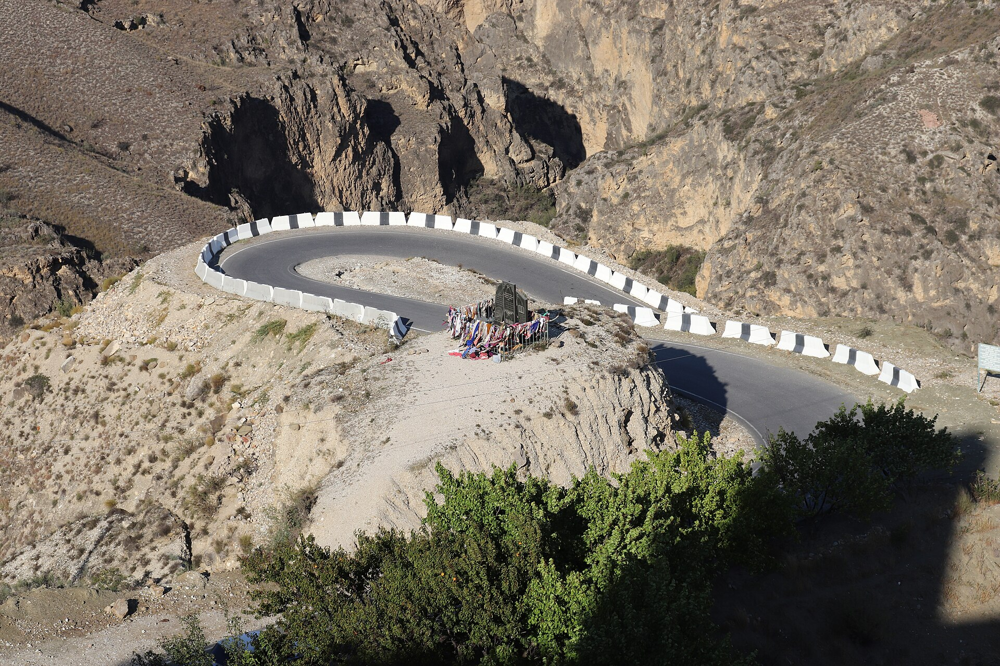

# 阿瓦尔民间伊斯兰与达吉斯坦圣地祈福（Avar）

<!-- 来源：CC BY-SA 4.0 | https://commons.wikimedia.org/wiki/File:Ziyarat_at_Akh1ulgokh1_Memorial_COmplex,_Dagestan,_RU.jpg -->

## 概述

**阿瓦尔人（Avar）** 为俄罗斯达吉斯坦共和国人口较多的高加索民族之一，绝大多数为逊尼派穆斯林。公开概述记述：清真寺、经堂与 **Naqshbandi** 等苏菲谱系在达吉斯坦山村历史上影响深远；**Imam Shamil** 记忆构成地方伊斯兰史的重要公开层；对谢赫陵墓／圣地的 **Ziyarat** 朝谒与地方习惯法记忆构成民间祈福层；**Dhikr** 赞念余绪为 **CONCEPT ONLY**。同时存在对圣陵实践的改革派批评。本条目为教育概览；**不提供**教团秘仪、政治动员或可冒充谢赫的步骤。与列兹金、车臣瓦伊纳赫条目可比较。

## 核心观念（祈福 / 功德 / 祈祷如何被理解）

祈福常被理解为：通过礼拜、斋戒、施舍与在被承认的圣徒纪念中求 baraka，祈求家庭平安与山村秩序；公开史亦铭记 **Imam Shamil**。功德贴近：支持语言与经堂教育，反对把高加索穆斯林一律安全化／污名化。访客的「福」体现为：遵守山村着装与性别规范，低调旅行。

## 典型仪式

### 1. 清真寺礼拜与 Naqshbandi／Imam Shamil 记忆（概念／公开层）
- **场合**：主麻、开斋、宰牲节等；地方史叙述。
- **主要步骤（概念层）**：理解公开伊斯兰框架、**Naqshbandi** 谱系命名与 **Imam Shamil** 历史记忆。**止于常识／教育**；禁止政治动员脚本。
- **物品**：从略。
- **谁来举行**：伊玛目与信众。

### 2. Ziyarat 谢赫陵／圣地朝谒（概念层）
- **场合**：纪念日、许愿还愿公开记述。
- **主要步骤（概念层）**：理解 **Ziyarat** 诵经、拜访陵园求吉庆的公开叙述。**禁止**编造介祷配方。
- **物品**：从略。
- **谁来举行**：家族与地方宗教权威。

### 3. Dhikr 苏菲赞念余绪（敏感，CONCEPT ONLY）
- **场合**：教团集会等公开／半公开记述。
- **主要步骤（概念层）**：知晓集体 **Dhikr** 传统的存在。**CONCEPT ONLY**；**勿闯入非公开 majlis**；禁止用户仿作赞念仪轨。
- **物品**：从略。
- **谁来举行**：谢赫与门人。

## 日常与节庆

优先 Britannica 达吉斯坦／阿瓦尔公开层；注意安全与摄影限制。

## 注意与尊重

**勿把苏菲圣地议题政治化猎奇。** 禁拍未同意对象。禁止冒充谢赫。Dhikr 仅概念。

## 手机互动适合度（Three.js 评估草稿）

- **档位：** B 仅氛围或图文场景
- **敏感度：** 高
- **判断：** **仅氛围／无用户主持。** 山村清真寺外观、Naqshbandi／Shamil／Ziyarat 命名可说明；Dhikr 教团仪轨不可操作化。
- **若做成互动：** 只做建筑＋地理／历史命名说明卡；不提供赞念或礼拜通关。
- **红线：** 禁止礼拜通关、冒充谢赫、政治煽动、用户主持 Dhikr。
- **评估状态：** 待后期统一评估

## 参考来源

- https://www.britannica.com/topic/Avar
- https://www.britannica.com/place/Dagestan
- https://www.britannica.com/topic/Sufism
