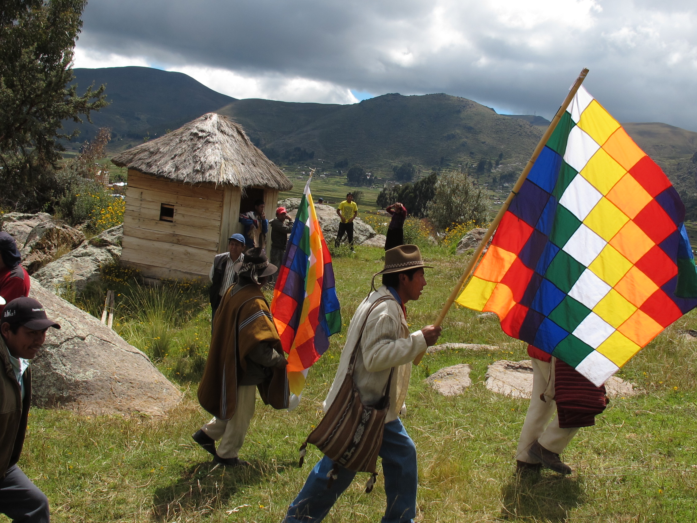

# 艾马拉祈福与大地母亲礼仪（Aymara／Pachamama）

<!-- 来源：CC BY-SA 3.0 | https://commons.wikimedia.org/wiki/File:Aymara_ceremony_copacabana_1.jpg -->

## 概述

**艾马拉人（Aymara）** 是安第斯高原（Altiplano）大型原住民族群，主要分布于玻利维亚与秘鲁，亦见于阿根廷、智利；其语言亦称艾马拉语。大英百科指出：艾马拉以农牧（马铃薯、藜麦、羊驼／美洲驼等）为生，曾建多个独立政体，后经印加与西班牙殖民；今日多数名义上为天主教徒，同时保持多灵世界与对 **Pachamama（大地母亲／大地女神）** 的敬拜。公开实践包括向大地与山灵献供、洒酒（*ch’alla*）以及拉巴斯等地 **Alasita（阿拉西塔）** 微型物祈愿节——联合国教科文组织于 2017 年将「拉巴斯 Alasita 期间的仪式旅程」列入人类非物质文化遗产代表作名录。本条目与泛安第斯、克丘亚条目互补，聚焦艾马拉语区公开可查的教育概述；**不提供** mesita／waxt’a 供物配方、可复现牲礼或任何可滥用的献祭操作。

## 核心观念（祈福 / 功德 / 祈祷如何被理解）

祈福常被理解为：在 Pachamama 与 **achachila／山灵**（公开叙述中亦称祖父山灵）的互惠秩序中，以洒酒、供桌、请许可后再动土等方式表达感恩与请求丰饶、健康与保护。公开综述强调：超自然力量亦栖居于山峰、河流与雷电等自然场所；天主教弥撒、洗礼与圣徒年历与本土节庆并行。功德贴近：履行家庭与 *ayllu*（社群）互助义务、在八月等节点以正当公共礼仪「喂养」大地，而非个人诅咒操纵。访客的「福」体现为：把艾马拉—天主教叠合看作精致的高原文明，而非猎奇「异教奇观」。

## 典型仪式

### 1. Alasita 与 Ekeko 微型物祈愿（公开遗产层）
- **场合**：拉巴斯一带约每年 1 月；围绕丰饶神 **Ekeko** 与微型物（*illa*）买卖、祝圣；UNESCO「仪式旅程」。
- **主要步骤（概念层）**：购买象征愿望的微型物；经仪式专家与／或教会祝福等公开环节。**止于公开节庆层**；不提供私人法术配方。
- **物品**：微型物、供酒外观、节庆摊位。
- **谁来举行**：家庭、仪式专家与教会礼仪配合；游客可观礼勿打断祝圣。

### 2. Yatiri 主持 Mesita — 用户仅观礼（观礼层）
- **场合**：公开报道称八月为大地「醒来、饥渴」的月份；家庭与田间、山巅献供。
- **主要步骤（概念层）**：由 **Yatiri**（安第斯仪式专家）准备供桌／**Mesita**（甜食、谷物、古柯叶等外观），焚烧并表达感恩。**Yatiri hosts Mesita — users view only**；禁止物项配方或用户仿作主持。
- **物品**：供桌外观（从略）。
- **谁来举行**：Yatiri 与受社群认可者；外人不可主持。

### 3. 日常 ch’alla CONCEPT（概念层）
- **场合**：动土、播种、建屋、出行等节点。
- **主要步骤（概念层）**：公开民族志称先向 Pachamama 请许可，并以 **ch’alla** 洒酒等表达互惠。**ch’alla CONCEPT ONLY**；止于观念说明。
- **物品**：酒水／饮料外观。
- **谁来举行**：家长与地方仪式知识持有者。

## 日常与节庆

天主教年历与安第斯农牧节点叠合；Alasita、八月大地礼仪、地方圣徒瞻礼与音乐舞蹈（如 huayño）构成公开节奏。优先 Britannica、UNESCO ICH、AP 等核实报道与学术综述。

## 注意与尊重

**勿把 Pachamama 供奉写成可网购「安第斯法术套装」。** 勿在圣地擅自焚烧／掩埋供品。摄影与进入仪式空间需许可。涉及牲礼或胎儿供品仅作概念认知，绝不复现。尊重艾马拉社群对采矿、土地与气候正义的当代主张。

## 手机互动适合度（Three.js 评估草稿）

- **档位：** B 仅氛围或图文场景
- **敏感度：** 中
- **判断：** **仅氛围／无用户主持。** Alasita 市集与高原景观适合可旋转图文场景；真 mesita 焚烧、牲礼与私人法术不可互动化。取 B：氛围与说明卡，不以「完成献供」为胜负。Ekeko／Alasita 可作氛围；Yatiri 主持 Mesita，用户仅观礼；ch’alla 为 CONCEPT。
- **若做成互动：** 只做可旋转高原／Alasita 摊位场景与说明卡；可选点选阅读 Pachamama—achachila—天主教叠合图解，不作献供手势。
- **红线：** 禁止模拟牲礼、胎儿供品、冒充 yatiri，或以真仪名称作通关。禁止模拟牲礼、冒充 Yatiri、用户主持 Mesita，或以真仪名称作通关。
- **评估状态：** 待后期统一评估

## 参考来源

- https://www.britannica.com/topic/Aymara
- https://www.encyclopedia.com/history/latin-america-and-caribbean/mesoamerican-indigenous-peoples/aymara
- https://ich.unesco.org/en/RL/ritual-journeys-in-la-paz-during-alasita-01182
- https://apnews.com/article/pachamama-mother-earth-bolivia-aymara-spirituality-3ff0b82f0324e9fef5cd24a4b6a6552d
