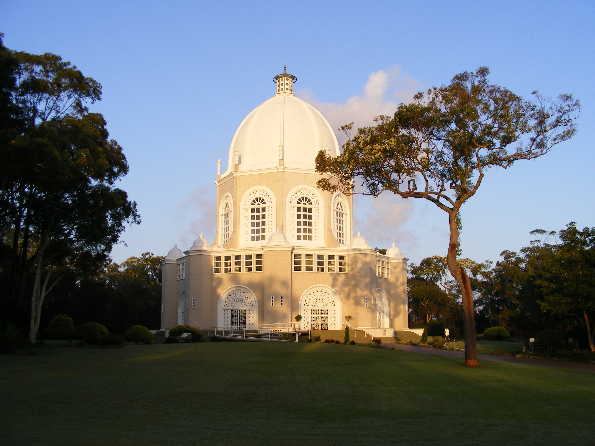

# 巴哈伊信仰（Baháʼí Faith）

<!-- 来源：Public domain | https://commons.wikimedia.org/wiki/File:Sydney_Bahai_House_of_Worship_at_dawn.jpg -->

## 概述

巴哈伊信仰是十九世纪中叶兴起的普世宗教，由伊朗人米尔扎·侯赛因·阿里·努里创立；他在传统中被称为巴哈欧拉（Baháʼu’lláh，阿拉伯语意为“真主的荣耀”）。运动源于伊朗的巴布教，并于伊拉克由巴哈欧拉公开宣示。教义核心是：巴哈欧拉及其先驱巴布（Báb）为不可知真主的显示者；世界各大宗教的创始者同为渐进启示的媒介；宗教本质统一，人类一体。百科强调其重心在社会伦理，废除种族、阶级与宗教偏见，**无祭司、亦不以繁复礼仪形式作为崇拜核心**。信徒义务包括每日祈祷、禁绝致幻物质与酒类、一夫一妻、婚姻须得父母同意，并出席巴哈伊历每月首日的十九日灵宴会。二十一世纪初已有逾一百八十个国家／地区灵理会；截至 2024 年，澳洲、柬埔寨、智利、刚果民主共和国、德国、印度、肯尼亚、巴拿马、巴布亚新几内亚、萨摩亚、美国、乌干达、瓦努阿图等地设有灵曦堂（mashriq al-adhkār）。本条目为教育性概览，不提供义务祷文全文或内部行政细则。

## 核心观念（祈福 / 功德 / 祈祷如何被理解）

在巴哈伊语境中，**祈祷是灵魂的食粮**：加深对真主的爱，并将个人意愿调整到符合神圣意志，从而获得内在安宁。官方文献区分两类祈祷——用自己的话与造物主交通，以及使用巴布、巴哈欧拉与阿博都巴哈著作中的祷文。巴哈欧拉规定三种义务祷（Obligatory Prayer），信徒每日择一诵念：短祷（中午至日落之间）、中祷（晨、午、晚）与长祷（每二十四小时一次）。功德与“福德”更贴近**服务人类与诚实劳作**：工作若以服务精神完成，可被视为崇拜；施舍、参与地方灵理会与消除偏见，是“一体人类”伦理的具体实践。集体层面，十九日灵宴会结合祈祷、读经、社区事务讨论与联谊，确保普遍参与并培养手足之情。灵曦堂服务无讲道，仅诵读巴哈伊经典及其他宗教圣典——祈福在此表现为开放、非排他的经文聆听。

## 典型仪式

### 1. 每日义务祷与个人灵修（概念层）
- **场合**：个人每日灵修；可在家中或安静处进行。
- **主要步骤（概念层）**：依所选义务祷的规定时段诵念；亦可诵读其他祷文、默思经文。公开描述止于义务结构与目的，**不收录**祷文原文或体式细节。
- **物品**：经典文本；无祭司主持。
- **谁来举行**：每位有能力的成年信徒。

### 2. 十九日灵宴会（Nineteen Day Feast）— 社区聚会
- **场合**：巴哈伊历每月首日（一年十九月、每月十九日，另有闰日；岁首约在春分 3 月 21 日）。
- **主要步骤（概念层）**：本地信徒 **community gathering**：祈祷与经文诵读、社区活动讨论、联谊。旨在普遍参与与手足之情。原由巴布创立，经巴哈欧拉确认。**止于社区聚会概念**；不以完成流程为通关。
- **物品**：聚会场所（家中或地方中心）；经文读本。
- **谁来举行**：地方巴哈伊社区全体；无专职神职人员。

### 3. Mashriqu'l-Adhkár（灵曦堂）崇拜与灵修聚会
- **场合**：世界各地 **Mashriqu'l-Adhkár**（灵曦堂）；以及家中或中心举办的灵修聚会。
- **主要步骤（概念层）**：灵曦堂无讲道、无祭司；服务仅为诵读各宗教圣典。社区灵修聚会常含经文朗诵、聆听与音乐。九边形建筑象征与“九”相关的公开描述。
- **物品**：开放的崇拜空间；经文。
- **谁来举行**：对所有宗教信徒开放；巴哈伊社群组织日常灵修。

## 日常与节庆

每日祈祷与每年十九日斋戒（日出至日落禁食禁饮，有能力者履行）构成个人节律。历法圣日包括岁首等；朝圣中心在以色列海法与阿卡一带的巴布陵寝、阿博都巴哈相关圣地及巴哈欧拉陵寝附近。治理由地方、国家灵理会层层选举产生，最高机构为海法的世界正义院（Universal House of Justice）。伊朗等地历史上与当代迫害提醒：公开身份与礼仪参与须尊重当地安全与法律环境。

## 注意与尊重

勿将巴哈伊与主流伊斯兰教混同，亦勿在迫害风险地区公开指认信徒。灵曦堂对访客通常开放，但仍应遵守当地礼仪（安静、着装得体）。义务祷属个人灵修，勿要求他人展示或录制。引用经典请使用经授权译本，勿编造祷文。

## 手机互动适合度（Three.js 评估草稿）

- **档位：** B 仅氛围或图文场景
- **敏感度：** 中
- **判断：** **仅氛围／无用户主持。** 每日义务祷与十九日灵宴会属信徒灵修与社区生活；灵曦堂无祭司但诵读圣典。不宜把义务祷做成可打卡通关。Mashriqu'l-Adhkár 与 Nineteen Day Feast 作为社区聚会可作氛围说明；义务祷不可通关化。
- **若做成互动：** 可不做操作关卡，只做可旋转/可走近的场景与说明卡。
- **红线：** 不以完成义务祷／灵宴会流程为胜负；勿编造祷文或强迫录制个人灵修。
- **评估状态：** 待后期统一评估

## 参考来源

- https://www.britannica.com/topic/Bahai-Faith
- https://www.britannica.com/topic/mashriq-al-adhkar
- https://www.bahai.org/beliefs/life-spirit/devotion
- https://www.bahai.org/beliefs/life-spirit/devotion/prayer
