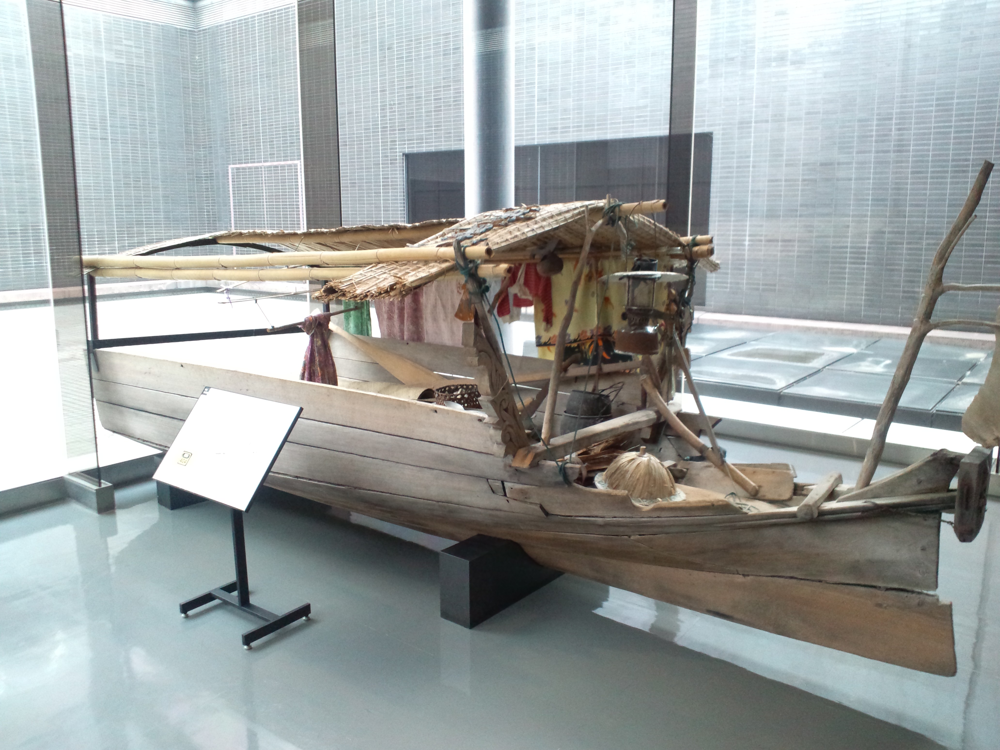

# 巴瑶／萨马海洋伊斯兰与海灵祈福（Bajau／Sama）

<!-- 来源：CC BY-SA 4.0 | https://commons.wikimedia.org/wiki/File:National_Museum_of_Ethnology,_Osaka_-_Houseboat_-_Bajau_people_-_State_of_Sabah_in_Malaysia.jpg -->

## 概述

**巴瑶人（Bajau；亦作 Sama／Sama-Bajau）** 分布于东南亚苏禄海、苏拉威西海至马来半岛东岸等海域，历史上以船居渔捞闻名，今日多数已岸居。公开民族志记述：主体为逊尼派沙斐仪学派穆斯林，清真寺与伊玛目构成岸居社区宗教中心；同时并存通灵／占卜、海神／海灵 **Umboh Dilaut（亦作 Omboh Dilaut）**与「送疫灵船」等海洋民俗层，船居群体的伊斯兰正统性常被岸居他者争议。本条目为教育概览；**不提供**驱疫船操作、通灵脚本或可冒充仪式专家的步骤。

## 核心观念（祈福 / 功德 / 祈祷如何被理解）

祈福常被理解为：通过礼拜、施舍与在海洋生计中对海灵的敬意，祈求航行平安与渔获。功德贴近：支持语言与反对把「海上游牧」浪漫化为可任意进入的体验旅游。访客的「福」体现为：关注渔权、气候变化与定居压力下的尊严。

## 典型仪式

### 1. Umboh Dilaut 与海洋敬意（概念层）
- **场合**：出海、风暴、渔获与疫病恐惧等公开记述。
- **主要步骤（概念层）**：理解对海神／海灵 **Umboh Dilaut** 的祈请叙事与海洋生计伦理。**CONCEPT ONLY**；**禁止**复现送灵船或海灵操作。
- **物品**：从略。
- **谁来举行**：家庭与地方专家；访客不可主持。

### 2. Duata／Magpaayau 海祝福节庆 CONCEPT（概念层）
- **场合**：公开民族志／文化叙述中的海上／岸边祝福节庆概念。
- **主要步骤（概念层）**：仅作 **Duata／Magpaayau** 命名与社群凝聚功能说明。**CONCEPT ONLY**；不提供节庆仪程 how-to。
- **物品**：从略。
- **谁来举行**：社群与被承认的地方权威。

### 3. Jinan 灵媒 HIGH SENSITIVITY CONCEPT ONLY（高度敏感）
- **场合**：危机、疾病等公开记述。
- **主要步骤（概念层）**：理解存在 **Jinan** 等灵媒／通灵并行实践的公开记述。**HIGH SENSITIVITY — CONCEPT ONLY**；**禁止**通灵复现、附体脚本或角色扮演。
- **物品**：从略。
- **谁来举行**：被承认的地方专家；外人严禁冒充。

## 日常与节庆

岸居社区以清真寺礼拜与生命礼仪为公开伊斯兰层；海洋民俗与灵媒叙述并行但止于概念。优先 everyculture 与巴瑶／萨马社群自述；区分菲律宾、马来西亚沙巴与印尼各地差异。

## 注意与尊重

**勿把「最后海游牧」写成潜水打卡秀。** 勿购买来路不明的「送疫船」旅游仿品。禁止驱灵演示。

## 手机互动适合度（Three.js 评估草稿）

- **档位：** B 仅氛围或图文场景
- **敏感度：** 高
- **判断：** **仅氛围／无用户主持。** 海岸／船屋外观可说明；通灵与送疫船不可操作化。Umboh Dilaut／Duata／Magpaayau 仅命名与概念；Jinan 高度敏感不可互动化。
- **若做成互动：** 只做海景＋伊斯兰／海洋伦理说明卡。
- **红线：** 禁止通灵、送疫船通关、冒充伊玛目／灵媒。禁止 Jinan／通灵、送疫船、冒充伊玛目／灵媒。
- **评估状态：** 待后期统一评估

## 参考来源

- https://www.everyculture.com/East-Southeast-Asia/Bajau-Religion-and-Expressive-Culture.html
- https://doi.org/10.5901/mjss.2013.v4n9p184
- https://www.peoplesoftheworld.org/text?people=Bajau
