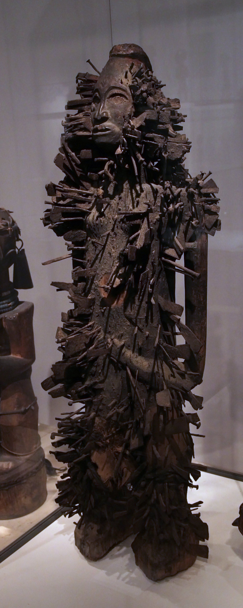

# 巴刚果／刚果传统宗教（Bakongo／Kongo traditional religion）

<!-- 来源：CC0 | https://commons.wikimedia.org/wiki/File:British_Museum_Room_25_Nkisi_Kongo_people_19th_century_17022019_4979.jpg -->

## 概述

**刚果人（Kongo／Bakongo）** 是班图语族群体，分布于刚果民主共和国西部、刚果共和国与安哥拉北部沿海至宽果河一带。大英百科与《宗教百科》等概述：传统宗教以全能创造者 **Nzambi Mpungu／Nzambi Kalunga** 为终极力量来源，但日常祈福与裁决多经由**祖先（bakulu）**、地方灵与 **minkisi（单数 nkisi，圣药／力量容器）** 中介。专业职分者 **nganga** 制作、启用 minkisi，处理疾病、誓约、保护与社会失序。历史上王国政治、大西洋奴隶贸易、殖民与天主教／独立教会（如金邦古主义）深刻重塑实践，但祖先土地伦理与可见—不可见世界互通的宇宙观仍具韧性，并对美洲非裔宗教产生深远影响。本条目为教育性概览；**不提供** minkisi 制作／启用、「钉入 nkondi」操作、巫蛊对抗或入会可复现步骤。

## 核心观念（祈福 / 功德 / 祈祷如何被理解）

祈福常被理解为：恢复人与祖先、土地及社群关系的「正当秩序」。公开文本强调 Nzambi 创造万物，但较少被日常直接「呼叫」；祖先守护母系土地与后嗣，而 minkisi 则是被注入灵性药效的容器／雕像，用于治疗、护卫、起誓与纠正不义。恶意与灾祸常被解释为贪婪、嫉妒或 **kindoki**（公开文献中常译巫蛊／害人灵力）等人际灵性破坏。功德贴近：维护家系墓地与土地义务、在生命礼仪中履行亲属角色、尊重 nganga 与酋长／先知职分的边界。访客的「福」体现为：在博物馆欣赏 nkisi 艺术时理解其非「魔玩」，不尝试「激活」复制品。

## 典型仪式

### 1. 祖先与土地相关奉献（概念层）
- **场合**：家系延续、土地权益、丧葬与纪念。
- **主要步骤（概念层）**：公开综合概括为「向埋于土地的母系祖先致敬、奉献、确认亲属与地产纽带」。**仅概念介绍**；不提供墓地仪式或牲礼教程。
- **物品**：家系土地与墓地外观（概念）。
- **谁来举行**：家系长辈与受承认权威；非游客 DIY。

### 2. Nkisi／minkisi 力量对象框架（限制性公共知识层）
- **场合**：疾病、争端、誓约、求保护等危机或公共秩序需求。
- **主要步骤（概念层）**：大英百科等说明 nkisi 由 nganga 以容器／雕像装填「圣药」（泥土、粘土、坟墓相关物质等象征表述），用以治疗与防御。博物馆常见钉刺 **nkondi** 形象，公开解说将其与誓约／追缉不义相连。**不提供**装填、钉入或启用步骤。
- **物品**：博物馆藏 nkisi 外观（木雕、包布、钉等）。
- **谁来举行**：nganga；外人不得「扮演激活」。

### 3. 生命礼仪与历史更新运动（概念层）
- **场合**：命名、青春期、婚姻、丧礼；以及历史上的治病结社、市场保护性仪轨与先知更新运动。
- **主要步骤（概念层）**：公开史学强调危机时期常出现销毁个人符咒、净化墓地、重建公共道德等号召；近现代亦与基督教先知传统交织。不展开入会考验或可复现治疗脚本。
- **物品**：公共聚会与教会／传统并置场合外观。
- **谁来举行**：酋长、先知、nganga 或教会职分依语境而定。

## 日常与节庆

当代多数 Bakongo 生活在基督教（天主教、新教、金邦古教会等）框架中，同时在都市与乡村延续祖先敬拜、治病与灵性解释语言。艺术史与博物馆展示使 nkisi 成为全球认识中非美学的入口，但展品语境不等于完整宗教授权。

## 注意与尊重

**勿购买来路不明的「力量雕像」或尝试自制 minkisi。** 勿把 kindoki 话语写成猎巫游戏。涉及坟墓物质、钉刺 nkondi 与巫蛊指控时，仅作概念／艺术史层理解。优先刚果社群学者与严肃民族志／博物馆口径。

## 手机互动适合度（Three.js 评估草稿）

- **档位：** A 不可做成关卡
- **敏感度：** 高
- **判断：** 核心涉及 nganga 启用 minkisi、祖先墓地纽带与 kindoki 话语；虽有丰富博物馆艺术可做只读图鉴，但任何「激活／钉入／驱巫」互动都会越界。取 A：静态艺术与宇宙观百科，不可操作关卡。
- **若做成互动：** 不提供操作步骤。仅可考虑只读 nkisi 艺术图鉴＋「禁止模拟启用」警示，无点击通关。
- **红线：** 禁止模拟 minkisi 装填／启用、钉刺 nkondi、坟墓取土、巫蛊对抗或以 nkisi／nganga 真仪名称作胜负。
- **评估状态：** 待后期统一评估

## 参考来源

- https://www.britannica.com/topic/Kongo-people
- https://www.britannica.com/art/nkisi
- https://www.encyclopedia.com/environment/encyclopedias-almanacs-transcripts-and-maps/kongo-religion
- https://www.encyclopedia.com/international/encyclopedias-almanacs-transcripts-and-maps/bakongo
