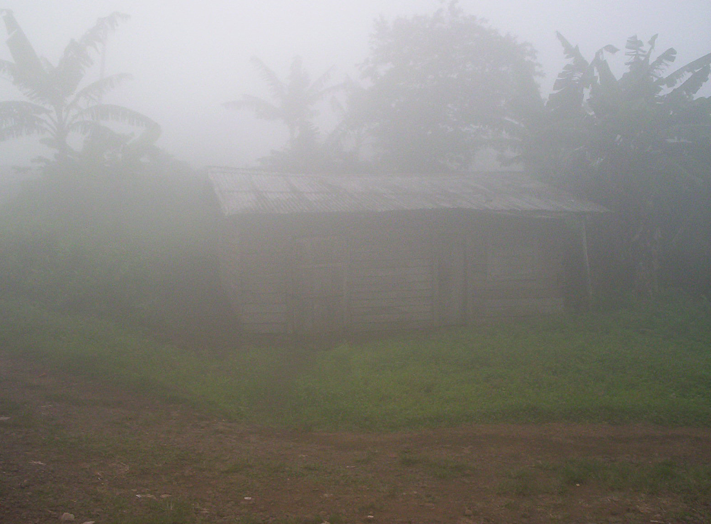

# 巴克韦里传统信仰与火山—祖灵祈福（Bakweri／Kwe）

<!-- 来源：CC BY-SA 3.0 | https://commons.wikimedia.org/wiki/File:Bakweri_house_at_foot_of_Fako.jpg -->

## 概述

**巴克韦里人（Bakweri／Kwe）** 分布于喀麦隆西南，临近喀麦隆火山（法科山）一带。公开概述记述：传统宇宙强调祖先、山灵与土地伦理；公开命名包括火山守护相关的 **Efasa Moto** 叙述，以及公共文化知识层的 **Male** 象面具社团（仅公开知识，无秘密操作）；今日多数为基督徒；火山风险与种植园历史塑造当代生活。本条目为教育概览；**不提供**献牲或可冒充仪者的步骤。与杜阿拉、巴米累克条目区分。

## 核心观念（祈福 / 功德 / 祈祷如何被理解）

祈福常被理解为：通过对祖先与火山山地的敬意，并／或通过教堂祈祷，求安全、健康与丰收。功德贴近：支持巴克韦里语与减灾教育。访客的「福」体现为：登山听从官方警告，尊重圣地。

## 典型仪式

### 1. Efasa Moto 火山守护命名（概念层）
- **场合**：法科山／喀麦隆火山相关的公开祖灵—山灵叙述。
- **主要步骤（概念层）**：理解 **Efasa Moto** 作为火山守护／山灵伦理的公开命名。**CONCEPT ONLY**；**禁止**复现祭仪或献牲。
- **物品**：从略。
- **谁来举行**：家庭与长者；外人不可主持。

### 2. Male 象面具社团（PUBLIC knowledge only）
- **场合**：公开文化展演与民族志可见的面具／舞蹈叙述。
- **主要步骤（概念层）**：仅述 **Male** 象面具作为公共文化知识。**PUBLIC knowledge only — no secret ops**；禁止入会、秘密职分或复现内部仪程。
- **物品**：面具外观（博物馆／公共展演语境）。
- **谁来举行**：社群有职分者；游客仅可在许可场合观礼。

### 3. 教堂崇拜与火山公共纪念（公开层）
- **场合**：主日、生命礼仪；喷发记忆与公共感恩／减灾活动。
- **主要步骤（概念层）**：理解基督教公开层与感恩—悼念交织。**勿消费灾难**；止于公开教会与公共安全层。
- **物品**：从略。
- **谁来举行**：教牧、会众与社群。

## 日常与节庆

优先喀麦隆西南公开文化层。

## 注意与尊重

**火山危险区听从疏导。** 禁止献牲旅游。摄影须许可。

## 手机互动适合度（Three.js 评估草稿）

- **档位：** B 仅氛围或图文场景
- **敏感度：** 高
- **判断：** **仅氛围／无用户主持。** 火山—社区文化可说明；祭仪与灾难不可游戏化。Efasa Moto 命名与 Male 公共知识可说明；秘密社团操作与献牲不可互动化。
- **若做成互动：** 只做减灾伦理＋信仰光谱说明。
- **红线：** 禁止献牲、冒充仪者、喷发逃生闯关。禁止献牲、Male 秘密 ops、冒充仪者、喷发逃生闯关。
- **评估状态：** 待后期统一评估

## 参考来源

- https://www.britannica.com/topic/Bakweri
- https://www.britannica.com/place/Mount-Cameroon
- https://www.britannica.com/place/Cameroon
