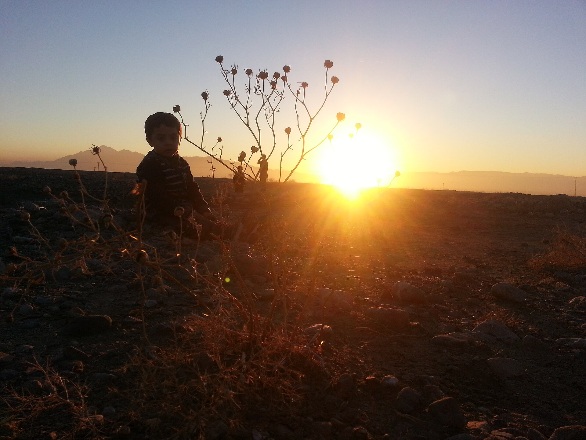

# 俾路支民间伊斯兰与部落荣誉祈福（Baloch）

<!-- 来源：CC BY-SA 4.0 | https://commons.wikimedia.org/wiki/File:Land_of_Baloch_-_Quetta.jpg -->

## 概述

**俾路支人（Baloch／Baluch）** 分布于巴基斯坦俾路支省、伊朗锡斯坦—俾路支斯坦与阿富汗西南等，绝大多数为逊尼派穆斯林（亦有少数什叶等）。公开概述记述：清真寺、经堂与苏菲圣地构成宗教生活；公开叙述包括 **Zikri** 传统与 **Koh-e-Murad** 等朝圣命名，以及 **Gwati** 音乐疗愈概念；部落习惯（如荣誉、好客、调解）与生命礼仪深度交织；当代资源与安全政治使外人叙述易偏见。本条目为教育概览；**不提供**血仇操作、政治动员或可冒充马拉布特的步骤。

## 核心观念（祈福 / 功德 / 祈祷如何被理解）

祈福常被理解为：通过礼拜、施舍与在被承认的宗教权威下求护佑，并维护好客与和解伦理。功德贴近：支持语言文学与平民教育，反对把俾路支一律安全化／污名化。访客的「福」体现为：旅行极度谨慎、尊重性别规范。

## 典型仪式

### 1. 清真寺礼拜与苏菲圣地（公开／概念层）
- **场合**：主麻、开斋、宰牲节；许愿还愿与圣地拜访。
- **主要步骤（概念层）**：理解公开伊斯兰框架与拜访圣陵求 baraka 的叙述。**止于常识／概念**；禁止编造介祷配方。
- **物品**：从略。
- **谁来举行**：伊玛目、家族与地方权威。

### 2. Zikri Koh-e-Murad 朝圣命名（概念层）
- **场合**：公开记述中的 Zikri 相关朝圣（如 **Koh-e-Murad** 命名）。
- **主要步骤（概念层）**：仅作朝圣地理与社群纪念命名说明。**CONCEPT／观礼层**；不提供仪程 how-to 或政治动员。
- **物品**：从略。
- **谁来举行**：相关社群与宗教权威；访客若获许可仅观礼。

### 3. Gwati 音乐疗愈 CONCEPT（概念层）
- **场合**：公开民族志中的音乐—疗愈叙述；生命礼仪与调解伦理。
- **主要步骤（概念层）**：理解 **Gwati** 作为音乐疗愈概念及部落调解交织。**CONCEPT ONLY**；禁止疗愈脚本、附体操作或血仇猎奇。
- **物品**：从略。
- **谁来举行**：被承认的地方实践者与长老；外人不可主持。

## 日常与节庆

优先 Britannica；注意跨境三国差异与安全。

## 注意与尊重

**冲突区勿以研究名义前往。** 禁拍未同意妇女。禁止政治煽动。

## 手机互动适合度（Three.js 评估草稿）

- **档位：** B 仅氛围或图文场景
- **敏感度：** 高
- **判断：** **仅氛围／无用户主持。** 文化地理可说明；礼拜与冲突叙事不可操作化／游戏化。mosque／Sufi 与 Koh-e-Murad 命名可说明；Gwati 仅概念。
- **若做成互动：** 只做语言文学与地理说明。
- **红线：** 禁止礼拜通关、血仇、政治动员。禁止礼拜通关、Gwati 操作、血仇、政治动员。
- **评估状态：** 待后期统一评估

## 参考来源

- https://www.britannica.com/topic/Baloch
- https://www.britannica.com/place/Balochistan
- https://www.britannica.com/topic/Islam
