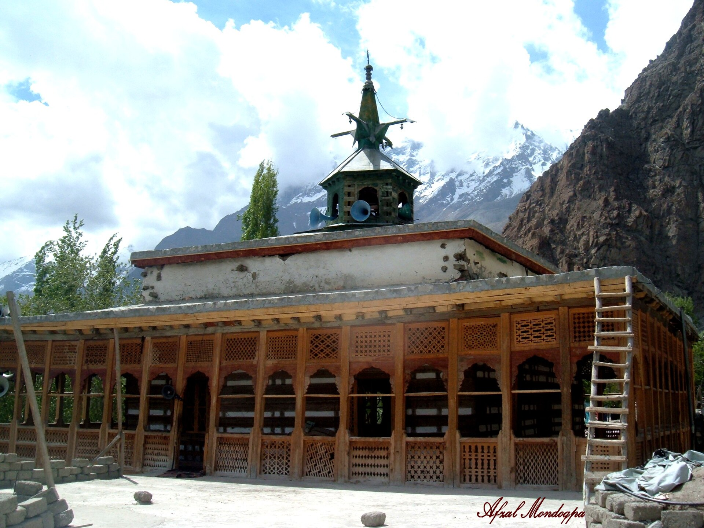

# 巴尔蒂伊斯兰与喀喇昆仑民间祈福（Balti）

<!-- 来源：CC BY-SA 4.0 | https://commons.wikimedia.org/wiki/File:Chqchan_mosque.jpg -->

## 概述

**巴尔蒂人（Balti）** 主要分布于巴基斯坦吉尔吉特—巴尔蒂斯坦（斯卡杜等），语言文化与藏区有历史联系，今日绝大多数为穆斯林（十二伊玛目什叶与 **Noorbakshia（努尔巴赫希）** 等公开记述常见）。清真寺／伊玛目巴拉、**Lossar** 巴尔蒂新年火把祝福公开叙述、阿舒拉纪念与高山行旅祈福构成公共层；前伊斯兰苯教／佛教层仅作历史背景。本条目为教育概览；**不提供**自伤苦修操作、政治动员或可冒充教法权威的步骤。

## 核心观念（祈福 / 功德 / 祈祷如何被理解）

祈福常被理解为：通过礼拜、施舍与对圣裔的纪念，求护佑、忍耐与旅途平安。功德贴近：支持高原生态与减灾，反对把巴尔蒂斯坦写成纯地缘棋子。访客的「福」体现为：高原反应量力而行，阿舒拉场合保持恭敬、不猎奇。

## 典型仪式

### 1. Noorbakshia／日常礼拜与聚礼（概念层）
- **场合**：日礼、主麻；Noorbakshia 与什叶公共崇拜框架。
- **主要步骤（概念层）**：理解 **Noorbakshia** 命名与伊斯兰公开崇拜。**止于常识**；禁止用户主持或礼拜通关。
- **物品**：从略。
- **谁来举行**：伊玛目与信众。

### 2. Lossar 巴尔蒂新年火把祝福（公开／概念层）
- **场合**：巴尔蒂新年（**Lossar**）等公开节庆记述。
- **主要步骤（概念层）**：理解火把／灯光祝福与社群凝聚的公开叙事。**止于公开节庆命名与观礼规范**；不提供点火仪程 how-to。
- **物品**：火把／灯外观（概念）。
- **谁来举行**：家庭与社群；访客仅可在许可场合观礼。

### 3. 穆哈兰姆／阿舒拉（敏感，viewing-only）
- **场合**：教历一月。
- **主要步骤（概念层）**：理解诵悼、公厨与游行的公开纪念。**viewing-only／敏感**；**禁止**自伤操作化或猎奇拍摄。
- **物品**：从略。
- **谁来举行**：社区与宗教权威。

## 日常与节庆

优先 Britannica 巴尔蒂斯坦；并与哈扎拉、拉达克、帕米尔条目区分。

## 注意与尊重

**严禁自伤仪轨猎奇。** 边境与安全以官方为准。禁止政治煽动。

## 手机互动适合度（Three.js 评估草稿）

- **档位：** B 仅氛围或图文场景
- **敏感度：** 高
- **判断：** **仅氛围／无用户主持。** 河谷清真寺外观可说明；自伤与完整礼拜不可操作化。Noorbakshia／Lossar 可说明；Muharram／Ashura 仅观礼、不可操作化。
- **若做成互动：** 只做地理＋什叶纪念概念（无暴力）。
- **红线：** 禁止自伤、礼拜通关、政治动员。
- **评估状态：** 待后期统一评估

## 参考来源

- https://www.britannica.com/place/Baltistan
- https://www.britannica.com/topic/Balti
- https://www.britannica.com/topic/Shiiah
