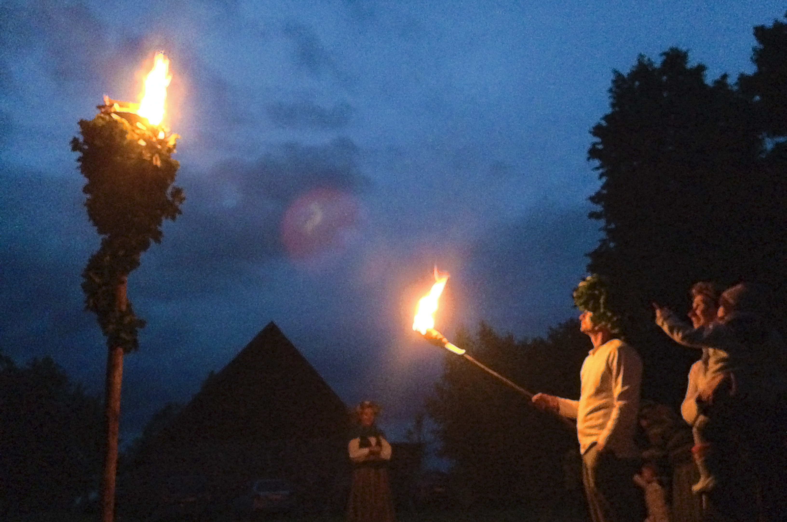

# 波罗的海民间信仰（立陶宛／拉脱维亚传统）

<!-- 来源：CC BY-SA 2.0 | https://commons.wikimedia.org/wiki/File:P%C5%ABdeles_iedeg%C5%A1ana.jpg -->

## 概述

波罗的海诸语民族（今日尤以**立陶宛、拉脱维亚**为代表；古普鲁士语族群已消亡）在基督教化前后长期保持以天神、雷神、太阳、命运女神与地母为中心的民俗宗教层。学者常称 **Baltic religion**：重视星辰与天体、命运人格化（如 *Laima*）以及丰饶崇拜。圣火与灶火（立陶宛语境中的 **Gabija** 等）是家庭福祉的核心象征；岁时（夏至、收获）与人生礼仪（出生、婚嫁、丧葬）伴有特定祈请与供奉。基督教传入后，民俗层与教会实践长期并存；苏联时期许多公开形式受压，十字雕刻等象征反而强化民族—宗教认同。联合国教科文组织将立陶宛 **十字工艺（Kryždirbystė）及其象征**列入人类非物质文化遗产代表作名录；**十字架山（Kryžių kalnas）** 为广为人知的公共祈愿与纪念地景。夏至民俗中，立陶宛 **Rasa**／拉脱维亚 **Līgo** 等仲夏篝火与花环欢庆尤为显著。20 世纪末以来，立陶宛 *Romuva*、拉脱维亚 *Dievturība* 等现代异教复兴运动尝试在史料与民俗基础上重建对前基督教神祇的尊崇。本条目侧重可核验的民俗—历史概览，非任何当代团体的入会手册。

## 核心观念（祈福 / 功德 / 祈祷如何被理解）

祈福常体现为对**火、土地、雷雨与命运**的照料与求告：熄灭不当的灶火被视为威胁家庭运气；向地母（拉脱维亚 *Zemes māte*，立陶宛 *Žemyna*）奠酒献祭关乎人畜与收成；雷神 *Pērkons*／*Perkūnas* 掌雨与丰饶，旱灾与收获时可有献礼。命运女神 *Laima* 关涉母婴与人生际遇。功德／福祉较少表述为抽象“积德点数”，而更多是维持家火、岁时义务、对死者的可渗透边界（亡者仍可“在场”于重要时刻）以及社群节庆中的正当行为。民谣 *dainas* 与口头咒词（*charms*）保存了大量祈请与疗愈话语；研究强调须批判对待外国人写成的历史文献中的神名讹传。

## 典型仪式

### 1. 灶火／圣火照料与对 Gabija 的祈请
- **场合**：每日夜晚封火、婚嫁将火与面包带入新居、祈求家庭好运。
- **主要步骤（概念层）**：女主人谨慎照料灶火不使熄灭，并向火祈愿；部落时代圣火曾由祭司在高地／河岸看护，年中熄灭重燃，后重心转入家户。公开描述止于象征与职责。
- **物品**：家灶、火种、面包等婚俗象征物。
- **谁来举行**：传统叙述中多为家中女主人；公共圣火则属特定守护者。

### 2. 岁时与农事开启礼（Rasa／Līgo 仲夏火等）
- **场合**：夏至（立陶宛 Rasa、拉脱维亚 Līgo 等）、收获节，以及首次放牧、犁第一垄、春播等节点。
- **主要步骤（概念层）**：以歌谣、供奉、仲夏篝火／花环与集体节庆标志季节转换，祈求雨顺与丰收；细节因地与时代而异。**止于公共民俗层**。
- **物品**：谷物象征（如双穗 *Jumis* 意象）、节庆饮食与民歌、篝火外观。
- **谁来举行**：家庭与村落共同体。

### 3. 人生礼仪与十字／路旁圣所的祈愿（Kryždirbystė；Kryžių kalnas）
- **场合**：出生（如仅女性参与的浴屋圣餐式礼 *pirtīžas* 概念）、婚嫁、求助与纪念；路旁、村口与墓园的雕刻十字；十字架山（Kryžių kalnas）等公共地景。
- **主要步骤（概念层）**：出生礼强调 *Laima* 对母婴的护佑；婚俗重视火与面包；**Kryždirbystė** 十字经神父祝圣后成为祈愿与供奉点（食物、念珠、彩巾等），并在帝国与苏联压制下成为认同象征。**不提供**咒术操作文本。
- **物品**：浴屋空间、十字与小型圣坛、供物。
- **谁来举行**：亲属女性团体、工匠与堂区／村民；祝圣涉及教会圣职。

## 日常与节庆

民歌档案与节庆（尤其夏至相关民俗）仍是拉脱维亚、立陶宛公共文化的重要部分。城市生活中，教会日历与民俗节庆常叠合；复兴团体的仪式与博物馆／国家文化政策中的“传统”展示并存，读者应区分历史重建、活态民俗与旅游展演。

## 注意与尊重

勿将 19–20 世纪浪漫民族主义发明的神名不加分辨地等同于古代信仰。当代 *Romuva*／*Dievturība* 有自身组织规范，外人不应擅自主持其礼仪。路旁十字与墓地是活着的纪念与祈祷空间，拍摄与触摸须节制。口头咒词传统涉及私人疗愈知识，本档案不予抄录操作文本。

## 手机互动适合度（Three.js 评估草稿）

- **档位：** C 可做致敬小品（非真仪）
- **敏感度：** 低
- **判断：** 路旁十字与小型圣所可留下彩巾、念珠等祈愿物，属公开纪念空间；灶火祭司传统与口头咒词不可操作化。取挂彩致敬。
- **若做成互动：** 手机手势练习（致敬小品，非 Romuva 主持）：

1. 走近路旁十字造型。
2. 拖拽系一条彩巾。
3. 点放一枚象征性小面包／供物说明（非真祭）。
4. 标题如「十字路旁」。
- **红线：** 禁止擅自主持新异教礼仪、抄录咒术或轻慢墓地拍摄。
- **评估状态：** 待后期统一评估

## 参考来源

- https://ich.unesco.org/en/RL/cross-crafting-and-its-symbolism-00013
- https://tautosmenta.lt/wp-content/uploads/2013/12/Vaitkeviciene_Daiva/Vaitkeviciene_Charms_2009.pdf
- https://ich.unesco.org/en/RL/baltic-song-and-dance-celebrations-00087
