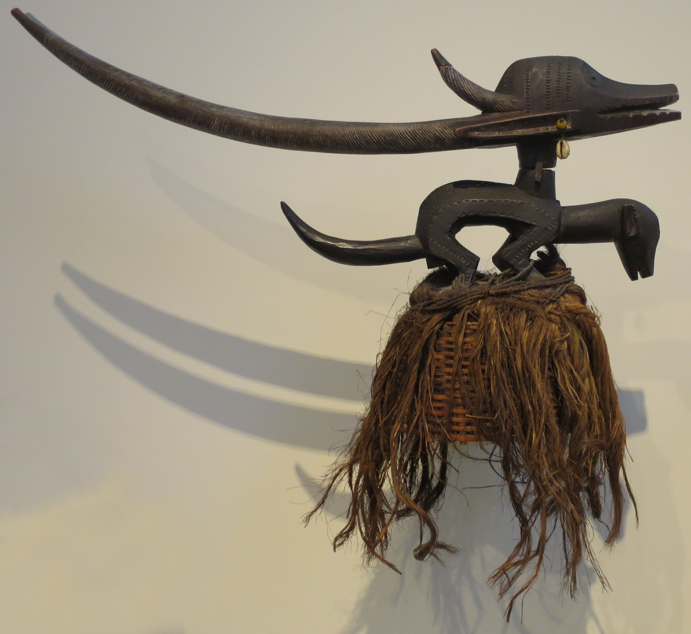

# 班巴拉／巴马纳传统宗教（Bambara／Bamana）

<!-- 来源：CC0 | https://commons.wikimedia.org/wiki/File:Antelope_dance_headdress,_Bamana_or_Bambara_people,_Honolulu_Museum_of_Art,_4377.1.JPG -->

## 概述

**班巴拉人（Bambara，自称 Bamana）** 是马里最重要的曼德语族群体之一，传统上沿尼日尔河从事农业。Encyclopedia.com 与大英百科相关条目记述：传统宗教以创造者神 **Bemba／Ngala** 为核心，并展开与气、火、水、土相关的神性位格叙事（公开材料常提到 Pemba、Nyale／Mousso Koroni、Faro、Ndomadyiri 等）；祖先崇拜、村落守护灵与多个男性启蒙社团（如 Ndomo、Komo、Kono、Tyiwara／Chiwara、Korè 等）构成宗教生活骨架。大英百科 **Chiwara** 条指出：羚羊形头饰与舞蹈纪念教会人类农耕的精灵 Chiwara。今日绝大多数 Bamana 为穆斯林，但公开记述仍提到祖先礼仪与部分传统实践的延续。本条目为教育性概览；**不提供**秘密社团入会、牲礼操作、占卜教程或可复现启蒙仪程。

## 核心观念（祈福 / 功德 / 祈祷如何被理解）

祈福常被理解为：透过对祖先、村落守护灵（公开记述提到 **dasiri** 圣林等）与农耕相关精灵的奉献，求雨顺、丰收、社群免灾。功德贴近：参与（或尊重）启蒙社团所维系的道德秩序、在家庭神龛与村落层面履行献祭义务、不泄露社团知识。访客的「福」体现为：把 Chiwara 头饰当作博物馆艺术与农耕神话来理解，而非可购买的「丰收 Buff」。

## 典型仪式

### 1. Chiwara 羚羊头饰农耕纪念舞（概念层）
- **场合**：耕种与收获季节；今日亦常见于文化展演与博物馆语境。
- **主要步骤（概念层）**：大英百科概述舞者戴 **Chiwara** 羚羊形头饰，模仿羚羊跳跃，纪念教会人类农耕的精灵。**仅概念／展演层介绍**。
- **物品**：木雕羚羊头饰、舞装外观。
- **谁来举行**：传统上相关社团成员；当代文化表演另有编排者。

### 2. Dasiri 村落守护奉献（概念层）
- **场合**：家庭危机、年度村落集体献祭；个人与家庭求福。
- **主要步骤（概念层）**：公开材料概括为在家庭神龛与村落圣林 **Dasiri** 向祖先／守护灵献祭。**CONCEPT ONLY**；不提供牲礼步骤。
- **物品**：神龛、圣林外观（概念）。
- **谁来举行**：家庭长辈与村落有职分者。

### 3. Komo／Ndomo STRICT boundary CONCEPT（限制性）
- **场合**：男童成长、社群道德教化与防护叙事。
- **主要步骤（概念层）**：各社团（**Ndomo**、**Komo** 等）有秘密知识与集会。**STRICT boundary — CONCEPT ONLY**；禁止任何入会复现或秘密 ops。
- **物品**：面具与社团象征物多见于博物馆，现场仪轨从略。
- **谁来举行**：社团成员；外人不得参与。

## 日常与节庆

十九至二十世纪伊斯兰化深刻改变 Bamana 社会；今日多数人自我认同为穆斯林，同时部分地区仍可见祖先礼仪与艺术传统的公共表达。尊重马里法律、地方伊玛目与传统权威对圣地、面具与社团知识的规范。

## 注意与尊重

**勿把 Komo／Korè 写成可解锁的秘密关卡。** 勿模仿牲礼或占卜操作。Chiwara 头饰多为社群与博物馆高度敏感的文化遗产，禁止盗用真品仪式语境。优先 Bamana／马里学术与社群口径。

## 手机互动适合度（Three.js 评估草稿）

- **档位：** B 仅氛围或图文场景
- **敏感度：** 中
- **判断：** **仅氛围／无用户主持。** 秘密启蒙社团与牲礼不可互动化；博物馆语境下的 Chiwara 头饰与农耕神话适合做成可旋转展陈与说明卡。取 B：艺术／神话教育场景，不提供入会或献祭操作。Chiwara 头饰舞与 Dasiri 可作说明；Komo／Ndomo 严格边界、仅概念。
- **若做成互动：** 只做可旋转的 Chiwara 头饰展陈、尼日尔河农耕说明卡与「禁止模拟秘密社团」提示；不提供奉献／入会手势作为胜负条件。
- **红线：** 禁止模拟 Komo 等入会、牲礼、占卜、冒充社团成员，或以真仪名称作胜负。禁止模拟 Komo／Ndomo 入会、牲礼、占卜、冒充社团成员。
- **评估状态：** 待后期统一评估

## 参考来源

- https://www.encyclopedia.com/environment/encyclopedias-almanacs-transcripts-and-maps/bambara-religion
- https://www.encyclopedia.com/humanities/encyclopedias-almanacs-transcripts-and-maps/bamana
- https://www.britannica.com/topic/Chiwara
