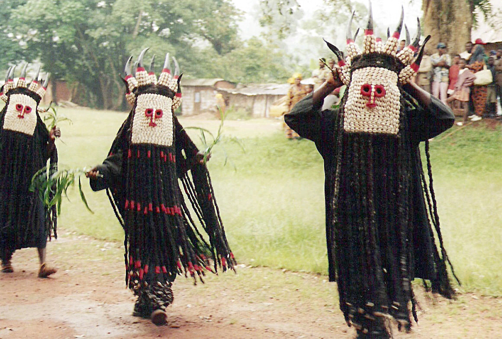

# 巴米累克传统信仰与草原王国祈福（Bamileke）

<!-- 来源：CC BY-SA 3.0 | https://commons.wikimedia.org/wiki/File:Bamileke_dancers.jpg -->

## 概述

**巴米累克人（Bamileke）** 分布于喀麦隆西部草原，以众多酋长国、面具与祖先礼仪传统闻名于民族志（部分内容极高敏感，本卡仅概念提及，**绝不提供操作**）。公开概述记述：今日多数为基督徒，同时习俗与酋长权威仍重要。本条目为教育概览；**严禁**入会、献牲、遗骨相关任何操作化。

## 核心观念（祈福 / 功德 / 祈祷如何被理解）

祈福常被理解为：通过对祖先与酋长秩序的敬意，并／或通过教堂祈祷，求丰收、健康与社群繁荣。功德贴近：支持草原语言与城市侨民慈善。访客的「福」体现为：观礼让路，不把面具写成可购买的「魔法道具」。

## 典型仪式

### 1. 酋长宫廷与公开节庆（概念层）
- **场合**：登基纪念、公共舞会公开记述。
- **主要步骤（概念层）**：理解公开展演与权威象征。**止于观礼礼貌层。**
- **物品**：从略。
- **谁来举行**：宫廷与社群。

### 2. 祖先敬礼（极高敏感，仅概念）
- **场合**：家庭与王国礼仪公开学术叙述。
- **主要步骤（概念层）**：知晓祖先敬礼传统存在。**禁止**任何遗骨／献牲操作化描写。
- **物品**：从略。
- **谁来举行**：家族与仪式权威（内部）。

### 3. 教堂崇拜（概念层）
- **场合**：主日、生命礼仪。
- **主要步骤（概念层）**：理解基督教公开层。**止于公开教会层**。
- **物品**：从略。
- **谁来举行**：教牧与会众。

## 日常与节庆

优先喀麦隆西部草原公开文化层。

## 注意与尊重

**严禁遗骨猎奇。** 面具礼仪勿擅自触摸。摄影须许可。

## 手机互动适合度（Three.js 评估草稿）

- **档位：** A 不建议做成操作型互动
- **敏感度：** 极高
- **判断：** 祖先—面具核心不宜游戏化。
- **若做成互动：** 不建议；最多静态草原王国历史说明。
- **红线：** 禁止遗骨、献牲、入会、冒充仪者。
- **评估状态：** 待后期统一评估

## 参考来源

- https://www.britannica.com/topic/Bamileke
- https://www.britannica.com/place/Cameroon
- https://www.britannica.com/place/West-Africa
