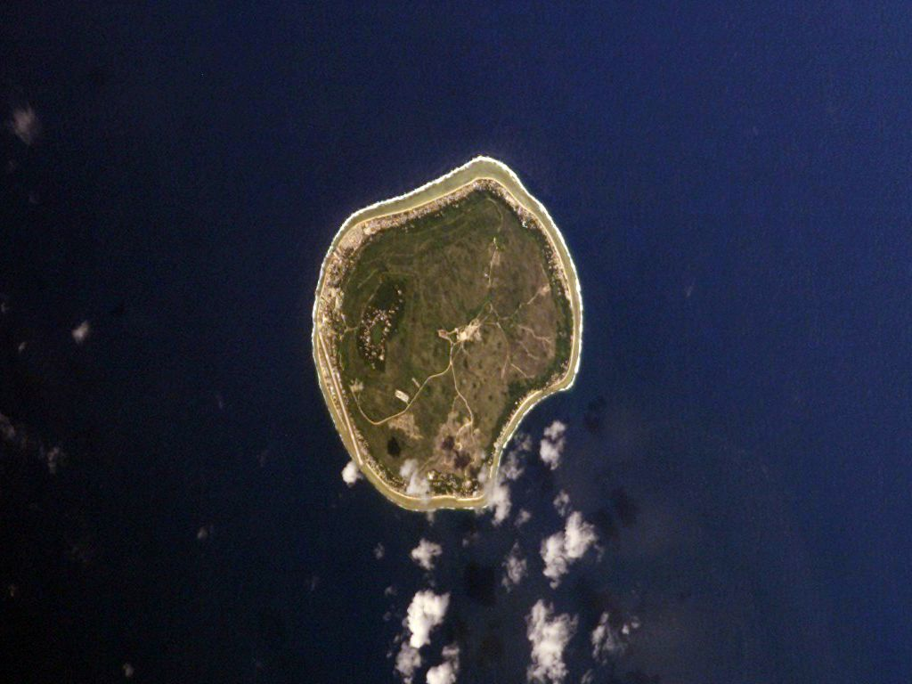

# 巴纳巴人传统信仰与流散—基督教祈福（Banaban）

<!-- 来源：Public domain | https://commons.wikimedia.org/wiki/File:Kiribati_Banaba.jpg -->

## 概述

**巴纳巴人（Banaban）** 原居太平洋巴纳巴岛（Ocean Island），因磷酸盐开采于二十世纪中叶大规模迁至斐济拉比岛（Rabi）等地，形成显著流散社群。公开记述：基督教主导公共崇拜；家园记忆、祖先与海洋伦理进入祈福与政治诉求。本条目为教育概览；**不提供**可冒充首领的步骤；**勿消费流离创伤**。与基里巴斯、斐济主流条目相关但巴纳巴认同独立。

## 核心观念（祈福 / 功德 / 祈祷如何被理解）

祈福常被理解为：通过教堂祈祷求护佑，并通过对祖居岛记忆的敬意维持社群凝聚。功德贴近：支持气候正义、采矿历史诚实叙述与拉比社群福祉。访客的「福」体现为：倾听自述，不把流散写成浪漫流亡故事。

## 典型仪式

### 1. 基督教堂区礼仪（概念层）
- **场合**：主日、生命礼仪。
- **主要步骤（概念层）**：理解当代主要公共崇拜。**止于公开教会层**。
- **物品**：从略。
- **谁来举行**：教牧与信众。

### 2. 家园纪念与公共集会（敏感，仅概念）
- **场合**：纪念日、社群会议公开记述。
- **主要步骤（概念层）**：理解祈祷与记忆交织。**勿消费创伤**。
- **物品**：从略。
- **谁来举行**：社群领袖与家庭。

### 3. 海洋—祖先伦理（概念层）
- **场合**：口述与文化活动。
- **主要步骤（概念层）**：理解对祖居海洋的敬意。**止于概念**。
- **物品**：从略。
- **谁来举行**：长者与文化组织。

## 日常与节庆

优先拉比／巴纳巴流散公开叙述；与基里巴斯卡特区分。

## 注意与尊重

**采矿与被迫迁徙史勿娱乐化。** 摄影须许可。默认尊重社群对外访的边界。

## 手机互动适合度（Three.js 评估草稿）

- **档位：** A 不建议做成操作型互动
- **敏感度：** 极高
- **判断：** 流散创伤不宜游戏化。
- **若做成互动：** 不建议；最多静态历史正义说明。
- **红线：** 禁止采矿寻宝闯关、消费流离、冒充首领。
- **评估状态：** 待后期统一评估

## 参考来源

- https://www.britannica.com/place/Banaba
- https://www.britannica.com/place/Rabi-Island
- https://www.britannica.com/place/Kiribati
