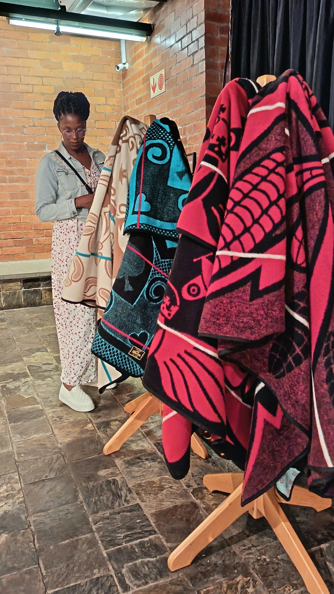

# 巴索托／索托祖先祝福传统（Basotho／Sotho）

<!-- 来源：CC BY-SA 4.0 | https://commons.wikimedia.org/wiki/File:Dikobo_tsa_Basotho.jpg -->

## 概述

**巴索托人（Basotho）** 是南部非洲索托语（Sesotho）群体的核心一支，主要分布于莱索托王国与南非自由邦等地；大英百科在 **Sotho** 条下将其与北索托、茨瓦纳等并列为广阔的班图语文化连续体。公开民族志与百科综述强调：至高存在常称 **Modimo（Molimo）**，一般不直接崇拜，而是透过祖先灵 **balimo／badimo** 作为中介；遗忘或怠慢祖先可导致疾病与不幸。家庭院落中的小型祭坛、墓前奉献，以及啤酒、鼻烟、肉食等象征性供奉，是可见的祈福与和解途径。莱索托文化生活中，成丁学校（*lebollo*）仍传承社群价值，但属高度限制性礼仪。许多人同时实践基督教与祖先敬拜。本条目为教育性概览；**不提供**献牲操作、成丁／割礼步骤、疗愈脚本或任何可复现仪轨。

## 核心观念（祈福 / 功德 / 祈祷如何被理解）

祈福常被理解为：透过祖先向 Modimo 转达祈求，求雨水、收成、家宅平安与人际关系修复；公开记述提到「幼神（祖先）向老神（至高）祈祷」的谚语式表述。功德贴近：履行对自家父系祖先的义务、在首席／族长层面顾及部落福祉、尊重医者／神启者职分。访客的「福」体现为：把祖先器皿与院落圣地视为不可擅入的家庭宗教空间，而非旅游「许愿角」。

## 典型仪式

### 1. Badimo 院落祭坛与祖先奉献（民俗／概念层）
- **场合**：家庭重大事务、疾病忧虑、迁居、和解与节庆前后。
- **主要步骤（概念层）**：透过祖先灵 **Badimo**（亦作 balimo）向 Modimo 转达祈求；院落小祭坛或墓前奉献仅为概念。**CONCEPT**；禁止供奉操作教程。
- **物品**：院落祭坛外观、陶制祖先器概念；公共文化标识亦见 **Seana Marena**（巴索托毯）等。
- **谁来举行**：家庭长辈与亲属；酋长可代表更大群体。

### 2. Mathuela／Ngaka CONCEPT（限制性公共知识层）
- **场合**：诊断不幸来源、调解与祖先相关的失衡。
- **主要步骤（概念层）**：研究概述 **Ngaka**、**Mathuela**（*lethuela*）等行者，常被认为由祖先召唤入职。**CONCEPT ONLY**；不提供诊断或附体脚本。
- **物品**：从略。
- **谁来举行**：受召唤并经社群承认者；游客不得自称。

### 3. Lebollo CONCEPT ONLY；Seana Marena 公共文化（限制性名称层）
- **场合**：莱索托与相关地区仍存的成丁教育（**Lebollo**）；日常可见的毯袍文化（**Seana Marena**）。
- **主要步骤（概念层）**：Lebollo 仅作社会功能命名——道德、历史与灵性教育面向。**LEBOLLO CONCEPT ONLY**；禁止任何身体改造或山中学校操作。Seana Marena 可作公共服饰文化说明。
- **物品**：毯袍外观（公共层）；成丁细节从略。
- **谁来举行**：传统导师与社群；严禁外人闯入或偷拍成丁场合。

## 日常与节庆

乡村生活围绕田地、酋长法庭、畜栏、学校、教堂与成丁居所展开；多彩毯袍（**Seana Marena** 等）与锥形草帽是可见的文化标识。莱索托过基督教节日与独立日等公共假日。尊重莱索托与南非法律对成丁学校、摄影与文化遗产的规范。

## 注意与尊重

**勿把 badimo 写成可收集的「祖先精灵」。** 勿购买「巴索托成丁体验」或模仿院落献祭。涉及身体切割的礼仪仅作概念认知。优先巴索托社群、莱索托文化机构与可靠百科口径；勿与祖鲁／恩古尼条目混为一谈。

## 手机互动适合度（Three.js 评估草稿）

- **档位：** B 仅氛围或图文场景
- **敏感度：** 中高
- **判断：** **仅氛围／无用户主持。** 山地王国村落与毯袍文化可做氛围场景；院落祖先祭与成丁学校均不可做成操作关卡。取 B：可旋转山地村落与说明卡，明确禁止模拟献祭与成丁。Badimo／Seana Marena 可作氛围；Mathuela／Ngaka 与 Lebollo 仅 CONCEPT。
- **若做成互动：** 只做可旋转莱索托山地／村落外观、Modimo—balimo 概念说明卡。不提供献酒、熏香或成丁相关手势练习。
- **红线：** 禁止模拟祖先献祭、冒充 ngaka／sangoma、复现 lebollo／割礼，或以真仪名称作胜负。禁止模拟祖先献祭、冒充 Ngaka／Mathuela、复现 Lebollo／割礼。
- **评估状态：** 待后期统一评估

## 参考来源

- https://www.britannica.com/topic/Sotho
- https://www.britannica.com/place/Lesotho/Cultural-life
- https://www.encyclopedia.com/places/africa/south-african-political-geography/sotho
