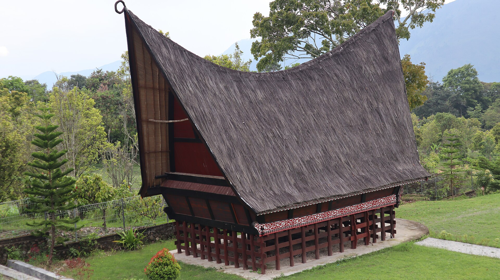

# 巴塔克帕马林／乌加莫马林（Parmalim／Ugamo Malim）

<!-- 来源：CC BY-SA 4.0 | https://commons.wikimedia.org/wiki/File:Rumah_Bolon_(Batak_Traditional_House).jpg -->

## 概述

**帕马林（Parmalim）** 指印度尼西亚北苏门答腊**托巴巴塔克人（Toba Batak）** 中遵循 **乌加莫马林（Ugamo Malim，常称马林教／巴塔克民族宗教之现代形态）** 的信徒与其信仰实践。大英百科记述巴塔克诸群体历史上以祖先与自然灵观念为特征，今日多数改信基督新教或伊斯兰教，但仍有社群持守本土宗教形态。学术期刊记述：马林教以创造主 **Debata Mulajadi Na Bolon** 为核心（公开叙述亦涉 **Debata Asiasi** 等神名层级），强调洁净（*hamalimon*），并由 **Ihutan** 等祭司职分主持；并有出生、丧葬、周六礼拜与年度大礼等义务性仪典；部分仪典须配合 **gondang**（鼓乐）与 **tortor**（传统舞）。本条目为教育性概览；**不提供**献祭操作、洁净配方细节或可复现的祭司指引。

## 核心观念（祈福 / 功德 / 祈祷如何被理解）

祈福常理解为向 Debata Mulajadi Na Bolon 祈求洁净、赦罪、丰收与生命阶段的妥当过渡。公开研究强调马林教神学与巴塔克文化叙事、伦理教导紧密交织，并适应现代社会以求存续。功德贴近守洁净规范、参与周六集体礼拜、在 Sipaha Sada／Sipaha Lima 等年度礼仪中与社群同在，以及维护与祖先／自然秩序的正当关系。访客的「福」体现为尊重少数群体信仰地位、不把 gondang／tortor 抽离为无语境的旅游表演要求。

## 典型仪式

### 1. Marari Sabtu／周六礼拜（公开可见层）
- **场合**：每周六的集体崇拜；是日常宗教生活的节奏核心之一。
- **主要步骤（概念层）**：会众聚集祈祷与教导。**止于公开礼拜存在的事实**；不提供内部讲章或仪文照做版。用户仅氛围／观礼边界。
- **物品**：礼拜空间（parsantian 等）、简明礼仪布置。
- **谁来举行**：帕马林社群与其宗教领袖（含 **Ihutan** 祭司职分公开命名）；访客不可主持。

### 2. Sipaha Sada 与 Sipaha Lima（年度大礼，观礼边界）
- **场合**：纪念神圣诞生叙事的 Sipaha Sada；与收获／奉献相关的 Sipaha Lima 等年度高峰。
- **主要步骤（概念层）**：学术文献指出此类大礼常须 gondang 与 tortor 相伴。**Sipaha — viewing boundaries**；仅概念说明；不展开献牲或洁净操作细节。
- **物品**：鼓乐、舞蹈空间、节庆服饰与供奉外观。
- **谁来举行**：获承认的礼仪主持人与社群——非游客点菜式「加演」。

### 3. Debata Asiasi／人生礼仪与洁净（概念层）
- **场合**：Martutuaek（出生）、Mamasumasu（婚姻祝福）、Pasahat Tondi（丧葬相关）、Marpangir（洁净）等；神名层级公开提及。
- **主要步骤（概念层）**：理解 **Debata Asiasi** 等公开神名与生命阶段礼仪存在。**CONCEPT ONLY**；**不提供**可复现步骤或「去罪」操作手册。
- **物品**：依礼仪而异的洁净与祝福可见物。
- **谁来举行**：家庭与 **Ihutan**／宗教权威。

## 日常与节庆

帕马林社群在官方宗教分类中常处边缘，礼拜场所建设与公开仪式有时受限制——本档案只述信仰结构，不介入行政争议细节。托巴湖周边文化旅游常见巴塔克建筑与音乐，但不等同于获邀参加马林教核心礼仪。

## 注意与尊重

**勿将**帕马林污名为「邪教」或「魔鬼崇拜」（社群领袖公开反驳此类诽谤）。勿要求社群为游客表演 Sipaha Lima。勿把猪肉禁忌等规范戏仿为猎奇内容。勿擅自进入未开放的 parsantian。商业使用 gondang／tortor 与仪典影像须经社群授权。

## 手机互动适合度（Three.js 评估草稿）

- **档位：** B 仅氛围或图文场景
- **敏感度：** 高
- **判断：** **仅氛围／无用户主持。** 作为仍在实践的少数群体宗教，周六礼拜与年度大礼均有资格与场所限制；Debata Asiasi／Ihutan 仅命名；Sipaha 观礼边界；gondang／tortor 易被旅游化。适合建筑／湖区氛围与说明卡，不适合做成可完成的真礼拜关卡。
- **若做成互动：** 只做可旋转的托巴湖畔／传统房屋外观场景与说明卡。可选：轻点一面鼓图标阅读「音乐属礼仪，不是点播」提示；不作献祭、洁净操作或主持礼拜。
- **红线：** 禁止模拟帕马林礼拜主持、复现 Sipaha Lima 献祭、教做洁净配方，或以 Ugamo Malim 真仪名称作胜负。
- **评估状态：** 待后期统一评估

## 参考来源

- https://www.britannica.com/topic/Batak
- https://doi.org/10.4102/hts.v80i1.9167
- https://hts.org.za/index.php/hts/article/view/9167
- https://doi.org/10.15575/jis.v5i3.43073
