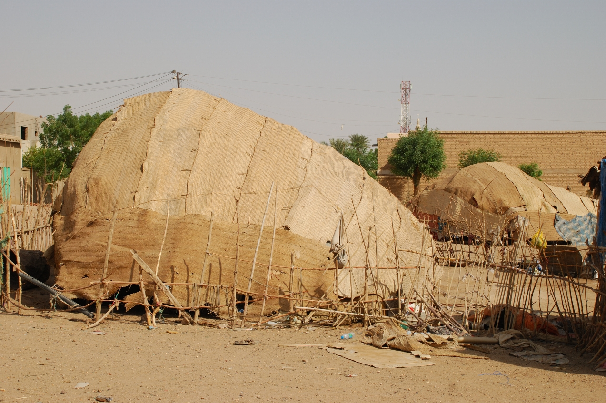

# 贝贾牧民伊斯兰与红海山地祈福传统（Beja）

<!-- 来源：CC BY 3.0 | https://commons.wikimedia.org/wiki/File:Beja_tent_Atbara.jpg -->

## 概述

**贝贾人（Beja）** 为红海与尼罗河之间山地—沙漠的库希特语游牧／半游牧民族，分布于埃及东南、苏丹与厄立特里亚高原。大英百科记述：其祖先可追溯至极早的地区居民；语言有 To Bedawi，部分操提格雷语，多人亦用阿拉伯语；六世纪曾有基督教化，自约十三世纪多数为穆斯林。传统上偏好与邻族保持距离，对贸易兴趣被描述为淡薄。当代宗教生活以逊尼伊斯兰为主，并与骆驼—牛羊牧养伦理、部族习惯法交织。公开记述亦提及 **Khatmiyya（哈特米亚）** 等苏菲教团影响，以及 **Kassala** 等地圣徒／谢赫圣地朝谒的概念层；节庆与迎宾中可见 **Dhaff／Sababla** 等剑舞／盾舞公共展演（概念命名，非作战教程）。本条目为教育概览；**不提供**献牲操作、部族仇杀脚本或任何可冒充宗教专家的程序。

## 核心观念（祈福 / 功德 / 祈祷如何被理解）

祈福常被理解为：在干旱山地中，通过礼拜、斋月与对真主的托靠，祈求雨水、畜群平安与氏族和解；习惯法调解亦具道德—宗教分量。功德贴近：待客、斋月济贫、守护牧场水源。访客的「福」体现为：认真对待东苏丹／红海地区的发展与冲突语境，勿把贝贾写成「孤立野蛮人」。

## 典型仪式

### 1. 伊斯兰礼拜与斋月；Khatmiyya／Kassala 圣地（公共—概念层）
- **场合**：日常拜功、周五聚礼、斋月与两大节日；苏菲教团（如 Khatmiyya）相关公开敬礼；Kassala 等地圣徒／谢赫圣地朝谒叙事。
- **主要步骤（概念层）**：礼拜、开斋共餐、施舍；圣地朝谒属公开概念层。**止于概念**；不提供教团入会或圣地秘祷步骤。
- **物品**：清真寺／祈祷点与圣地外观（概念）。
- **谁来举行**：伊玛目、谢赫承认框架下的会众／家族。

### 2. 生命礼仪、部族互助与 Dhaff／Sababla 剑舞概念（公共层）
- **场合**：命名、婚礼、丧葬；节庆／迎宾中的公开展演。
- **主要步骤（概念层）**：伊斯兰礼仪与习惯法并行的公开文化层；Dhaff／Sababla 等剑舞／盾舞仅作公共文化命名与观礼理解。**止于概念**；禁止当作格斗或「召唤」教程。
- **物品**：从略。
- **谁来举行**：宗教职分者与长老；舞者属社群公开展演层。

### 3. 牧养伦理与求雨叙事（概念层）
- **场合**：旱季、迁徙。
- **主要步骤（概念层）**：理解畜群—水源—信仰的互惠。**献牲仅作概念**。
- **物品**：从略。
- **谁来举行**：牧民与长老。

## 日常与节庆

贝贾跨三国分布，政治边缘化常见于报道。优先 Britannica 与贝贾人自身声音。

## 注意与尊重

**勿在冲突区进行冒险旅游。** 勿擅自拍摄妇女与营地内部。尊重游牧迁徙路线与水源。勿与阿法尔、提格雷条目混同。

## 手机互动适合度（Three.js 评估草稿）

- **档位：** C 可做致敬小品（非真仪）
- **敏感度：** 低–中
- **判断：** 红海山地与牧养公共层适合轻量致敬；冲突场景不可游戏化。取 C：原创手势练习，明确非真仪。
- **若做成互动：** 手势练习示例——(1) 陀螺仪眺望红海丘陵说明卡；(2) 拖动将「分享乳品」放入待客示意；(3) 写下祈雨／和平的一句祝福；(4) 点亮灯火象征营地平安。禁止战争闯关。
- **红线：** 禁止模拟冲突、献牲操作或以真拜功名称作胜负。
- **评估状态：** 待后期统一评估

## 参考来源

- https://doi.org/10.1371/journal.pone.0253511
- https://doi.org/10.37892/2686-8946-2022-3-2-368-388
- https://cedejsudan.hypotheses.org/2791
- https://doi.org/10.1080/13648470.2011.646945
- https://doi.org/10.1075/sl.00003.van
- https://doi.org/10.1080/00934690.2025.2479290
