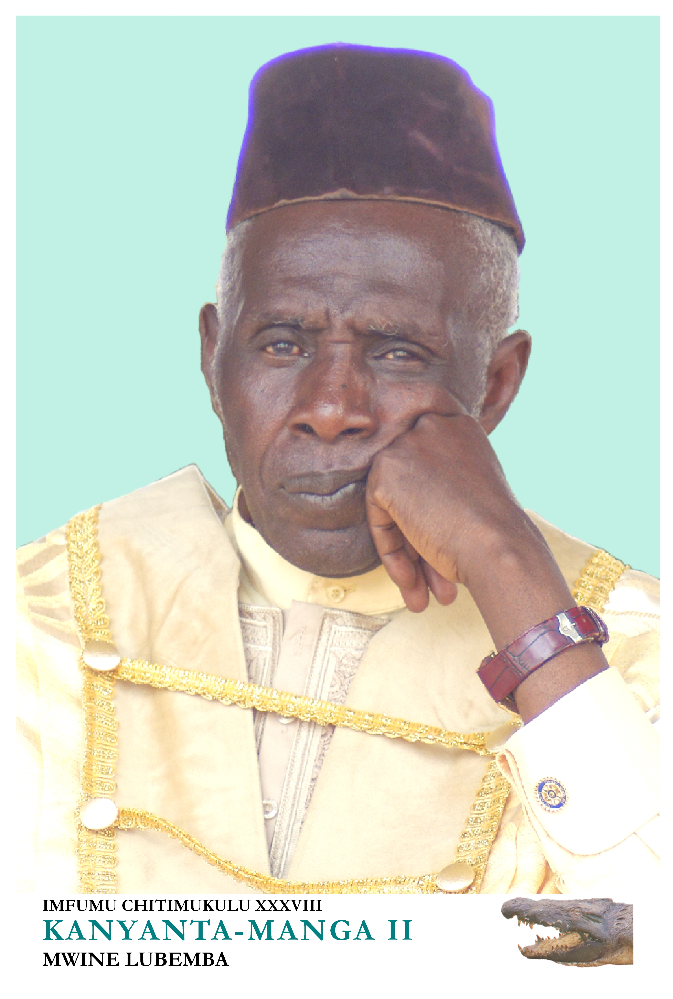

# 本巴传统宗教与莱萨—祖灵祈福（Bemba）

<!-- 来源：CC BY-SA 4.0 | https://commons.wikimedia.org/wiki/File:Chitimukulu_38_KANYANTA-MANGA_II.jpg -->

## 概述

**本巴人（Bemba；亦作 Babemba）** 为赞比亚东北部等地的班图语民族，历史上以母系氏族与大酋长 **Citimukulu** 为中心的政治传统著称。公开宗教学条目（encyclopedia.com《Bemba Religion》）记述：本巴承认至高创造神 **Lesa**——掌管雨水与人、畜、作物的生育力，亦是疗愈草木力量的源头；通常无日常献祭崇拜团，但在严重旱灾等共同体危机时组织集体求请。日常宗教生活更贴近**祖灵**、王室圣物与圣地（如与女始祖 Bwalya Chabala 相关的叙事与供奉外观；公开材料亦提及 **Ituna／Mbabala** 等王室祖先圣地概念命名）。公开民族志亦记述女性成年礼仪 **Chisungu** 与教导物件／象征 **Mbusa**——**仅作概念命名**，不提供任何入会／教导如何操作。基督教在殖民与后殖民时期广泛传播，形成交织景观。本条目为教育概览；**不提供**献牲操作、王室秘仪、入会细节或任何可冒充仪式专家的程序。

## 核心观念（祈福 / 功德 / 祈祷如何被理解）

祈福常被理解为：在母系亲属与酋长权威下，通过对 Lesa 的敬畏与祖灵／王室记忆的维护，祈求雨水、土地肥沃与政治和平。功德贴近：供养圣地与长老、遵守土地伦理、在教会与传统互助中扶持邻里。访客的「福」体现为：尊重 Citimukulu 制度仍具当代意义，勿把本巴写成「无国家部落」。

## 典型仪式

### 1. 旱灾等危机中的 Lesa 集体祈请（概念层）
- **场合**：严重干旱或共同体危机。
- **主要步骤（概念层）**：公开材料指出组织集体仪式求 Lesa 相助。**止于概念**；不提供操作。
- **物品**：从略。
- **谁来举行**：酋长—长老体系承认的权威。

### 2. 祖灵与王室圣地敬礼（Ituna／Mbabala 等，部分敏感）
- **场合**：女始祖／王室相关圣地（公开记述中的 Ituna、Mbabala 等概念命名）；布、面粉等供奉外观见诸公开记述。
- **主要步骤（概念层）**：理解土地—女性始祖—王权叙事的互惠。**禁止**闯入圣地或复现供奉步骤。
- **物品**：从略。
- **谁来举行**：王室礼仪职分者与家族。

### 2b. Chisungu／Mbusa（概念命名层，禁止 how-to）
- **场合**：公开民族志中的女性成年礼仪与教导象征物件叙事。
- **主要步骤（概念层）**：仅作名称与存在性认知——Chisungu 为礼仪框架、Mbusa 为教导象征。**绝不提供**入会程序、教导内容或操作步骤。
- **物品**：从略（禁止图解操作）。
- **谁来举行**：社群承认的女性礼仪权威；外人不得模仿。

### 3. 教会生活与生命礼仪（公共／当代层）
- **场合**：弥撒／礼拜、婚礼与丧礼。
- **主要步骤（概念层）**：基督教与祖灵伦理并存。**止于概念**。
- **物品**：教堂外观（概念）。
- **谁来举行**：教牧与家庭。

## 日常与节庆

本巴地区以农业与铜带城市移民网络相连。写作应优先 encyclopedia 与赞比亚本地叙述，避免把母系制度猎奇化。

## 注意与尊重

**勿擅自接近王室圣物屋或圣地。** 勿拍摄未同意的丧礼。勿将本巴与广义「班图乌班图」条目混同为可互相替代。献牲与入会（含 Chisungu／Mbusa）仅作概念认知；**禁止**任何 how-to。

## 手机互动适合度（Three.js 评估草稿）

- **档位：** C 可做致敬小品（非真仪）
- **敏感度：** 中
- **判断：** 高原农作与雨水祈愿的公共伦理层适合轻量致敬；王室秘仪不可操作化。取 C：原创手势练习，明确非真仪。
- **若做成互动：** 手势练习示例——(1) 陀螺仪眺望高原农田说明卡；(2) 拖动将「分享面粉」放入邻里互助示意；(3) 写下祈雨／和平的一句祝福；(4) 点亮家屋灯火。禁止进圣地闯关。
- **红线：** 禁止模拟献牲、王室秘仪或以真仪名称作胜负。
- **评估状态：** 待后期统一评估

## 参考来源

- https://doi.org/10.17159/2309-9585/2026/v52a7
- https://doi.org/10.1093/acref/9780195301731.013.48534
- https://dx.doi.org/10.3389/fenvs.2025.1538921
- https://repository.up.ac.za/server/api/core/bitstreams/644905d8-357e-4d23-b318-2c400436484a/content
- https://scielo.org.za/scielo.php?script=sci_arttext&pid=S1011-76012025000100002
- https://njas.fi/njas/article/view/103
- https://ich.unesco.org/en/RL/kalela-dance-01698
