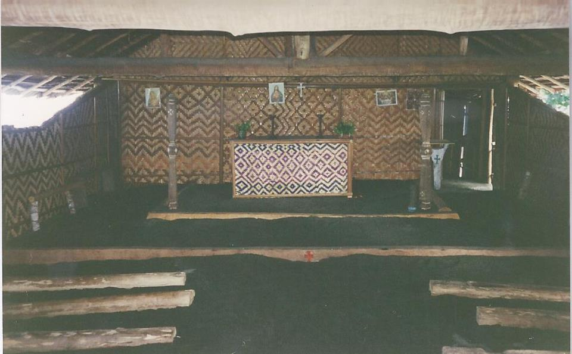

# 比南代雷传统信仰与巴布亚北岸祈福（Binandere）

<!-- 来源：CC BY-SA 3.0 | https://commons.wikimedia.org/wiki/File:Village_Anglican_church_in_Oro_Province.jpg -->

## 概述

**比南代雷人（Binandere）** 分布于巴布亚新几内亚北部（奥罗省一带）相关语群社群。公开叙述涉及园艺、氏族与展示礼仪——**高度敏感，本卡仅概念层**。今日并存基督教与现金作物。教育概览；**严禁**入会／丧礼操作或可冒充仪者的步骤。与奥罗凯瓦等北岸条目区分。

## 核心观念（祈福 / 功德 / 祈祷如何被理解）

祈福常被理解为：通过对祖先、园地肥力与展示名誉的正确关系，求健康与社会认可。功德贴近：支持地方教育与去殖民刻板印象。访客的「福」体现为：**非邀莫入**私域仪典。

## 典型仪式

### 1. 园艺与丰产伦理（概念层）
- **场合**：农作季节公开叙述。
- **主要步骤（概念层）**：理解劳动与分享。**勿写成魔法咒语教程。**
- **物品**：从略。
- **谁来举行**：家庭。

### 2. 展示与舞会（公开／敏感交界）
- **场合**：公开节庆与历史记述。
- **主要步骤（概念层）**：观看获邀的公开表演。**禁止**未授权身体彩绘复现当 authentic。
- **物品**：从略。
- **谁来举行**：表演群体。

### 3. 基督教与丧礼（敏感，仅概念）
- **场合**：教会与家庭。
- **主要步骤（概念层）**：公开礼拜可从众；丧礼**禁止观光**。
- **物品**：从略。
- **谁来举行**：教会与亲属。

## 日常与节庆

优先省内合法文化活动与教会公开礼拜。

## 注意与尊重

勿将北岸文化简化为殖民猎奇叙事。

## 手机互动适合度（Three.js 评估草稿）

- **档位：** A 不建议做成操作型互动
- **敏感度：** 高
- **判断：** 丧礼与入会绝不可游戏化；公开氛围亦须克制。
- **若做成互动：** 不建议操作型；最多北岸地理图文。
- **红线：** 禁止丧礼通关、入会、冒充仪者。
- **评估状态：** 待后期统一评估

## 参考来源

- https://www.britannica.com/place/Papua-New-Guinea
- https://www.britannica.com/topic/Melanesian-culture
- https://www.britannica.com/place/New-Guinea
