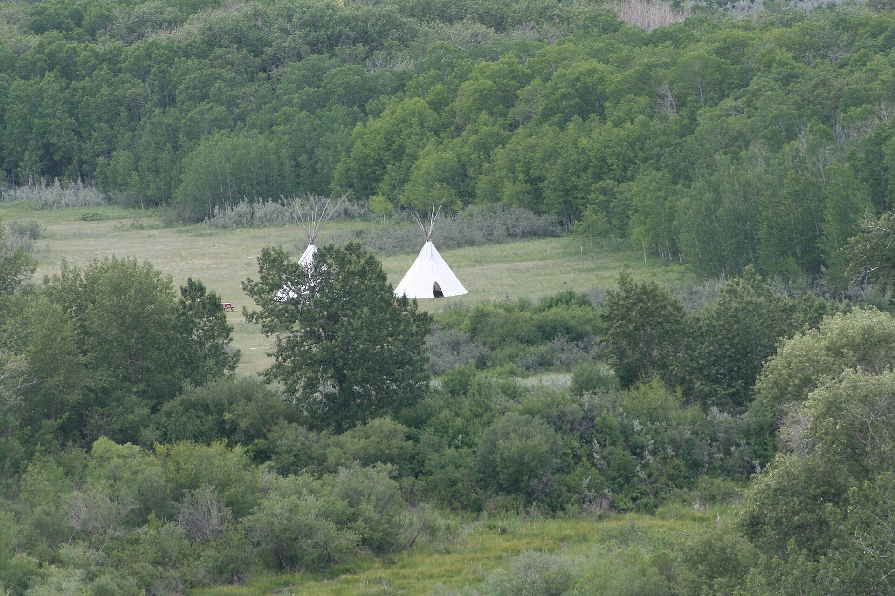

# 黑足／尼特西塔皮礼仪与医药捆（Niitsitapi／Blackfoot medicine bundles）

<!-- 来源：CC BY 2.0 | https://commons.wikimedia.org/wiki/File:Blackfoot_crossing_Alberta_Canada_(16045368024).jpg -->

## 概述

**黑足人（Blackfoot／Blackfeet；自称语境常作 Niitsitapi「真实之人」）** 为北美大平原阿尔冈昆语族社群，传统上包括 **Siksika、Kainai（Blood）、Piikani（Piegan／Peigan）** 等，分布于今加拿大阿尔伯塔与美国蒙大拿。大英百科记述：夏季各大狩猎群体会聚集举行主要部落性宗教礼仪 **Sun Dance（太阳舞）**；许多个人持有复杂的 **medicine bundles（医药捆／神圣捆）**——内含歌曲、故事与圣物，在正确礼仪下关涉保护、狩猎与康健。Encyclopedia.com 等强调捆物作为「可携带圣所」，连结水下、陆地与天空的存在，并以严格转让礼仪在保管者之间流通。本条目为教育性概览；**不提供**太阳舞肉体奉献操作、捆物打开程序、幻视追求教程或歌曲盗用。

## 核心观念（祈福 / 功德 / 祈祷如何被理解）

「祝福」常被理解为：透过与自然力量建立互惠关系、妥善保管并尊敬转让医药捆，以及在社群性太阳舞中更新生命。大英百科称夏季太阳舞为主要部落宗教礼仪；妇女许愿与 **Natoas** 等相关捆物在公开民族志中被视为 Okan／太阳舞的重要环节。功德贴近：遵守保管者戒律、参与馈赠与宴请、支持捆物回归社群（归还／遣返）而非文物投机。访客的「福」体现为：不触摸、不购买来路不明的「圣物」，把博物馆展品与仍在使用的捆物区分开来。

## 典型仪式

### 1. 医药捆保管与转让（概念层）
- **场合**：个人、社团或社群层级的捆物；如 Beaver Bundle、Medicine Pipe、Natoas 等公开文献曾述及的类型。
- **主要步骤（概念层）**：公开研究概括为在导师指导下以馈赠／宴请完成转让，伴随歌曲与义务。**仅概念介绍**；不提供打开捆物或演唱专属歌曲的步骤。
- **物品**：包裹中的自然物、烟斗等外观（博物馆可见复制／历史描述）。
- **谁来举行**：有资格的保管者夫妇／社团成员。

### 2. 太阳舞／Okan（限制性公共知识层）
- **场合**：夏季社群大营；传统上可与妇女许愿、Natoas 转让及多日祈祷相关。
- **主要步骤（概念层）**：大英百科将其列为黑足主要部落宗教礼仪；详细身体奉献与誓约内容**不予复述为操作指南**。
- **物品**：礼仪营地与相关捆物外观（概念）。
- **谁来举行**：许愿者、圣者／祭司职分与社群；绝非旅游体验项目。

### 3. 甜草焚香与日常祈祷意象（概念层）
- **场合**：个人祈祷、净化与公开文化教育场合。
- **主要步骤（概念层）**：艺术与民族志图像传统中常见甜草（sweetgrass）等焚香意象；具体家庭做法从略，避免写成「万能净化关卡」。
- **物品**：甜草编织辫外观。
- **谁来举行**：家庭与知识保管者。

## 日常与节庆

殖民时期野牛灭绝、条约、寄宿学校与土地割让造成深重创伤；二十世纪後期以来，Piikani 等社群推动捆物归还与太阳舞复兴。尊重各 Nation 对礼仪季节、摄影与外人参与的规定。

## 注意与尊重

**勿购买或转售宣称「真医药捆」的网拍物件。** 勿把太阳舞写成极限挑战赛。涉及肉体奉献、幻视与捆物歌曲时，仅作概念层理解。优先 Siksika、Kainai、Piikani／Blackfeet Nation 口径。

## 手机互动适合度（Three.js 评估草稿）

- **档位：** A 不可做成关卡
- **敏感度：** 高
- **判断：** 医药捆与太阳舞均属高度规范的神圣财产／社群仪轨；做成「收集捆物」或「许愿通关」会直接冒犯。取 A：只读历史与归还伦理说明，不可操作礼仪。
- **若做成互动：** 不提供操作步骤。仅可考虑只读联盟地理、语言濒危与「捆物不是商品」教育图文。
- **红线：** 禁止模拟打开／转让医药捆、太阳舞肉体奉献、盗用歌曲，或以 Sun Dance／Okan／medicine bundle 真仪名称作胜负。
- **评估状态：** 待后期统一评估

## 参考来源

- https://www.britannica.com/topic/Blackfoot-people
- https://www.encyclopedia.com/environment/encyclopedias-almanacs-transcripts-and-maps/blackfeet-religious-traditions
- https://americanindian.si.edu/
