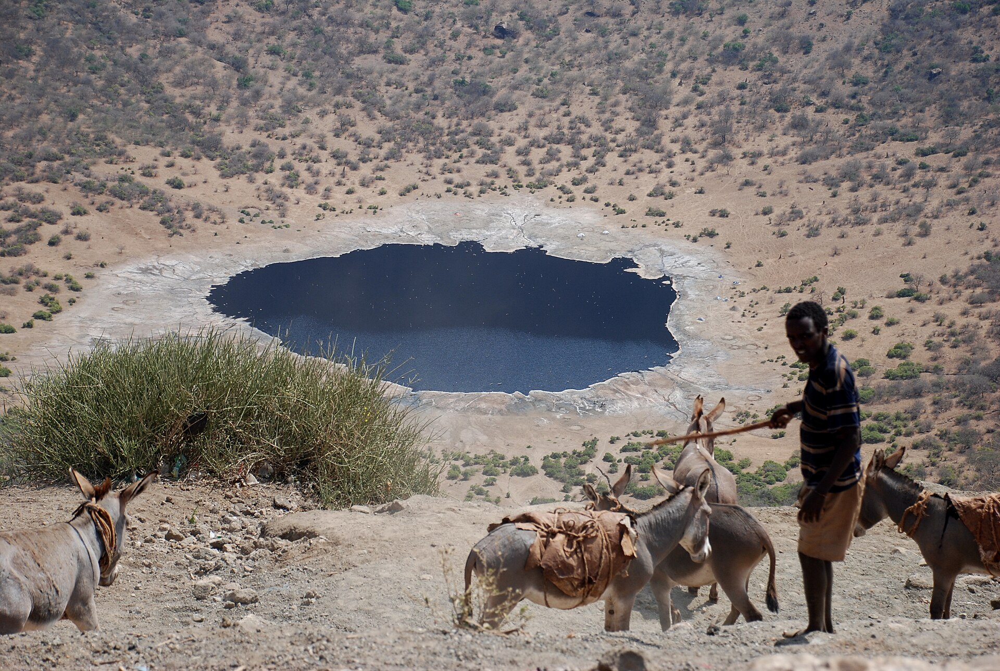

# 博拉纳传统信仰与东非牧祈福（Borana）

<!-- 来源：CC BY-SA 4.0 | https://commons.wikimedia.org/wiki/File:Borana_herder_descending_into_El_Sod_crater,_Ethiopia,_2011.jpg -->

## 概述

**博拉纳人（Borana）** 为奥罗莫支系牧人社群，分布于埃塞俄比亚南部与肯尼亚北部。公开叙述涉及 **Gadaa** 世代制度（**UNESCO** 人类非物质文化遗产相关公开层）、至高神 **Waaqa**、精神权威 **Kallu**、以及 **Singing Wells（歌唱井）** 等井泉—牧界伦理——**中高敏感**。今日并存伊斯兰教／基督教接触与跨境牧界政治。教育概览；不提供祭祀操作。与马赛、桑布鲁、伦迪勒等条目区分（博拉纳属奥罗莫—盖达传统，非马赛）。

## 核心观念（祈福 / 功德 / 祈祷如何被理解）

祈福常被理解为：通过对井泉、牲畜与 gadaa 道德秩序的正确关系，求雨水、和平与畜群繁荣。功德贴近：支持和平协商与反对歧视。访客的「福」体现为：尊重**公开**文化表述，勿闯入议事／祭祀核心。

## 典型仪式

### 1. Gadaa UNESCO 与 Waaqa 伦理（概念层）
- **场合**：公开文化遗产叙述（含 **Gadaa** 制度的 UNESCO 相关公开层）。
- **主要步骤（概念层）**：理解世代责任、和解价值与对 **Waaqa** 的敬畏叙事。**CONCEPT ONLY**；**禁止**把议事写成可扮演权斗游戏。
- **物品**：从略。
- **谁来举行**：传统权威（内部）；访客不可主持。

### 2. Singing Wells 与牧界祝福（敏感，仅概念）
- **场合**：旱季—雨季、井泉管理公开记述。
- **主要步骤（概念层）**：理解 **Singing Wells** 等井泉劳动／礼仪叙事与牧界用水伦理。**止于概念**；不提供井泉仪轨 how-to。
- **物品**：从略。
- **谁来举行**：长者与牧团。

### 3. Kallu 与精神领袖（观礼 only）
- **场合**：公开文化日与合法表述。
- **主要步骤（概念层）**：知晓 **Kallu** 等精神领袖角色存在。**spiritual leaders — viewing-only**；**禁止**冒充或「请长老做法」旅游脚本。并存伊斯兰／基督教公开层止于常识。
- **物品**：从略。
- **谁来举行**：被承认的精神权威；用户仅观礼／氛围。

## 日常与节庆

优先公开文化日与合法市集；关注牧界冲突安全提示。

## 注意与尊重

勿将奥罗莫—博拉纳简化为「部落仇杀」奇观。

## 手机互动适合度（Three.js 评估草稿）

- **档位：** B 仅氛围或图文场景
- **敏感度：** 中高
- **判断：** **仅氛围／无用户主持。** 可做草原—井泉氛围；Gadaa／Waaqa／Singing Wells 仅命名与概念；Kallu 等精神领袖仅观礼。
- **若做成互动：** 静态牧场景与和平伦理说明。
- **红线：** 禁止祭祀操作、议事权斗通关、冒充长老。 禁止祭祀操作、议事权斗通关、冒充 Kallu／长老。
- **评估状态：** 待后期统一评估

## 参考来源

- https://www.britannica.com/topic/Borana
- https://www.britannica.com/topic/Oromo
- https://www.britannica.com/place/Ethiopia
