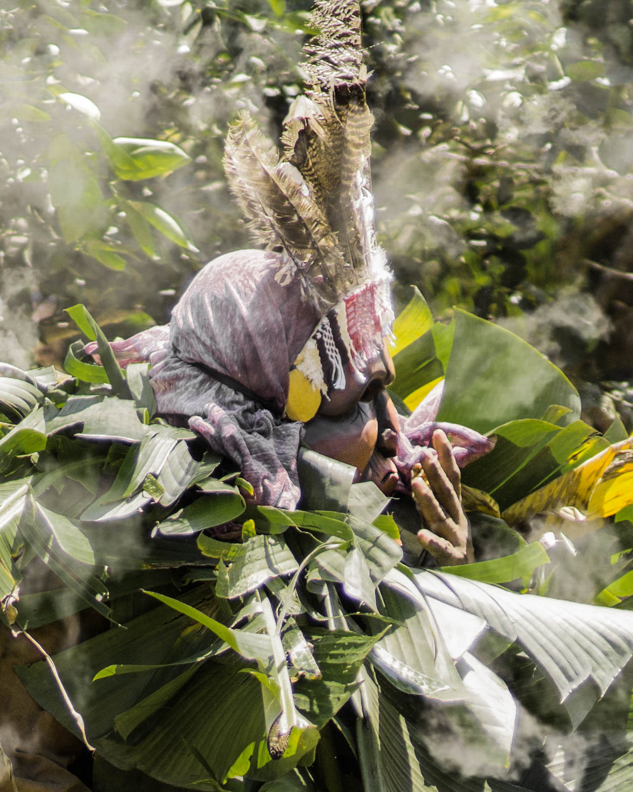

# 博鲁卡传统信仰与收获节祈福（Boruca／Brunca）

<!-- 来源：CC BY-SA 4.0 | https://commons.wikimedia.org/wiki/File:Boruca_Fiesta_de_los_Diablitos.jpg -->

## 概述

**博鲁卡人（Boruca／Brunca）** 分布于哥斯达黎加南部。公开文化记述：天主教与本土认同交织；著名的「小魔鬼舞」（Juego de los Diablitos）等节庆以**雕刻面具**、**植物染色纺织**与**抵抗记忆**为核心公共文化层，常被旅游过度奇观化——本卡强调其为社群历史—认同展演，**禁止**写成可购买的「驱魔／exorcism how-to」。本条目为教育概览；**不提供**可冒充仪者的步骤。

## 核心观念（祈福 / 功德 / 祈祷如何被理解）

祈福常被理解为：通过节庆中的社群凝聚、对祖先与土地的敬意，并／或通过教堂礼仪，求丰收、健康与尊严。功德贴近：支持博鲁卡语与公平手工艺。访客的「福」体现为：观礼让路、不打断、不把面具写成万圣节道具。

## 典型仪式

### 1. 雕刻面具与认同展演（概念／观礼层）
- **场合**：年末／收获相关公开节庆记述（含「小魔鬼舞」等）。
- **主要步骤（概念层）**：理解 **carved masks（雕刻面具）** 作为殖民遭遇记忆与社群力量的公共展演符号。**区分舞台与封闭仪轨**；**NOT exorcism how-to**；禁止操作化「驱魔」。
- **物品**：公开面具外观（概念）。
- **谁来举行**：博鲁卡社群；访客仅观礼。

### 2. 植物染色纺织与手工艺伦理（概念层）
- **场合**：日常与文化日。
- **主要步骤（概念层）**：理解 **plant-dyed textiles（植物染色纺织）** 与编织作为文化延续与公平贸易伦理。**止于概念**；支持工匠生计，勿盗用图案商用。
- **物品**：从略。
- **谁来举行**：家庭与工匠。

### 3. 抵抗记忆与主保节／教堂礼仪（概念层）
- **场合**：瞻礼、主日；节庆叙事中的历史抵抗记忆。
- **主要步骤（概念层）**：理解弥撒与公开节庆并行，以及节庆作为 **resistance memory** 的公共叙事。**止于观礼礼貌层**；勿把创伤写成通关游戏。
- **物品**：从略。
- **谁来举行**：神职与社群。

## 日常与节庆

优先哥斯达黎加南部公开文化层；警惕旅游奇观框架。

## 注意与尊重

**摄影先征得同意。** 勿打断舞者。禁止把节庆写成可通关游戏。

## 手机互动适合度（Three.js 评估草稿）

- **档位：** B 仅氛围或图文场景
- **敏感度：** 高
- **判断：** **仅氛围／无用户主持。** 节庆外观、雕刻面具与植物染色纺织可说明；抵抗记忆止于教育叙事；不可做成驱魔对战或 exorcism how-to。
- **若做成互动：** 只做历史记忆＋观礼礼仪说明。
- **红线：** 禁止驱魔通关、冒充舞者仪者、面具恶搞。 禁止驱魔通关、冒充舞者仪者、面具恶搞；NOT exorcism how-to。
- **评估状态：** 待后期统一评估

## 参考来源

- https://www.britannica.com/place/Costa-Rica
- https://www.britannica.com/topic/Central-American-Indian
- https://www.britannica.com/topic/Roman-Catholicism
