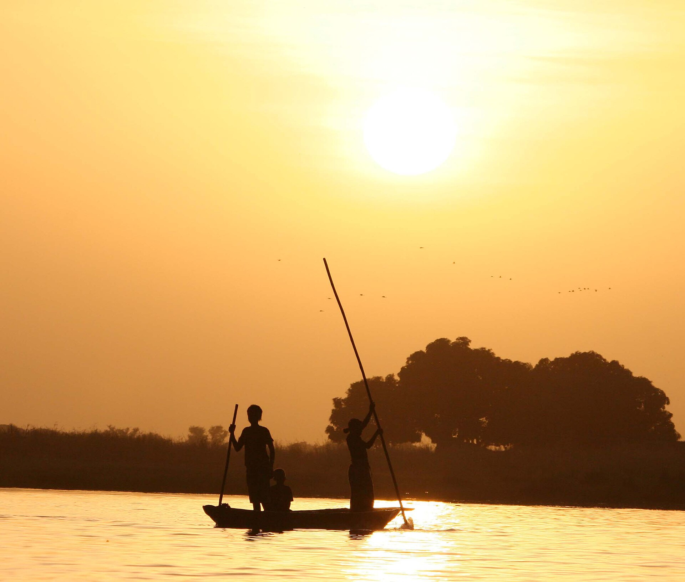

# 博佐传统信仰与尼日尔河渔猎祈福（Bozo）

<!-- 来源：CC BY 2.0 | https://commons.wikimedia.org/wiki/File:Bozo_Fishermen.jpg -->

## 概述

**博佐人（Bozo）** 主要分布于马里尼日尔河沿岸，以渔捞专长与河湖生计闻名于西非民族志。公开概述记述：传统宇宙强调水灵（如公开叙述中的 **Faro／Kano** 等）、祖先与渔业禁忌；西非公开遗产层亦关联 **Sogo Bò** 水上木偶／动物假面表演传统（**UNESCO** 相关公开知识）；今日并存伊斯兰。本条目为教育概览；**不提供**献牲、水灵召唤或可冒充仪者的步骤。与班巴拉、桑海、索宁克条目生计与认同均不同。

## 核心观念（祈福 / 功德 / 祈祷如何被理解）

祈福常被理解为：通过对水灵—祖先伦理的正确关系，并／或通过清真寺礼拜，求渔获平安、免溺与社群和解。功德贴近：支持可持续渔业与母语。访客的「福」体现为：尊重渔捞禁忌，不把河灵写成探险项目。

## 典型仪式

### 1. Sogo Bò 水上木偶／假面表演（UNESCO 公开遗产层）
- **场合**：尼日尔河流域公开节庆与文化展演记述。
- **主要步骤（概念层）**：理解 **Sogo Bò** 作为社群叙事与水生计相关的公开木偶／假面表演遗产。**止于公开遗产命名层**；不提供排练或角色扮演 how-to。
- **物品**：从略（公开外观）。
- **谁来举行**：传统表演社群；访客仅观礼。

### 2. Faro／Kano 水灵与渔捞伦理（敏感，仅概念）
- **场合**：渔季、危险水域公开记述。
- **主要步骤（概念层）**：理解 **Faro／Kano** 等水灵—禁忌叙事。**Faro／Kano — CONCEPT ONLY**；**禁止**复现祭仪或「请神」。
- **物品**：从略。
- **谁来举行**：渔捞家庭与长者（内部）。

### 3. 清真寺礼拜与祖先敬礼（概念层）
- **场合**：主麻、伊斯兰节日；家庭危机、丧葬公开记述。
- **主要步骤（概念层）**：理解公开伊斯兰框架与祖先伦理位置。**止于常识／概念**；禁止复现祭仪。
- **物品**：从略。
- **谁来举行**：伊玛目、信众、家庭与长者。

## 日常与节庆

优先尼日尔河内陆三角洲公开研究；与班巴拉农耕中心区分。

## 注意与尊重

**勿强求「水灵仪式」演示。** 禁止危险水域冒险采风。摄影须许可。

## 手机互动适合度（Three.js 评估草稿）

- **档位：** B 仅氛围或图文场景
- **敏感度：** 高
- **判断：** **仅氛围／无用户主持。** 河湖生计与 Sogo Bò 公开遗产可说明；Faro／Kano 水灵仅 CONCEPT；祭仪不可操作化。
- **若做成互动：** 只做渔业伦理＋地理说明。
- **红线：** 禁止请神、献牲、冒充仪者、危险溺水闯关。
- **评估状态：** 待后期统一评估

## 参考来源

- https://www.britannica.com/topic/Bozo
- https://www.britannica.com/place/Niger-River
- https://www.britannica.com/place/Mali
