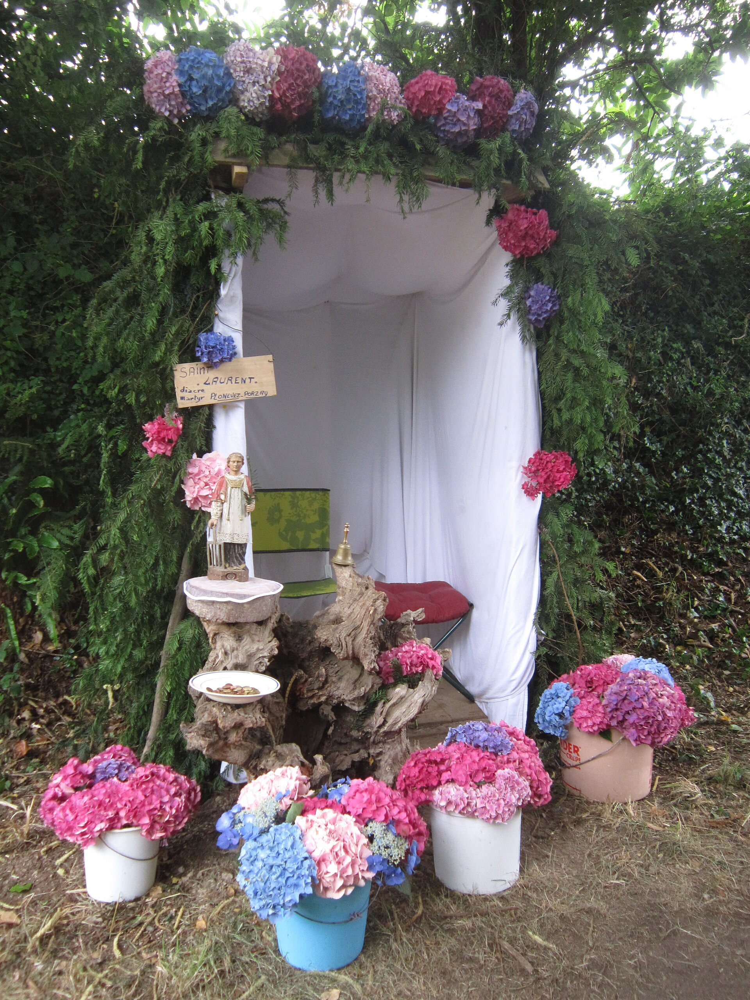

# 布列塔尼赦罪朝圣与民间祈福（Breton Pardons）

<!-- 来源：CC BY-SA 4.0 | https://commons.wikimedia.org/wiki/File:506_Troménie_Locronan.jpg -->

## 概述

**布列塔尼赦罪礼（pardon；布列塔尼语相关表述常与“宽恕／大赦”相连）** 是法国西北布列塔尼半岛西部布列塔尼语区特有的教区主保圣人瞻礼—朝圣形式，天主教百科与地方文化综述均将其视为布列塔尼民间天主教最显著的公开表达之一。公开记述强调：信众在圣人／圣母瞻礼日告解、弥撒、列队绕堂或长距巡行（如 Locronan 的 *troménie*），求治愈、航海平安与感恩还愿；著名者包括圣伊夫（Tréguier）、Rumengol、Saint-Jean-du-Doigt、圣罗南与 Sainte-Anne-d'Auray 等。列队中常见圣旗／**banners（旗帜）**；多地 pardon 亦与**圣井／圣泉（sacred wells）**巡礼叙事相连，属公开朝圣—民俗层。本条目聚焦可核验的公开朝圣—节庆层；**不提供**告解内容、圣事操作或任何可复现的“获得大赦”步骤。

## 核心观念（祈福 / 功德 / 祈祷如何被理解）

祈福常被理解为：在地方圣人／圣母的代祷下，通过告解、圣体、列队祈祷与还愿物，使个人与堂区重新进入恩宠与社群团结。功德贴近：步行朝圣、携带蜡烛／还愿物、资助堂区节日、以节日服装与旗帜维护地方身份。Everyculture 等综述指出：洗礼、婚丧等仍高度依赖教会礼仪，而 pardon 在当代亦叠合旅游与民俗展演；教育性介绍应区分虔敬核心与集市侧面。访客的「福」体现为：尊重活态布列塔尼语文化，而非把凯尔特符号抽成奇幻商品。

## 典型仪式

### 1. 教区主保 pardon 日（公开朝圣层；旗帜／圣井）
- **场合**：堂区或地方圣堂瞻礼；多数集中在复活节至米迦勒节之间；部分圣地含圣井／圣泉巡礼。
- **主要步骤（概念层）**：前夕告解、清晨弥撒、列队绕行（抬旗帜／banners）、赞美与社交节庆；圣井属公开朝圣意象。**止于公开文化叙述**；不提供告解／圣事教程。
- **物品**：旗帜（banners）、十字架、蜡烛、传统服装外观；圣井外观（概念）。
- **谁来举行**：本堂神职与堂区信众；外人可作安静观礼者，不擅自带队。

### 2. 长距巡行 troménie（概念—公开层）
- **场合**：如 Locronan 圣罗南相关巡行；公开记述称大巡行数年一次、路程约十余公里。
- **主要步骤（概念层）**：抬圣像／旗帜步行拜访堂区圣点。**仅概念层**。
- **物品**：圣像、旗帜。
- **谁来举行**：堂区组织；服从交通与文物保护规定。

### 3. 还愿与“神迹游行”叙事（历史—民俗层）
- **场合**：航海获救、疗愈感恩等；天主教百科记述水手携船板碎片、曾用拐杖者抬拐杖入队等公开意象。
- **主要步骤（概念层）**：理解还愿物作为感恩可见记号。**禁止**编造神迹证明或贩卖“灵验保证”。
- **物品**：还愿物外观（从略）。
- **谁来举行**：当事信众与堂区。

## 日常与节庆

堂区年历、布列塔尼语文化复兴活动与旅游季节并存。优先 Catholic Encyclopedia、Bécédia、Everyculture 等可核验综述；与泛凯尔特古代宗教条目互补，本条不写德鲁伊操作。

## 注意与尊重

**勿在弥撒或告解时段喧哗拍照。** 勿把 pardon 简化为“异教残留派对”。进入堂区空间、使用无人机与贩卖宗教周边需许可与诚信。

## 手机互动适合度（Three.js 评估草稿）

- **档位：** C 可做致敬小品（非真仪）
- **敏感度：** 低
- **判断：** 旗帜列队、石堂与海岸朝圣的公开文化层视觉清晰，适合非圣事的手机致敬小品；告解、弥撒圣事与宣称“获赦”不可游戏化。取 C：以手势练习向布列塔尼民间天主教致敬，不以真 pardon 名称为通关。
- **若做成互动：** 手势练习：1）拖动旋转石堂—旗帜街景；2）陀螺仪平稳“抬旗步行”保持队列不偏；3）在说明卡上点选一位布列塔尼地方圣人简介（非祈祷生效）；4）拖动点亮一盏象征性蜡烛图标并阅读尊重提示。全程标注为手势练习，非真朝圣。
- **红线：** 禁止模拟告解／圣餐、伪造大赦证书，或以真弥撒／pardon 名称为胜负条件。
- **评估状态：** 待后期统一评估

## 参考来源

- https://www.newadvent.org/cathen/11477b.htm
- https://www.bcd.bzh/becedia/en/brittany-land-of-pardons
- https://www.culture.gouv.fr/thematiques/patrimoine-culturel-immateriel/vivre-le-patrimoine-culturel-immateriel/reportages/la-bretagne-terre-des-pardons
- https://www.culture.gouv.fr/Media/Thematiques/Patrimoine-culturel-immateriel/Files/Fiches-inventaire-du-PCI/les-pardons-et-tromenies-en-bretagne.pdf
- https://dx.doi.org/10.3917/ethn.124.0635
