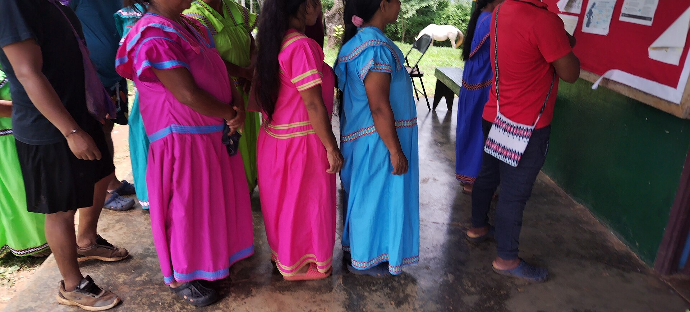

# 布格雷传统信仰与山地祈福（Buglé）

<!-- 来源：CC BY 4.0 | https://commons.wikimedia.org/wiki/File:Indígenas_Gnabe_Bugle._Panamá.jpg -->

## 概述

**布格雷人（Buglé）** 分布于巴拿马西部，与恩加贝共同构成 Ngäbe-Buglé 自治区语境，但语言—认同分立。公开概述记述：传统宇宙强调大地与主人灵伦理；今日并存基督教；采矿与自治议题显著——**勿消费抗争**。本条目为教育概览；**不提供**疗愈脚本、献牲或可冒充仪者的步骤。**非** `ngabe-traditional.md` 的重复。

## 核心观念（祈福 / 功德 / 祈祷如何被理解）

祈福常被理解为：通过对大地与主人灵的敬意，并／或通过教堂祈祷，求健康、丰收与领地存续。功德贴近：支持布格雷语与自治区权利。访客的「福」体现为：非邀莫入，拒绝「双族套餐」猎奇。

## 典型仪式

### 1. 大地—主人灵伦理（概念层）
- **场合**：农事、疾病公开记述。
- **主要步骤（概念层）**：理解人与山地秩序。**禁止**复现祭仪／疗愈操作。
- **物品**：从略。
- **谁来举行**：家庭与被承认的仪者。

### 2. 教堂崇拜（概念层）
- **场合**：主日、生命礼仪。
- **主要步骤（概念层）**：理解基督教公开层。**止于公开教会层**。
- **物品**：从略。
- **谁来举行**：教牧与会众。

### 3. 社群集会与自治叙事（概念层）
- **场合**：公共会议、文化日公开记述。
- **主要步骤（概念层）**：理解集体祝福与尊严诉求。**勿猎奇旁观抗争。**
- **物品**：从略。
- **谁来举行**：社群权威。

## 日常与节庆

优先巴拿马西部公开文化层；与恩加贝对照阅读。

## 注意与尊重

**领地许可优先。** 禁止疗愈旅游。摄影须许可。

## 手机互动适合度（Three.js 评估草稿）

- **档位：** A 不建议做成操作型互动
- **敏感度：** 极高
- **判断：** 土地冲突与疗愈不宜游戏化。
- **若做成互动：** 不建议；最多静态语言—山地伦理说明。
- **红线：** 禁止疗愈脚本、献牲、冒充仪者、消费抗争。
- **评估状态：** 待后期统一评估

## 参考来源

- https://www.britannica.com/place/Panama
- https://www.britannica.com/topic/Guaymi
- https://www.britannica.com/topic/Central-American-Indian
