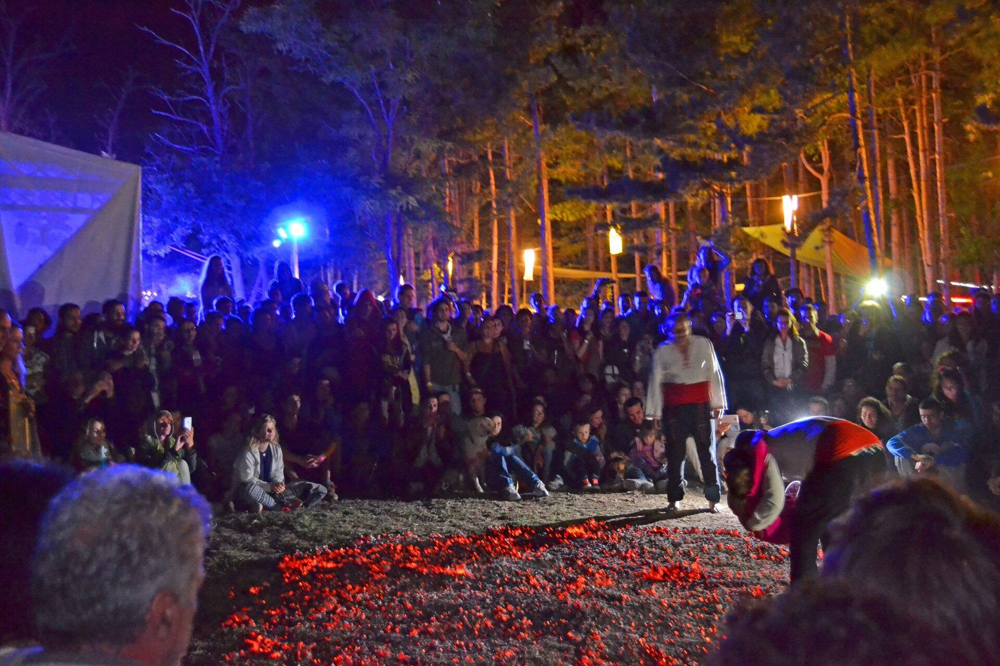

# 保加利亚涅斯蒂纳尔火舞祈福传统（Nestinarstvo）

<!-- 来源：CC BY-SA 4.0 | https://commons.wikimedia.org/wiki/File:Nestinari.jpg -->

## 概述

**涅斯蒂纳尔（Nestinarstvo，亦称火舞／踩火礼）** 是保加利亚东南部斯特兰贾（Strandzha）山区村落、尤其是 **布尔加里村（Bulgari／Balgari）** 保存的社区节庆仪式。2009 年以「Nestinarstvo, messages from the past: the Panagyr of Saints Constantine and Helena in the village of Bulgari」之名列入联合国教科文组织人类非物质文化遗产代表作名录。教科文组织公开文本指出：仪式在圣君士坦丁与圣海伦娜瞻礼（公历约 6 月 3–4 日）的 **Panagyr** 中达到高潮，旨在祈求村落福祉与丰饶；清晨有圣像游行与圣泉分发圣水、蜡烛以求健康，傍晚则以鼓与风笛引领，**Nestinari** 赤足踏入余烬圆圈，被视为圣徒意志得以表达的精神与身体领袖。布尔加斯地区历史博物馆等机构亦概述圣像「着装」、stolnina（圣像保管处）、horo 圈舞与家族传承的 nestinarka 角色。今日黑海度假地亦有商业化火舞表演，与村落真仪宜严格区分。本条目与罗马尼亚卡鲁什、斯拉夫民间等区分保加利亚斯特兰贾火舞遗产；**不提供**入定诱导、踩火操作、预言脚本或可复现「踏火得圣」步骤。

## 核心观念（祈福 / 功德 / 祈祷如何被理解）

祈福常被理解为：在瞻礼日透过合格 nestinari 的游行、圣水与火圈践履，为村落求健康、丰产与防护。功德贴近：维护圣像与 stolnina、款待节庆来客、在遗产框架下传承鼓乐与舞蹈知识。访客的「福」体现为：把 Nestinarstvo 当作活态社区遗产与东正教—民俗交融记忆，而非可付费购买的「火舞通关体验」或旅游餐厅秀。

## 典型仪式

### 1. 圣像游行、圣泉与白天礼仪（节庆公共层，概念）
- **场合**：6 月 3–4 日 Panagyr 上午至中午。
- **主要步骤（概念层）**：教科文组织与布尔加斯博物馆概述：圣像自 stolnina 游行至圣泉、分发圣水与蜡烛、horo 圈舞等。**止于节庆外观与求健康象征**；不提供祝圣操作或「圣像着装」秘传细节。
- **物品**：圣君士坦丁与圣海伦娜圣像外观、鼓、风笛（gaida）、蜡烛（概念）。
- **谁来举行**：教会与 nestinar 家族相关角色；外人勿擅取圣像。

### 2. 余烬火圈与 Nestinari 践履（核心神圣层，概念）
- **场合**：傍晚村落广场余烬圆圈。
- **主要步骤（概念层）**：公开遗产叙述强调静默围圈、圣鼓引领、nestinari 赤足踏火并被视为圣徒媒介。**仅概念与遗产说明**；禁止任何踩火、入定或「仿圣」练习指引。
- **物品**：余烬场地外观、圣鼓（概念，勿模仿）。
- **谁来举行**：经家族／社区承认的 Nestinari；游客绝不可「尝试」。

### 3. 遗产展演与旅游表演之区分（公共文化层）
- **场合**：国家／地方文化展演；黑海度假区商业火舞。
- **主要步骤（概念层）**：舞台或餐厅表演侧重视觉奇观，与布尔加里村落社区义务不同。观众可欣赏经许可的公开演出；勿要求表演者「当场预言」或演示秘传。
- **物品**：舞台服装与乐队（概念）。
- **谁来举行**：注册民俗团体或娱乐从业者（非村落真仪替代）。

## 日常与节庆

村落真仪一年一度、人潮极盛；遗产化带来保护亦带来观光压力。参观须遵守当地治安与摄影规定，勿闯入火圈或触碰圣像。优先 UNESCO 名录文本、布尔加斯地区历史博物馆与保加利亚国家遗产登记说明，而非「学会踩火」旅行广告。

## 注意与尊重

**勿把 Nestinarstvo 写成可学习的「赤足踏火教程」。** 勿将度假区秀等同布尔加里社区礼仪。涉及入定、预言、家族媒介角色与真火圈仅作概念认知。勿在任何场合鼓励模仿踩火。

## 手机互动适合度（Three.js 评估草稿）

- **档位：** A 不可做成关卡
- **敏感度：** 高
- **判断：** 圣像游行的村落天际线可作为静态说明插图，但赤足踏火、入定媒介与圣徒表达意志的核心仪轨不可互动化或「通关」。取 A：不以任何踩火手势、余烬计时或「获得圣示」为进度。
- **若做成互动：** A: 不提供操作步骤。
- **红线：** 禁止模拟踏火、入定、预言、冒充 nestinarka／nestinari，或以真 Nestinarstvo 火圈作胜负。
- **评估状态：** 待后期统一评估

## 参考来源

- https://ich.unesco.org/en/RL/nestinarstvo-messages-from-the-past-the-panagyr-of-saints-constantine-and-helena-in-the-village-of-bulgari-00191
- https://ich.unesco.org/en/decisions/4.COM/13.05
- https://www.burgasmuseums.bg/en/encdetail/nestinarstvo-60
