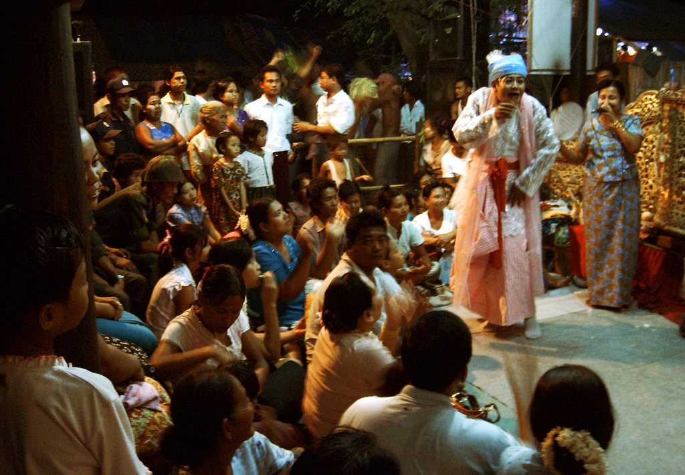

# 缅甸纳特崇拜（Nat）

<!-- 来源：CC BY 2.0 | https://commons.wikimedia.org/wiki/File:Nat_pwe_in_Amarapura.jpg -->

## 概述

在缅甸民间宗教中，**nat**（纳特）指一类需加抚慰的灵：包括横死者英灵、自然灵、村寨与家宅守护灵等。大英百科全书指出，其崇拜可能早于佛教传入，并与上座部佛教长期并存；泰国类似灵称 *phi*。最著名的是「三十七纳特」正式名录（成员历代有更替，数目保持三十七），多与暴力死亡传说相关：妥善供奉可护佑，受怠慢则可致祸。蒲甘王阿奴律陀时代曾整理官方纳特名单，并将其纳入佛教宇宙论框架。波帕山（Mount Popa）等地为重要朝圣地。本条目为教育性概览；**nat kadaw**（纳特妻／灵媒）附体与献祭细节属社群内部，不提供可复现步骤。

## 核心观念（祈福 / 功德 / 祈祷如何被理解）

纳特崇拜处理「眼前的安危与运气」：旅行、疾病、村寨安全、家宅平和。佛教则指向业力、轮回与解脱。两者常并见于同一人生活——寺院布施累积功德，纳特供奉则维持与地方灵的契约式关系。祈福透过食物、鲜花与节庆中的礼敬表达；百科记述多数家庭在屋柱悬挂椰子等，以敬家宅纳特 Min Mahagiri（Min Maha Giri）。村寨纳特神龛多在入口树木或柱旁。所谓福佑，首先是「不被冒犯」与获得守护，而非抽象积德计量。

## 典型仪式

### 1. 家宅与村寨日常供奉（概念层）
- **场合**：重要人生节点、岁时、出行前后。
- **主要步骤（概念层）**：献食或鲜花；对家宅／村寨纳特致意。公开叙述止于供奉结构。
- **物品**：食物、花、椰子与红布等象征（家宅纳特相关公开记述）。
- **谁来举行**：家庭成员；村寨仪礼担当者。

### 2. 纳特节庆与朝圣（如 Taungbyon、波帕山等，概念层）
- **场合**：纪念特定纳特（如 Taungbyon 兄弟）的全国性或地方节庆；波帕山等圣地朝拜。
- **主要步骤（概念层）**：集会、献供、乐舞；节庆中可见灵媒舞蹈与预言（概念层）。**不描述**附体诱导技术。
- **物品**：神龛、供品、节庆仪仗。
- **谁来举行**：组织者、nat kadaw、朝圣信众。

### 3. 灵媒抚慰礼仪（概念层）
- **场合**：个人危机、还愿、节庆现场。
- **主要步骤（概念层）**：受认可的 nat kadaw 进入附体状态，代纳特发言或接受供奉。百科与宗教学辞书强调其占卜与预言角色。止于公开文化层。
- **物品**：供饮与烟草等（公开人类学记述中的节庆互动）；神龛偶像。
- **谁来举行**：nat kadaw；信众求问须尊重其权威与边界。

## 日常与节庆

纳特崇拜在乡村与部分都市边缘仍活跃，正统佛教话语有时将其边缘化。三十七纳特的艺术、舞蹈与雕塑是缅甸视觉文化重要组成部分。游客可见神龛与节庆，但不宜将纳特文化简化为「奇观附体秀」。

## 注意与尊重

勿拍摄或模仿 nat kadaw 附体，勿索要「如何请纳特」教程。进入村寨神树／神龛区域服从当地指示。讨论横死传说时避免猎奇 consumptive 叙事。政治动荡时期的朝圣与节庆安全须另行评估，本档案不鼓励冒险旅行。

## 手机互动适合度（Three.js 评估草稿）

- **档位：** A 不可做成关卡
- **敏感度：** 高
- **判断：** 纳特节庆核心常含 nat kadaw 附体与预言；家宅／村寨供奉亦嵌入地方义务。附体诱导与抚慰程序明确不宜互动化。
- **若做成互动：** 不提供操作步骤。
- **红线：** 禁止附体诱导、冒充 nat kadaw 或牲礼／抚慰配方；纳特仪典名不作通关。
- **评估状态：** 待后期统一评估

## 参考来源

- https://www.britannica.com/topic/nat
- https://www.encyclopedia.com/philosophy-and-religion/eastern-religions/buddhism/nats
