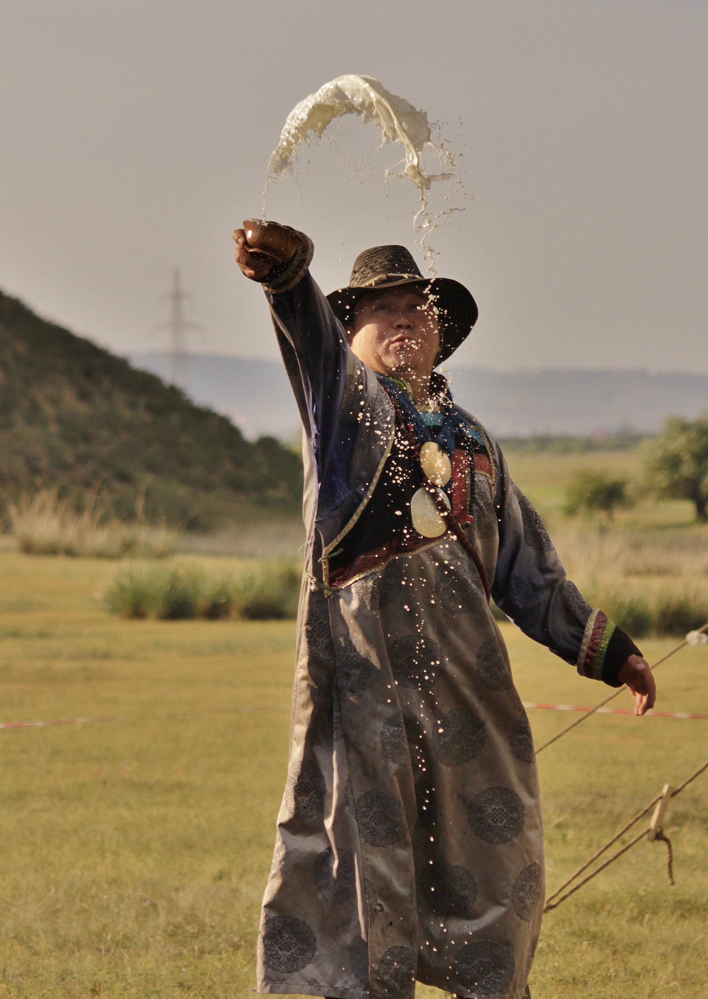

# 布里亚特萨满与佛教交融（Buryat）

<!-- 来源：CC BY-SA 3.0 | https://commons.wikimedia.org/wiki/File:%D0%91%D1%8D%D0%BB%D0%B8%D0%BA%D1%82%D0%BE.JPG -->

## 概述

**布里亚特人（Buryat／Buriat）** 是贝加尔湖周边的蒙古语族群体，主要分布于俄罗斯联邦布里亚特共和国及相邻地区，亦有人口在蒙古与中国。大英百科记述：其宗教生活呈现**萨满传统与藏传（多为格鲁派）佛教**的复杂交织；湖东布里亚特受喀尔喀蒙古影响更深、佛教仪轨更显著，湖西则萨满传统相对更强。学术研究指出：氏族性的 *taylagan*（献祭／敬献仪典）与佛教化的 *oboo taykhu*（敖包敬献）常共享「向地方神灵与祖先求佑」的目的，但主持者与供物形态不同——前者可由萨满主持并在传统叙述中涉及牲礼，后者常由喇嘛主持并以乳制品等「白食」替代。苏联时期宗教受压制，后苏联时代萨满与佛教同时复兴。本条目为教育性概览；**不提供**萨满通灵脚本、牲礼操作或可复现的密咒仪轨。

## 核心观念（祈福 / 功德 / 祈祷如何被理解）

祈福常理解为与**地方神灵、祖先与佛教本尊**维持互惠：人需要丰产、出行平安与疾病缓解，灵界需要得体的供养与尊重。圣地（山、湖岛如奥尔洪一带、敖包石堆）是可见的交会点；系彩带、置硬币、泼洒乳酒等公开姿态表达「不空手经过」。功德贴近按时举行氏族仪典、护持寺院与避免冒犯圣地，而非旅游打卡。佛教一侧强调皈依、持戒与寺院法会；萨满一侧强调被神灵「选中」的资格与氏族记忆。两者数百年互渗，使许多日常祝福外观相似，但权威来源与禁忌仍须向当地长老／僧伽确认。

## 典型仪式

### 1. *Taylagan*（氏族敬献／萨满侧概念）
- **场合**：季节性氏族聚会、祈请祖先与地方保护灵、与传统竞技（摔跤、射箭、赛马）相连的节庆语境。
- **主要步骤（概念层）**：萨满或负礼仪责任者祈祷；供物呈献；传统叙述中可有牲礼概念。公开描述止于目的与社会结构；**不提供**宰杀、招灵或鼓技教程。
- **物品**：供物、鼓与仪式空间（因氏族而异）。
- **谁来举行**：氏族萨满与长老；外人勿自行模仿。

### 2. 敖包 *oboo*／*oboo taykhu*（佛教化圣地敬献）
- **场合**：旅行经过圣地、季节法会、地方保护神纪念日。
- **主要步骤（概念层）**：在石堆／敖包处祈祷；喇嘛可诵经；供「白食」等；绕行与系带为常见公开姿态。目的常与求雨、畜群平安、地方安宁相关。止于可见礼节。
- **物品**：乳制品、彩带、硬币等（地方惯例不同）。
- **谁来举行**：喇嘛与信众；家庭亦可作简易致敬，但仍须遵守当地告示。

### 3. 寺院法会与家庭祝福（概念层）
- **场合**：藏历／地方节庆、人生过渡、病愈祈请。
- **主要步骤（概念层）**：诵经、献灯、接受僧人祝福；家庭中可见佛坛与萨满记忆并存。**不收录**密乘灌顶或伏藏仪轨细节。
- **物品**：佛像、经书、哈达类织物、灯烛。
- **谁来举行**：布里亚特佛教僧伽与家庭长辈。

## 日常与节庆

贝加尔湖旅游升温使奥尔洪等岛上的「萨满点」高度可见，但可见不等于可参与：许多仪式仍属氏族内部。体育竞技在复兴叙述中被重新连结到取悦神灵的节庆功能。当代认同政治中，有人主张以佛教整合民族象征，有人强调萨满的普遍性，讨论时应避免把复杂现实简化为单一「国教」。

## 注意与尊重

**勿索要**萨满附体表演或拍摄未同意的仪式。勿在敖包与圣山乱涂乱拿石块。牲礼与通灵属高度敏感，本档案仅概念说明。勿将布里亚特传统与泛蒙古腾格里条目完全混同，亦勿忽略湖东／湖西差异。涉及跨境（俄、蒙、中）社群时，尊重各地法律与文化遗产规定。

## 手机互动适合度（Three.js 评估草稿）

- **档位：** A 不可做成关卡
- **敏感度：** 高
- **判断：** *Taylagan* 涉及萨满资格与牲礼概念；敖包敬献虽有公开姿态，但与地方神灵契约及僧伽／萨满权威相连。与蒙古腾格里条目类似，混合传统取更严档位，不宜做成可完成的通灵或献牲关卡。
- **若做成互动：** 不提供操作步骤。
- **红线：** 禁止附体、献牲、鼓技招灵或把「敖包祈福成功」作成通关；不以萨满／喇嘛身份扮演为胜负。
- **评估状态：** 待后期统一评估

## 参考来源

- https://www.britannica.com/topic/Buryat
- https://doi.org/10.3390/rel10050306
- https://www.mdpi.com/2077-1444/10/5/306
- http://www.drustvo-antropologov.si/AN/PDF/2013_3/Anthropological_Notebooks_XIX_3_Wierucka.pdf
