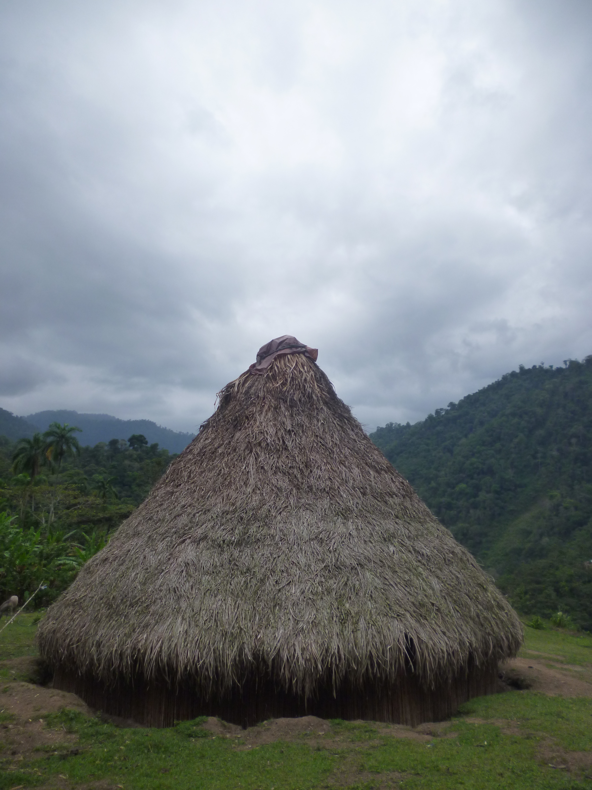

# 卡韦卡尔传统信仰与山地祈福（Cabécar）

<!-- 来源：CC BY-SA 3.0 | https://commons.wikimedia.org/wiki/File:Cabecar_house.JPG -->

## 概述

**卡韦卡尔人（Cabécar）** 分布于哥斯达黎加大西洋侧山地，为该国重要原住民族群之一。公开概述记述：传统宇宙强调主人灵、萨满—仪者与森林伦理；今日并存天主教／基督教接触。本条目为教育概览；**不提供**疗愈脚本、致幻植物操作或可冒充仪者的步骤。与布里布里条目相关但语言—领地认同分立（布里布里已有专卡）。

## 核心观念（祈福 / 功德 / 祈祷如何被理解）

祈福常被理解为：通过对主人灵与祖先的正确关系，求健康、丰收与领地存续。功德贴近：支持卡韦卡尔语与山地土地权利。访客的「福」体现为：非邀莫入，拒绝「萨满一日游」。

## 典型仪式

### 1. 主人灵与森林伦理（概念层）
- **场合**：农事、疾病、迁徙公开记述。
- **主要步骤（概念层）**：理解人与森林灵力秩序。**禁止**复现祭仪／致幻操作。
- **物品**：从略。
- **谁来举行**：被承认的仪者与家庭。

### 2. 教堂／传教接触层（概念层）
- **场合**：主日、生命礼仪公开记述。
- **主要步骤（概念层）**：理解基督教公开层。**止于公开教会层**。
- **物品**：从略。
- **谁来举行**：教牧与会众。

### 3. 生命礼仪（敏感，仅概念）
- **场合**：出生、丧葬公开记述。
- **主要步骤（概念层）**：理解社群祝福与规范。**止于概念**。
- **物品**：从略。
- **谁来举行**：家庭与仪者。

## 日常与节庆

优先哥斯达黎加大西洋侧公开文化层；与布里布里对照。

## 注意与尊重

**严禁致幻／疗愈旅游。** 领地许可优先。摄影须许可。

## 手机互动适合度（Three.js 评估草稿）

- **档位：** A 不建议做成操作型互动
- **敏感度：** 极高
- **判断：** 萨满核心不可游戏化。
- **若做成互动：** 不建议；最多静态语言—生态说明。
- **红线：** 禁止致幻剂、疗愈脚本、冒充仪者。
- **评估状态：** 待后期统一评估

## 参考来源

- https://www.britannica.com/topic/Cabecar
- https://www.britannica.com/place/Costa-Rica
- https://www.britannica.com/topic/Central-American-Indian
