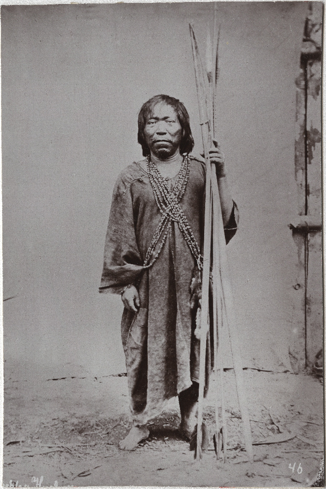

# 卡希博／卡卡塔伊博传统信仰与乌卡亚利祈福（Cashibo / Cacataibo）

<!-- 来源：Public Domain | https://commons.wikimedia.org/wiki/File:Cashibo_man_photographed_in_1888_by_Charles_Kroehle.jpg -->

## 概述

**卡希博—卡卡塔伊博人（Cashibo／Cacataibo）** 分布于秘鲁乌卡亚利一带，属帕诺语系社群。公开叙述涉及村落礼仪与护佑观念——**极高敏感，本卡仅概念层**。教育概览；**严禁**药方、入会或可冒充仪者的步骤。与希皮博—科尼博、马鲁博、卡希纳瓦等帕诺条目区分；本卡合并同义，不另开 cacataibo 卡。

## 核心观念（祈福 / 功德 / 祈祷如何被理解）

祈福常被理解为：通过对森林、互惠与知识持有者伦理的正确关系，求健康与社群安全。功德贴近：支持领地完整与去迷幻旅游化。访客的「福」体现为：**非邀莫入**。

## 典型仪式

### 1. 村落互惠（敏感，仅概念）
- **场合**：公开文化叙述。
- **主要步骤（概念层）**：理解共居与分享。**禁止**复现仪轨。
- **物品**：从略。
- **谁来举行**：家庭与长者。

### 2. 护佑传统（极高敏感，仅概念）
- **场合**：公开学术概述。
- **主要步骤（概念层）**：知晓存在护佑实践。**禁止任何药方或复现。**
- **物品**：从略。
- **谁来举行**：获授权知识持有者。

### 3. 权利与当代表述（公开层）
- **场合**：原住民组织公共叙述。
- **主要步骤（概念层）**：支持合法公开材料。
- **物品**：不适用。
- **谁来举行**：协会与领袖。

## 日常与节庆

优先公开语言／文化振兴叙述。

## 注意与尊重

**严禁药方采集。** 摄影须同意。

## 手机互动适合度（Three.js 评估草稿）

- **档位：** A 不建议做成操作型互动
- **敏感度：** 极高
- **判断：** 护佑绝不可游戏化。
- **若做成互动：** 不建议；最多雨林权利图文。
- **红线：** 禁止药方、入会、冒充仪者。
- **评估状态：** 待后期统一评估

## 参考来源

- https://www.britannica.com/place/Peru
- https://www.britannica.com/place/Ucayali-River
- https://www.britannica.com/place/Amazon-Rainforest
