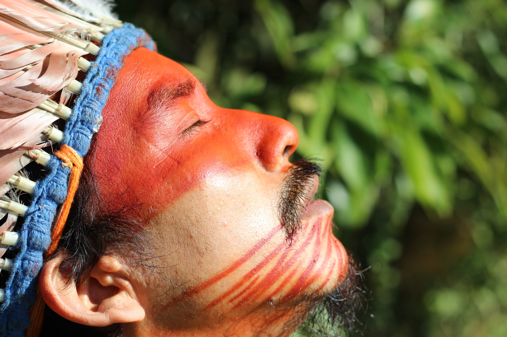

# 卡希纳瓦／胡尼库因传统信仰与雨林祈福（Cashinahua／Huni Kuin）

<!-- 来源：CC BY-SA 4.0 | https://commons.wikimedia.org/wiki/File:Cacique_Isaka_Huni_Kuin_Rezando.jpg -->

## 概述

**卡希纳瓦人（Cashinahua；自称常作 Huni Kuin）** 分布于巴西—秘鲁交界普鲁斯河流域，属帕诺语支。公开概述记述：传统宇宙强调身体绘饰、歌咏与萨满—治疗传统；今日并存基督教与土地维权。本条目为教育概览；**严禁**致幻植物操作、疗愈脚本或可冒充萨满的步骤。与希皮博—科尼博条目相关语支但社群独立，不可合并。

## 核心观念（祈福 / 功德 / 祈祷如何被理解）

祈福常被理解为：通过对森林与祖先歌咏秩序的正确关系，求健康与社群延续。功德贴近：支持领地与母语。访客的「福」体现为：**拒绝死藤水旅游套餐**。

## 典型仪式

### 1. 歌咏—绘饰公共文化层（概念层）
- **场合**：节庆、认同展演公开记述。
- **主要步骤（概念层）**：理解身体绘饰与歌咏作为宇宙伦理表达。**区分受邀展演与封闭仪轨。**
- **物品**：从略。
- **谁来举行**：社群。

### 2. 治疗中介（极高敏感，仅概念）
- **场合**：疾病叙事。
- **主要步骤（概念层）**：知晓存在萨满—治疗传统。**禁止任何配方、致幻或操作化指导。**
- **物品**：从略。
- **谁来举行**：被承认的专家。

### 3. 教堂／城镇接触层（概念层）
- **场合**：部分社区公开记述。
- **主要步骤（概念层）**：理解信仰光谱。**止于公开层**。
- **物品**：从略。
- **谁来举行**：相关宗教权威。

## 日常与节庆

优先阿克里／乌卡亚利公开文化层。

## 注意与尊重

**严禁致幻旅游。** 领地许可优先。摄影须同意。

## 手机互动适合度（Three.js 评估草稿）

- **档位：** A 不建议做成操作型互动
- **敏感度：** 极高
- **判断：** 萨满—致幻核心不可游戏化。
- **若做成互动：** 不建议；最多静态绘饰—权利说明（无通关）。
- **红线：** 禁止致幻剂、疗愈脚本、冒充萨满。
- **评估状态：** 待后期统一评估

## 参考来源

- https://www.britannica.com/topic/Cashinawa
- https://www.britannica.com/place/Acre
- https://www.britannica.com/place/Amazon-Rainforest
