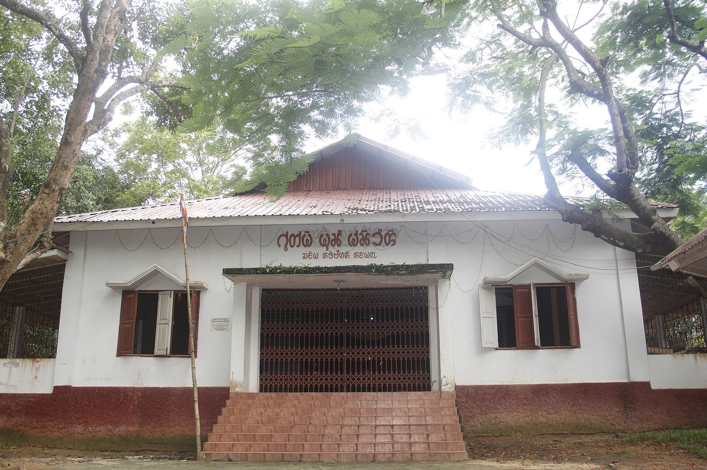

# 查克玛上座部佛教与丘陵祈福（Chakma）

<!-- 来源：CC BY-SA 4.0 | https://commons.wikimedia.org/wiki/File:Chakma_Raj_Vihara,Rangamati.jpg -->

## 概述

**查克玛人（Chakma）** 为孟加拉吉大港山丘地带最大原住民族群之一，亦分布于印度米佐拉姆／特里普拉／阿鲁纳恰尔及缅甸若开等地。公开百科记述：主体实践**上座部佛教**（19 世纪制度化改革影响深远），并存地方灵力与少数基督教；文字传统与跨境迁徙史构成认同关键部分。公开节庆记述含 **Bizhu／Biju** 新年水节；寺院层常称 **Kiyang**。本条目为教育概览；丘陵灵力仅 **CONCEPT**；**不提供**密续式操作或政治动员话术；冲突与流离议题仅作尊重性背景，不作猎奇。

## 核心观念（祈福 / 功德 / 祈祷如何被理解）

祈福常被理解为：通过礼佛、布施僧伽与守戒，积累功德并祈求家庭平安；Bizhu／Biju 水节亦承载社群欢庆与洁净象征。功德贴近：支持语言／文字与丘陵土地权利。访客的「福」体现为：倾听社群自述，不把难民叙事消费化。

## 典型仪式

### 1. Bizhu／Biju 新年水节（公开／概念层）
- **场合**：查克玛历新年前后（公开文化记述常称 **Bizhu／Biju**），含水嬉、歌舞与家庭团聚等公开层。
- **主要步骤（概念层）**：理解水节作为社群新年与洁净／祝福象征。**止于公开节庆层**；不提供仪程 how-to。
- **物品**：水、节庆服饰外观（概念）。
- **谁来举行**：家庭与社群；用户仅氛围／观礼，不可主持。

### 2. Kiyang 佛寺礼佛与布施（概念层）
- **场合**：佛日、出家／短期出家相关公开层；丘陵寺院常称 **Kiyang**。
- **主要步骤（概念层）**：理解上座部公开寺院实践。**止于访客可参与的礼貌层**。
- **物品**：鲜花、斋食等（从略）。
- **谁来举行**：僧伽引导；信众随喜；外人不可冒充僧职。

### 3. 丘陵灵力余绪（敏感，仅概念）
- **场合**：口述与民俗公开记述（**hill spirits CONCEPT**）。
- **主要步骤（概念层）**：知晓佛教框架外仍有地方／丘陵灵叙事。**CONCEPT ONLY**；**禁止**驱邪复现。
- **物品**：从略。
- **谁来举行**：地方专家（若存在）；外人不可扮演。

## 日常与节庆

优先 Britannica；注意孟印缅三地差异与安全。Bizhu／Biju 与 Kiyang 寺院为公开文化／信仰入口。

## 注意与尊重

**勿在流离／冲突议题上二次伤害。** 佛寺着装得体。禁止政治煽动。丘陵灵力不可操作化。

## 手机互动适合度（Three.js 评估草稿）

- **档位：** B 仅氛围或图文场景
- **敏感度：** 中高
- **判断：** **仅氛围／无用户主持。** 可做丘陵佛寺／水节氛围；Bizhu／Biju、Kiyang 仅命名与观礼；hill spirits 不可操作化。
- **若做成互动：** 只做佛教文化＋文字遗产说明与水节公开层场景。
- **红线：** 禁止戏仿僧职、驱邪、消费流离创伤。禁止丘陵灵力／驱邪 how-to。
- **评估状态：** 待后期统一评估

## 参考来源

- https://www.britannica.com/topic/Chakma
- https://en.wikipedia.org/wiki/Chakma_people
- https://www.britannica.com/topic/Theravada
