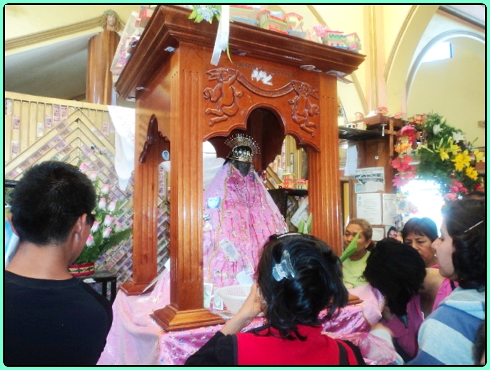

# 查蒂诺民间天主教与山灵祈福（Chatino）

<!-- 来源：CC BY 2.0 | https://commons.wikimedia.org/wiki/File:Santuario_Nuestra_Se%C3%B1ora_de_Juquila,_Christianity_in_Santa_Catarina_Juquila,_Estado_de_Oaxaca_in_Mexico.jpg -->

## 概述

**查蒂诺人（Chatino）** 分布于墨西哥瓦哈卡南部山地，支系与方言多样。公开概述记述：天主教圣徒与地方山灵、玉米—雨水伦理交织；朝圣层常涉 **Virgen de Juquila** 圣所；社区自治含 **Mayordomía（主保／筵席职分）**；**Curandero** 疗愈中介属 **HIGH SENSITIVITY CONCEPT ONLY**。本条目为教育概览；**不提供**疗愈脚本、献牲或可冒充仪者的步骤。与萨波特克、米斯特克、阿穆斯戈条目区分，补梅索美洲南部缺口。

## 核心观念（祈福 / 功德 / 祈祷如何被理解）

祈福常被理解为：通过对主保圣人（含 Juquila 圣母朝圣叙事）与山灵的敬意，祈求雨水、健康与社群平安。功德贴近：支持查蒂诺语与领地权利；承担 Mayordomía 公共责任属社群内部。访客的「福」体现为：非邀莫入圣地，节庆中礼让本地礼仪。

## 典型仪式

### 1. Virgen de Juquila 圣所与朝圣（公开／概念层）
- **场合**：瓦哈卡南部 **Virgen de Juquila** 圣所瞻礼与朝圣公开记述。
- **主要步骤（概念层）**：理解弥撒、游行与朝圣氛围。**止于公开观礼层**；用户不可主持礼仪。
- **物品**：从略。
- **谁来举行**：神职与社群；访客仅观礼。

### 2. Mayordomía 主保职分（概念层）
- **场合**：主保节、社区筵席与公共责任轮值（**Mayordomía**）。
- **主要步骤（概念层）**：理解主保职分作为社群互惠与节日组织机制。**CONCEPT**；禁止游戏化「买职分」或冒充 mayordomo。
- **物品**：从略。
- **谁来举行**：被社群承认的职分承担者与家庭。

### 3. Curandero 疗愈中介（高度敏感，仅概念）
- **场合**：疾病叙事。
- **主要步骤（概念层）**：知晓存在 **Curandero** 疗愈专家。**HIGH SENSITIVITY — CONCEPT ONLY**；**禁止**操作化。
- **物品**：从略。
- **谁来举行**：被承认的专家；外人严禁扮演。

## 日常与节庆

优先瓦哈卡南部公开文化层；注意支系差异。Juquila 朝圣为公开天主教入口。

## 注意与尊重

**勿强求萨满清洗。** 摄影须许可。禁止致幻／疗愈旅游话术。Mayordomía 与 Curandero 均不可用户主持。

## 手机互动适合度（Three.js 评估草稿）

- **档位：** B 仅氛围或图文场景
- **敏感度：** 高
- **判断：** **仅氛围／无用户主持。** 高地村寨／Juquila 圣所外观可说明；Mayordomía 仅命名；Curandero 不可操作化。
- **若做成互动：** 只做山—玉米概念卡与圣所远观。
- **红线：** 禁止献牲、疗愈脚本、冒充仪者／mayordomo。
- **评估状态：** 待后期统一评估

## 参考来源

- https://www.britannica.com/topic/Chatino
- https://www.britannica.com/place/Oaxaca-state-Mexico
- https://www.britannica.com/place/Mexico
